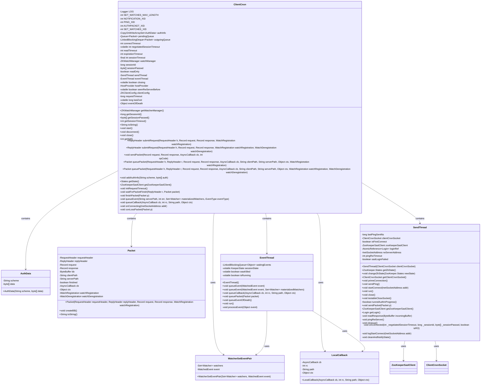
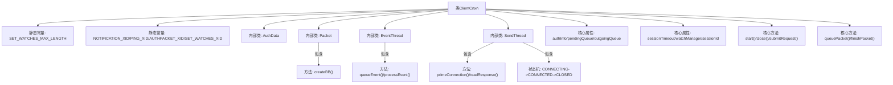
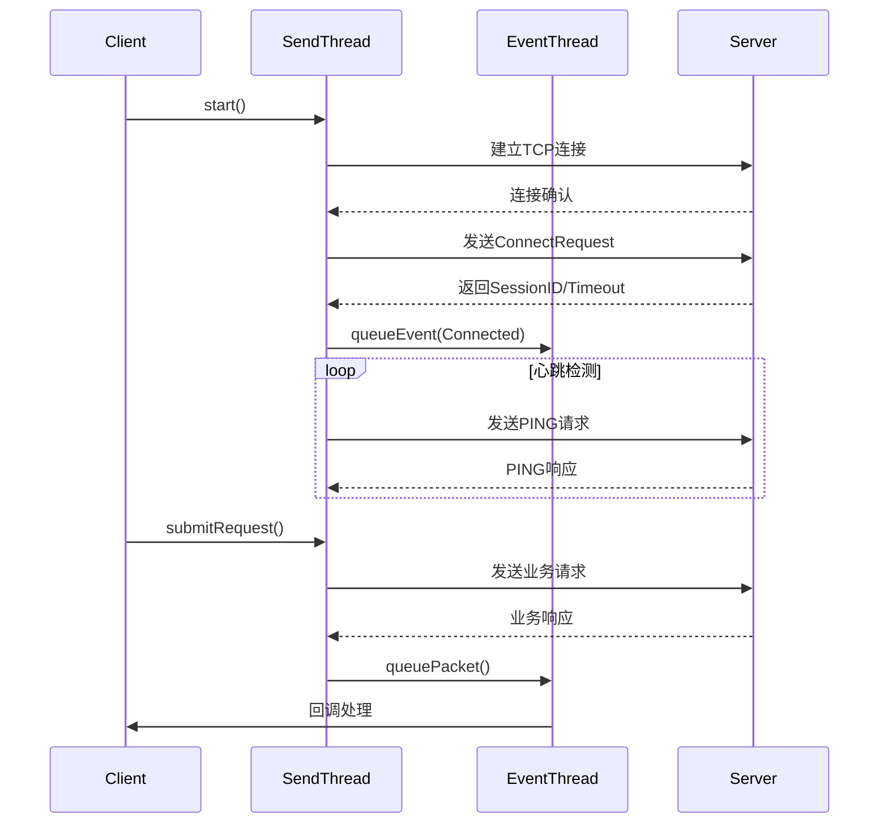

# 基础信息

|      |      |
|------|------|
| 名称 | ClientCnxn |
| 编码语言 | .java |
| 代码路径 | zookeeper/zookeeper-server/src/main/java/org/apache/zookeeper/ClientCnxn.java |
| 包名 | org.apache.zookeeper |
| 依赖项 | ['edu.umd.cs.findbugs.annotations.SuppressFBWarnings', 'java.io.ByteArrayOutputStream', 'java.io.IOException', 'java.net.ConnectException', 'java.net.InetSocketAddress', 'java.net.SocketAddress', 'java.nio.ByteBuffer', 'java.util.ArrayDeque', 'java.util.ArrayList', 'java.util.Collections', 'java.util.HashSet', 'java.util.Iterator', 'java.util.List', 'java.util.Map', 'java.util.Map.Entry', 'java.util.Queue', 'java.util.Set', 'java.util.concurrent.CopyOnWriteArraySet', 'java.util.concurrent.LinkedBlockingDeque', 'java.util.concurrent.LinkedBlockingQueue', 'java.util.concurrent.ThreadLocalRandom', 'java.util.concurrent.atomic.AtomicReference', 'javax.security.auth.login.LoginException', 'javax.security.sasl.SaslException', 'org.apache.jute.BinaryInputArchive', 'org.apache.jute.BinaryOutputArchive', 'org.apache.jute.Record', 'org.apache.zookeeper.AsyncCallback.ACLCallback', 'org.apache.zookeeper.AsyncCallback.AllChildrenNumberCallback', 'org.apache.zookeeper.AsyncCallback.Children2Callback', 'org.apache.zookeeper.AsyncCallback.ChildrenCallback', 'org.apache.zookeeper.AsyncCallback.Create2Callback', 'org.apache.zookeeper.AsyncCallback.DataCallback', 'org.apache.zookeeper.AsyncCallback.EphemeralsCallback', 'org.apache.zookeeper.AsyncCallback.MultiCallback', 'org.apache.zookeeper.AsyncCallback.StatCallback', 'org.apache.zookeeper.AsyncCallback.StringCallback', 'org.apache.zookeeper.AsyncCallback.VoidCallback', 'org.apache.zookeeper.KeeperException.Code', 'org.apache.zookeeper.OpResult.ErrorResult', 'org.apache.zookeeper.Watcher.Event', 'org.apache.zookeeper.Watcher.Event.EventType', 'org.apache.zookeeper.Watcher.Event.KeeperState', 'org.apache.zookeeper.ZooDefs.OpCode', 'org.apache.zookeeper.ZooKeeper.States', 'org.apache.zookeeper.ZooKeeper.WatchRegistration', 'org.apache.zookeeper.client.FourLetterWordMain', 'org.apache.zookeeper.client.HostProvider', 'org.apache.zookeeper.client.ZKClientConfig', 'org.apache.zookeeper.client.ZooKeeperSaslClient', 'org.apache.zookeeper.common.Time', 'org.apache.zookeeper.common.X509Exception', 'org.apache.zookeeper.proto.AuthPacket', 'org.apache.zookeeper.proto.ConnectRequest', 'org.apache.zookeeper.proto.Create2Response', 'org.apache.zookeeper.proto.CreateResponse', 'org.apache.zookeeper.proto.ExistsResponse', 'org.apache.zookeeper.proto.GetACLResponse', 'org.apache.zookeeper.proto.GetAllChildrenNumberResponse', 'org.apache.zookeeper.proto.GetChildren2Response', 'org.apache.zookeeper.proto.GetChildrenResponse', 'org.apache.zookeeper.proto.GetDataResponse', 'org.apache.zookeeper.proto.GetEphemeralsResponse', 'org.apache.zookeeper.proto.GetSASLRequest', 'org.apache.zookeeper.proto.ReplyHeader', 'org.apache.zookeeper.proto.RequestHeader', 'org.apache.zookeeper.proto.SetACLResponse', 'org.apache.zookeeper.proto.SetDataResponse', 'org.apache.zookeeper.proto.SetWatches', 'org.apache.zookeeper.proto.SetWatches2', 'org.apache.zookeeper.proto.WatcherEvent', 'org.apache.zookeeper.server.ByteBufferInputStream', 'org.apache.zookeeper.server.ZooKeeperThread', 'org.apache.zookeeper.server.ZooTrace', 'org.slf4j.Logger', 'org.slf4j.LoggerFactory', 'org.slf4j.MDC'] |
| 概述说明 | ClientCnxn是ZooKeeper客户端核心类，负责管理连接、会话、请求队列和事件处理。主要功能包括：维护连接状态（CONNECTED/READONLY等）、处理认证信息、分批次重注册监听器（SET_WATCHES_MAX_LENGTH=128KB）、管理请求队列（pendingQueue/outgoingQueue）、通过SendThread/EventThread异步处理网络IO和事件回调。关键特性：支持SASL认证、会话超时控制、读写分离模式、请求超时机制。 |

# 说明

ClientCnxn是ZooKeeper客户端网络连接的核心类，负责管理与服务器的通信。主要功能包括：维护连接状态（CONNECTING/CONNECTED等）、处理会话超时与重连、管理请求队列（outgoingQueue/pendingQueue）、实现心跳机制（PING_XID）、支持SASL认证。关键组件包含SendThread（处理请求发送和响应接收）和EventThread（处理异步事件回调）。类内定义了Packet结构封装请求/响应数据，支持多种回调类型（DataCallback/ACLCallback等）。通过HostProvider实现服务器地址轮询，提供读写分离支持（CONNECTEDREADONLY状态）。当连接断开时会触发cleanup清理未完成请求，并自动重建会话。

# 类列表 Class Summary

| 名称   | 类型  | 说明 |
|-------|------|-------------|
| ClientCnxn | class | ClientCnxn是ZooKeeper客户端核心类，负责管理连接、会话、请求队列和事件处理。主要功能包括：维护双队列（待发送/待响应）、处理认证与会话超时、支持读写模式切换、实现心跳机制及事件回调。关键属性：sessionId、超时控制、watch管理。含SendThread和EventThread双线程，分别处理网络IO和事件分发。 |

## 类 ClientCnxn

|      |      |
|------|------|
| 访问范围 | @SuppressFBWarnings({"EI_EXPOSE_REP", "EI_EXPOSE_REP2"});public |
| 类型 | class |
| 名称 | ClientCnxn |
| 说明 | ClientCnxn是ZooKeeper客户端核心类，负责管理连接、会话、请求队列和事件处理。主要功能包括：维护双队列（待发送/待响应）、处理认证与会话超时、支持读写模式切换、实现心跳机制及事件回调。关键属性：sessionId、超时控制、watch管理。含SendThread和EventThread双线程，分别处理网络IO和事件分发。 |

### UML类图

这段代码是ZooKeeper客户端连接的核心实现类ClientCnxn，负责管理与ZooKeeper服务器的网络通信、会话维护和事件处理。主要包含SendThread（负责网络I/O）、EventThread（处理服务器事件和回调）两个核心线程，以及Packet（网络数据包）、AuthData（认证信息）等辅助类。通过队列机制处理请求和响应，支持会话超时、重连、读写分离等特性，并提供了完善的错误处理和状态管理机制。整个类设计体现了高性能、可靠性和可扩展性，是ZooKeeper客户端功能实现的关键组件。

### 内部方法调用关系图

该流程图展示了ZooKeeper客户端连接的核心结构，包含ClientCnxn类的主要组件和交互关系。类结构分为连接管理（SendThread）、事件处理（EventThread）和协议封装（Packet）三大模块，通过队列机制实现异步通信。时序图描述了从连接建立、心跳维护到请求处理的完整生命周期，其中SendThread负责网络IO和状态维护，EventThread处理服务器事件和回调通知，两者通过队列解耦实现高效协作。关键设计包括会话超时控制、请求重试机制和读写分离支持，能有效处理网络波动和服务端故障场景。

### 字段列表 Field List

| 名称  | 类型  | 说明 |
|-------|-------|------|
| seenRwServerBefore = false | boolean | 声明一个易变的布尔变量seenRwServerBefore，初始值为false。 |
| closing = false | boolean | 私有易变布尔变量closing，初始值为false。 |
| eventThread | EventThread | 声明一个最终事件线程变量eventThread。 |
| requestTimeout | long | 私有长整型变量requestTimeout，用于设置请求超时时间。 |
| SET_WATCHES_XID = -8 | int | 静态常量SET_WATCHES_XID值为-8，用于标识设置监视操作。 |
| hostProvider | HostProvider | 私有成员hostProvider，类型为HostProvider。 |
| AUTHPACKET_XID = -4 | int | 定义常量AUTHPACKET_XID，值为-4，类型为静态整型。 |
| authInfo = new CopyOnWriteArraySet<>() | CopyOnWriteArraySet<AuthData> | 线程安全的AuthData集合，使用CopyOnWriteArraySet实现，确保并发访问安全。 |
| LOG = LoggerFactory.getLogger(ClientCnxn.class) | Logger | 定义ClientCnxn类的私有静态日志对象LOG，使用LoggerFactory创建。 |
| clientConfig | ZKClientConfig | 私有ZKClientConfig类型的clientConfig变量。 |
| sendThread | SendThread | 声明一个名为sendThread的final类型SendThread对象。 |
| watchManager | ZKWatchManager | 私有不可变的ZKWatchManager监视管理器实例。 |
| sessionTimeout | int | 私有整型变量sessionTimeout，用于会话超时设置。 |
| sessionId | long | 私有长整型会话ID变量。 |
| connectTimeout | int | 私有整型变量，用于设置连接超时时间。 |
| outgoingQueue = new LinkedBlockingDeque<>() | LinkedBlockingDeque<Packet> | 私有终态阻塞队列outgoingQueue，存储Packet类型数据。 |
| readOnly | boolean | 私有布尔类型变量readOnly，表示只读状态。 |
| NOTIFICATION_XID = -1 | int | 静态常量NOTIFICATION_XID值为-1，用于标识通知。 |
| xid = 1 | int | 声明一个受保护的整型变量xid，初始值为1。 |
| expirationTimeout | int | 私有整型变量，表示过期超时时间。 |
| pendingQueue = new ArrayDeque<>() | Queue<Packet> | 私有队列pendingQueue，使用ArrayDeque实现，存储Packet类型元素。 |
| lastZxid | long | 私有易变长整型变量lastZxid |
| negotiatedSessionTimeout | int | 私有可变整型变量，用于存储协商后的会话超时时间。 |
| SET_WATCHES_MAX_LENGTH = 128 * 1024 | int | 定义私有静态常量SET_WATCHES_MAX_LENGTH，值为128KB。 |
| sessionPasswd | byte[] | 私有字节数组sessionPasswd，用于存储会话密码。 |
| PING_XID = -2 | int | 静态常量PING_XID值为-2。 |
| readTimeout | int | 私有整型变量readTimeout，用于设置读取超时时间。 |
| eventOfDeath = new Object() | Object | 声明一个私有对象eventOfDeath并初始化为新对象实例。 |
| state = States.NOT_CONNECTED | States | 状态变量state初始化为未连接状态。 |

### 方法列表 Method List

| 名称  | 类型  | 说明 |
|-------|-------|------|
| addAuthInfo | void | 方法addAuthInfo用于添加认证信息，检查状态后存储认证数据并发送认证包。参数为认证方案和认证数据。 |
| disconnect | void | 断开客户端连接，关闭发送线程并等待其结束，若中断则记录警告，最后触发事件线程终止。 |
| getLastZxid | long | 获取最后的事务ID值。 |
| getSessionId | long | 获取会话ID的方法，返回长整型sessionId。 |
| sendPacket | void | 该方法用于发送数据包，生成唯一Xid并设置请求头，创建包含请求和响应数据的包，通过发送线程发送。可能抛出IO异常。 |
| close | void | 关闭客户端会话，发送关闭请求头，忽略中断异常，最终断开连接。 |
| makeThreadName | String | 私有静态方法，将线程名去掉"-EventThread"后拼接指定后缀返回。 |
| start | void | 启动两个线程：sendThread和eventThread。 |
| queueCallback | void | 异步回调入队方法，将回调、状态码、路径和上下文提交给事件线程处理。 |
| saslCompleted | void | 方法saslCompleted调用sendThread的ClientCnxnSocket完成SASL认证。 |
| toString | String | 重写toString方法，输出会话ID、本地/远程地址、最后Zxid、xid、收发计数、队列包数、待响应数及待处理事件数。 |
| getWatcherManager | ZKWatchManager | 方法getWatcherManager返回watchManager实例。 |
| submitRequest | ReplyHeader | 方法submitRequest接收请求头、请求记录、响应记录和观察注册参数，调用同名方法并返回结果，可能抛出中断异常。 |
| isInEventThread | boolean | 检查当前线程是否为事件线程，返回布尔值。 |
| finishPacket | void | 处理数据包完成操作：注册/注销监视器，处理错误，触发事件通知，更新状态并唤醒等待线程或加入事件队列。 |
| queueEvent | void | 方法queueEvent处理ZooKeeper事件，根据错误码设置会话状态，创建事件对象并加入队列。 |
| waitForPacketFinish | void | 等待数据包完成，超时则报错。剩余时间递减，未完成则记录超时错误并设置错误码。 |
| getSessionTimeout | int | 获取会话超时时间的方法，返回已协商的会话超时值。 |
| getXid | int | 同步方法getXid返回递增的xid值，避免负数和特殊值，当xid达到最大值时重置为1。 |
| queuePacket | Packet | 方法queuePacket将请求封装为Packet对象，加入发送队列。若连接关闭或会话结束，处理异常；否则加入队列并通知发送线程。返回Packet对象。 |
| submitRequest | ReplyHeader | 方法submitRequest处理请求，创建ReplyHeader和Packet，根据超时设置等待请求完成，超时则清理状态并返回响应头。 |
| conLossPacket | void | 处理连接丢失的数据包，根据状态设置错误码：认证失败、会话过期或默认连接丢失，最后完成数据包处理。 |
| getSessionPasswd | byte[] | 获取会话密码的字节数组方法。 |
| queuePacket | Packet | 方法queuePacket封装请求，包含头信息、请求响应记录、回调、路径参数和上下文，最终调用同名方法并传入null作为额外参数。 |
| onConnecting | void | Java方法：处理连接时的回调函数，参数为InetSocketAddress类型地址。 |
| getState | States | 获取当前状态的函数。 |
| initRequestTimeout | void | 初始化请求超时时间，从配置读取并验证，成功记录日志，失败抛出异常。 |
| getZooKeeperSaslClient | ZooKeeperSaslClient | 获取ZooKeeper的SASL客户端实例，返回sendThread中的ZooKeeperSaslClient对象。 |

