# 基础信息

|      |      |
|------|------|
| 名称 | ClientCnxnSocket |
| 编码语言 | .java |
| 代码路径 | zookeeper/zookeeper-server/src/main/java/org/apache/zookeeper/ClientCnxnSocket.java |
| 包名 | org.apache.zookeeper |
| 依赖项 | ['java.io.IOException', 'java.net.InetSocketAddress', 'java.net.SocketAddress', 'java.nio.ByteBuffer', 'java.text.MessageFormat', 'java.util.Queue', 'java.util.concurrent.LinkedBlockingDeque', 'java.util.concurrent.atomic.AtomicLong', 'org.apache.jute.BinaryInputArchive', 'org.apache.zookeeper.ClientCnxn.Packet', 'org.apache.zookeeper.client.ZKClientConfig', 'org.apache.zookeeper.common.Time', 'org.apache.zookeeper.common.ZKConfig', 'org.apache.zookeeper.compat.ProtocolManager', 'org.apache.zookeeper.proto.ConnectResponse', 'org.apache.zookeeper.server.ByteBufferInputStream', 'org.slf4j.Logger', 'org.slf4j.LoggerFactory'] |
| 概述说明 | ClientCnxnSocket是ZooKeeper客户端网络通信抽象类，管理连接状态、数据包收发、超时检测及会话ID。包含缓冲区管理、计数器统计、连接初始化及清理方法，支持SASL认证和异步传输。 |

# 说明

ClientCnxnSocket是一个抽象类，用于管理客户端网络连接的核心功能。它包含缓冲区管理（lenBuffer和incomingBuffer）、收发计数器（sentCount和recvCount）、超时检测机制（lastHeard和lastSend）以及队列管理（outgoingQueue）。类提供了连接状态更新、数据包读写、超时计算等方法，并定义了多个抽象方法如连接建立、数据传输、关闭等，需由子类实现。同时支持SASL认证和配置初始化功能。

# 类列表 Class Summary

| 名称   | 类型  | 说明 |
|-------|------|-------------|
| ClientCnxnSocket | class | 抽象类ClientCnxnSocket实现客户端Socket连接，管理协议、缓冲区、超时检测和传输逻辑，包含初始化、读写、连接状态维护及关闭方法。 |


## 类 ClientCnxnSocket

|      |      |
|------|------|
| 访问范围 | abstract |
| 类型 | class |
| 名称 | ClientCnxnSocket |
| 说明 | 抽象类ClientCnxnSocket实现客户端Socket连接，管理协议、缓冲区、超时检测和传输逻辑，包含初始化、读写、连接状态维护及关闭方法。 |


### UML类图

```mermaid
classDiagram
    class ClientCnxnSocket {
        <<abstract>>
        -Logger LOG
        -ProtocolManager protocolManager
        -boolean initialized
        -ByteBuffer lenBuffer
        -ByteBuffer incomingBuffer
        -AtomicLong sentCount
        -AtomicLong recvCount
        -long lastHeard
        -long lastSend
        -long now
        -ClientCnxn$SendThread sendThread
        -LinkedBlockingDeque~Packet~ outgoingQueue
        -ZKClientConfig clientConfig
        -int packetLen
        -long sessionId

        +void introduce(ClientCnxn$SendThread, long, LinkedBlockingDeque~Packet~)
        +void updateNow()
        +int getIdleRecv()
        +int getIdleSend()
        +long getSentCount()
        +long getRecvCount()
        +void updateLastHeard()
        +void updateLastSend()
        +void updateLastSendAndHeard()
        +void readLength() throws IOException
        +void readConnectResult() throws IOException
        +void initProperties() throws IOException

        <<abstract>>
        +boolean isConnected()
        +void connect(InetSocketAddress) throws IOException
        +SocketAddress getRemoteSocketAddress()
        +SocketAddress getLocalSocketAddress()
        +void cleanup()
        +void packetAdded()
        +void onClosing()
        +void saslCompleted()
        +void connectionPrimed()
        +void doTransport(int, Queue~Packet~, ClientCnxn) throws IOException, InterruptedException
        +void testableCloseSocket() throws IOException
        +void close()
        +void sendPacket(Packet) throws IOException
    }

    class ProtocolManager {
        +boolean isReadonlyAvailable()
        +ConnectResponse deserializeConnectResponse(BinaryInputArchive)
    }

    class ClientCnxn {
        class SendThread {
            +void onConnected(int, long, byte[], boolean)
        }
    }

    ClientCnxnSocket --> ProtocolManager : 依赖
    ClientCnxnSocket --> ClientCnxn$SendThread : 依赖
```

这段代码描述了一个抽象类`ClientCnxnSocket`，它是ZooKeeper客户端网络连接的核心组件，负责管理底层Socket通信、数据包传输和超时检测。类中包含缓冲区管理、连接状态跟踪、数据包队列处理等核心功能，并通过抽象方法定义了连接建立、数据传输等具体实现需要完成的操作。该类与`ProtocolManager`和`ClientCnxn.SendThread`存在依赖关系，前者用于协议解析，后者处理连接事件。整体设计体现了网络通信层的核心职责，同时为不同实现提供了扩展点。


### 内部方法调用关系图

```mermaid
graph TD
    A["抽象类ClientCnxnSocket"]
    B["属性: ProtocolManager protocolManager"]
    C["属性: boolean initialized"]
    D["属性: ByteBuffer lenBuffer/incomingBuffer"]
    E["属性: AtomicLong sentCount/recvCount"]
    F["属性: long lastHeard/lastSend/now"]
    G["属性: SendThread sendThread"]
    H["属性: LinkedBlockingDeque<Packet> outgoingQueue"]
    I["属性: ZKClientConfig clientConfig"]
    J["属性: int packetLen"]
    K["属性: long sessionId"]
    L["方法: introduce()"]
    M["方法: updateNow()"]
    N["方法: getIdleRecv()/getIdleSend()"]
    O["方法: getSentCount()/getRecvCount()"]
    P["方法: updateLastHeard()/updateLastSend()"]
    Q["方法: readLength()"]
    R["方法: readConnectResult()"]
    S["抽象方法: isConnected()/connect()"]
    T["抽象方法: getRemoteSocketAddress()"]
    U["抽象方法: getLocalSocketAddress()"]
    V["抽象方法: cleanup()/packetAdded()"]
    W["抽象方法: onClosing()/saslCompleted()"]
    X["抽象方法: connectionPrimed()"]
    Y["抽象方法: doTransport()"]
    Z["抽象方法: testableCloseSocket()/close()"]
    AA["抽象方法: sendPacket()"]
    AB["方法: initProperties()"]

    A --> B
    A --> C
    A --> D
    A --> E
    A --> F
    A --> G
    A --> H
    A --> I
    A --> J
    A --> K
    A --> L
    A --> M
    A --> N
    A --> O
    A --> P
    A --> Q
    A --> R
    A --> S
    A --> T
    A --> U
    A --> V
    A --> W
    A --> X
    A --> Y
    A --> Z
    A --> AA
    A --> AB
```



该流程图展示了ZooKeeper客户端连接套接字抽象类ClientCnxnSocket的完整结构。类包含12个核心属性（如协议管理器、缓冲区、计数器等）和18个关键方法，其中7个是抽象方法（如连接管理、传输操作等）。特别值得注意的是缓冲区管理(readLength)和连接结果处理(readConnectResult)的具体实现，以及通过initProperties()方法动态配置数据包长度的初始化逻辑。所有抽象方法都需要子类实现网络通信的具体细节。

### 字段列表 Field List

| 名称  | 类型  | 说明 |
|-------|-------|------|
| lastHeard | long | 
保护成员变量，记录最后通信时间戳。 |
| initialized | boolean | 声明一个受保护的布尔类型变量initialized，用于标记是否已初始化。 |
| clientConfig | ZKClientConfig | 受保护的ZKClientConfig客户端配置对象。 |
| recvCount = new AtomicLong(0L) | AtomicLong | 保护型原子长整型变量recvCount，初始值为0L。 |
| outgoingQueue | LinkedBlockingDeque<Packet> | 保护类型的LinkedBlockingDeque队列，存储Packet类型数据，用于处理输出数据包。 |
| incomingBuffer = lenBuffer | ByteBuffer | 保护成员变量incomingBuffer，初始化为lenBuffer。 |
| sessionId | long | 保护的长整型会话ID。 |
| sendThread | ClientCnxn.SendThread | 客户端连接管理线程sendThread，用于处理网络通信。 |
| lastSend | long | 变量lastSend为受保护的长整型，记录最后发送时间。 |
| protocolManager = new ProtocolManager() | ProtocolManager | 私有协议管理器实例化。 |
| lenBuffer = ByteBuffer.allocateDirect(4) | ByteBuffer | 分配4字节的直接字节缓冲区用于存储长度信息。 |
| sentCount = new AtomicLong(0L) | AtomicLong | 声明一个受保护的final AtomicLong变量sentCount，初始值为0L，用于线程安全的计数操作。 |
| now | long | 声明一个受保护的long类型变量now。 |
| LOG = LoggerFactory.getLogger(ClientCnxnSocket.class) | Logger | 定义ClientCnxnSocket类的私有静态日志对象LOG，使用LoggerFactory获取日志实例。 |
| packetLen = ZKClientConfig.CLIENT_MAX_PACKET_LENGTH_DEFAULT | int | 私有整型变量packetLen，默认值为ZKClientConfig.CLIENT_MAX_PACKET_LENGTH_DEFAULT。 |

### 方法列表 Method List

| 名称  | 类型  | 说明 |
|-------|-------|------|
| readConnectResult | void | 方法readConnectResult处理连接结果：若启用跟踪日志，记录接收缓冲区的十六进制内容；反序列化连接响应，检查服务器是否支持只读模式，更新会话ID并通知发送线程连接成功。 |
| doTransport | void | 方法doTransport用于传输数据，参数包括超时时间、待处理队列和客户端连接，可能抛出IO或中断异常。 |
| testableCloseSocket | void | 测试关闭套接字的方法，可能抛出IO异常。 |
| close | void | 关闭抽象方法，无返回值。 |
| sendPacket | void | 发送数据包方法，可能抛出IO异常。 |
| initProperties | void | 方法initProperties从配置读取packetLen，成功则记录日志，失败则抛出异常并记录错误。 |
| getSentCount | long | 方法getSentCount返回sentCount的当前值。 |
| updateNow | void | 更新当前时间为系统运行时间。 |
| saslCompleted | void | 方法摘要：完成SASL认证。 |
| updateLastHeard | void | 更新最后记录时间为当前时间。 |
| connectionPrimed | void | 抽象方法connectionPrimed()，用于连接准备就绪时的回调。 |
| getLocalSocketAddress | SocketAddress | 获取本地套接字地址。 |
| onClosing | void | 方法声明：无返回值，定义关闭时的回调操作。 |
| updateLastSend | void | 更新lastSend为当前时间。 |
| getIdleSend | int | 该方法返回当前时间与上次发送时间的差值，转换为整型。 |
| packetAdded | void | 新增空包时触发的事件。 |
| connect | void | 连接指定网络地址，可能抛出IO异常。 |
| updateLastSendAndHeard | void | 更新最后发送和接收时间为当前时间。 |
| getIdleRecv | int | 方法getIdleRecv返回当前时间与最后一次记录时间的差值，转换为整型。 |
| readLength | void | 读取数据长度并验证合法性，非法时抛出异常。分配对应长度缓冲区。 |
| isConnected | boolean | 方法isConnected返回布尔值，表示连接状态。 |
| getRecvCount | long | 该方法返回接收计数器的当前值。 |
| cleanup | void | 清理资源的方法。 |
| introduce | void | 方法`introduce`设置发送线程、会话ID和输出队列。参数为sendThread、sessionId和outgoingQueue。 |
| getRemoteSocketAddress | SocketAddress | 获取远程套接字地址。 |


