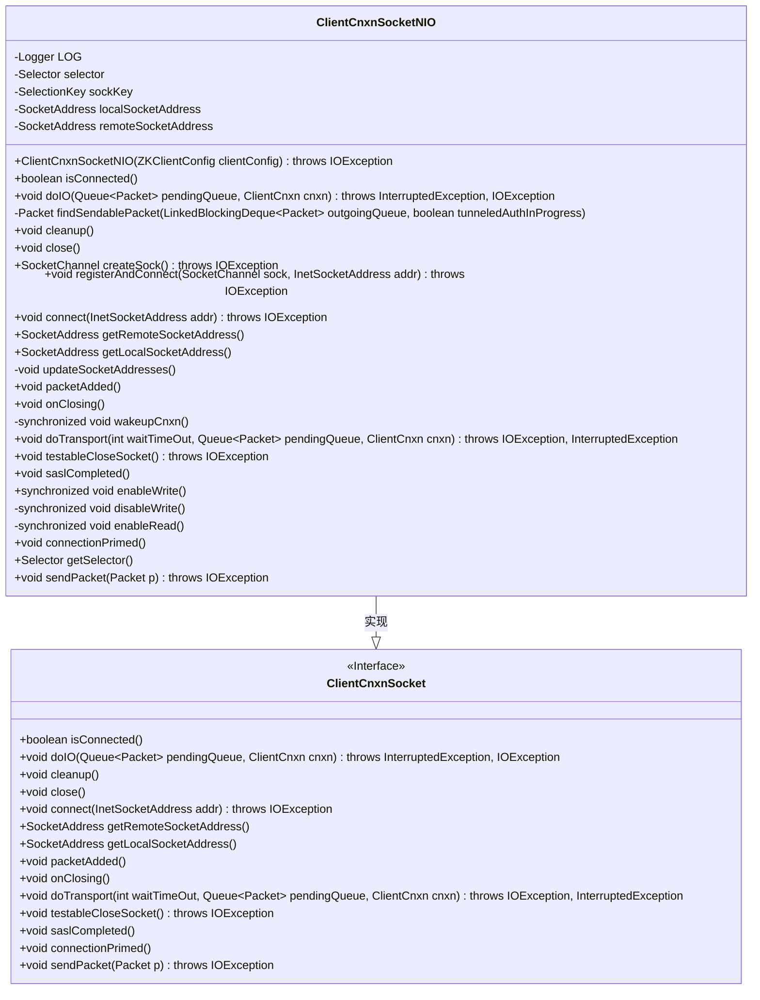

# 基础信息

|      |      |
|------|------|
| 名称 | ClientCnxnSocketNIO |
| 编码语言 | .java |
| 代码路径 | zookeeper/zookeeper-server/src/main/java/org/apache/zookeeper/ClientCnxnSocketNIO.java |
| 包名 | org.apache.zookeeper |
| 依赖项 | ['java.io.IOException', 'java.net.InetSocketAddress', 'java.net.Socket', 'java.net.SocketAddress', 'java.nio.ByteBuffer', 'java.nio.channels.SelectionKey', 'java.nio.channels.Selector', 'java.nio.channels.SocketChannel', 'java.nio.channels.UnresolvedAddressException', 'java.nio.channels.UnsupportedAddressTypeException', 'java.util.Iterator', 'java.util.Queue', 'java.util.Set', 'java.util.concurrent.LinkedBlockingDeque', 'org.apache.zookeeper.ClientCnxn.EndOfStreamException', 'org.apache.zookeeper.ClientCnxn.Packet', 'org.apache.zookeeper.ZooDefs.OpCode', 'org.apache.zookeeper.client.ZKClientConfig', 'org.slf4j.Logger', 'org.slf4j.LoggerFactory'] |
| 概述说明 | ClientCnxnSocketNIO类实现NIO客户端连接，处理读写、连接管理及SASL认证，包含socket创建、IO操作、数据包发送和清理功能。 |

# 说明

ClientCnxnSocketNIO是一个基于NIO的客户端连接套接字实现，用于管理ZooKeeper客户端与服务器的通信。它使用Selector处理I/O事件，支持读写操作，包括连接建立、数据发送和接收。类中封装了SocketChannel操作，如注册、连接、读写控制，并处理SASL认证流程。提供了连接状态检查、数据包队列管理、套接字清理等功能，同时维护本地和远程地址信息。通过SelectionKey动态控制读写兴趣集，确保高效网络通信。异常处理和资源清理机制完善，支持线程安全的连接唤醒和关闭操作。

# 类列表 Class Summary

| 名称   | 类型  | 说明 |
|-------|------|-------------|
| ClientCnxnSocketNIO | class | ClientCnxnSocketNIO是ZooKeeper客户端NIO实现，管理Socket连接、IO读写及网络事件处理，支持读写控制、连接状态维护和资源清理。 |

## 类 ClientCnxnSocketNIO

|      |      |
|------|------|
| 访问范围 | public |
| 类型 | class |
| 名称 | ClientCnxnSocketNIO |
| 说明 | ClientCnxnSocketNIO是ZooKeeper客户端NIO实现，管理Socket连接、IO读写及网络事件处理，支持读写控制、连接状态维护和资源清理。 |

### UML类图

类图描述：ClientCnxnSocketNIO是ClientCnxnSocket接口的具体实现类，采用NIO（非阻塞I/O）模式处理客户端网络连接。它通过Selector管理多个通道的I/O事件，核心功能包括连接建立、数据读写、Socket状态管理及异常处理。类中封装了NIO相关的底层操作，如SelectionKey管理、缓冲区操作和异步I/O事件处理，同时提供了线程安全的控制方法（如enableWrite/disableWrite）。该类主要用于ZooKeeper客户端的高性能网络通信场景。

### 内部方法调用关系图

```mermaid
graph TD
    A["类ClientCnxnSocketNIO"]
    B["属性: Selector selector"]
    C["属性: SelectionKey sockKey"]
    D["属性: SocketAddress localSocketAddress"]
    E["属性: SocketAddress remoteSocketAddress"]
    F["构造方法: ClientCnxnSocketNIO(ZKClientConfig)"]
    G["方法: boolean isConnected()"]
    H["方法: void doIO(Queue<Packet>, ClientCnxn)"]
    I["方法: Packet findSendablePacket(LinkedBlockingDeque<Packet>, boolean)"]
    J["方法: void cleanup()"]
    K["方法: void close()"]
    L["方法: SocketChannel createSock()"]
    M["方法: void registerAndConnect(SocketChannel, InetSocketAddress)"]
    N["方法: void connect(InetSocketAddress)"]
    O["方法: SocketAddress getRemoteSocketAddress()"]
    P["方法: SocketAddress getLocalSocketAddress()"]
    Q["方法: void updateSocketAddresses()"]
    R["方法: void packetAdded()"]
    S["方法: void onClosing()"]
    T["方法: void wakeupCnxn()"]
    U["方法: void doTransport(int, Queue<Packet>, ClientCnxn)"]
    V["方法: void testableCloseSocket()"]
    W["方法: void saslCompleted()"]
    X["方法: void enableWrite()"]
    Y["方法: void disableWrite()"]
    Z["方法: void enableRead()"]
    AA["方法: void connectionPrimed()"]
    AB["方法: Selector getSelector()"]
    AC["方法: void sendPacket(Packet)"]

    A --> B
    A --> C
    A --> D
    A --> E
    A --> F
    A --> G
    A --> H
    A --> I
    A --> J
    A --> K
    A --> L
    A --> M
    A --> N
    A --> O
    A --> P
    A --> Q
    A --> R
    A --> S
    A --> T
    A --> U
    A --> V
    A --> W
    A --> X
    A --> Y
    A --> Z
    A --> AA
    A --> AB
    A --> AC
```

这段代码是ZooKeeper客户端NIO套接字实现的核心类，主要负责管理客户端与服务器之间的网络连接和I/O操作。流程图展示了类结构和主要方法调用关系，包括连接建立、数据读写、资源清理等关键功能。该类通过Selector实现非阻塞I/O，处理网络事件如连接完成、可读/可写状态，并实现了连接超时、数据包发送、SASL认证等高级功能，是ZooKeeper客户端网络通信的基础组件。

### 字段列表 Field List

| 名称  | 类型  | 说明 |
|-------|-------|------|
| selector = Selector.open() | Selector | 私有最终变量selector通过Selector.open()方法初始化。 |
| localSocketAddress | SocketAddress | 私有SocketAddress类型的本地套接字地址变量。 |
| remoteSocketAddress | SocketAddress | 私有变量remoteSocketAddress，类型为SocketAddress，用于存储远程套接字地址。 |
| LOG = LoggerFactory.getLogger(ClientCnxnSocketNIO.class) | Logger | 私有静态日志常量LOG，用于ClientCnxnSocketNIO类的日志记录。 |
| sockKey | SelectionKey | 声明一个私有SelectionKey变量sockKey。 |

### 方法列表 Method List

| 名称  | 类型  | 说明 |
|-------|-------|------|
| packetAdded | void | 重写方法packetAdded，调用wakeupCnxn唤醒连接。 |
| onClosing | void | 方法重写，关闭时唤醒连接。 |
| findSendablePacket | Packet | 方法从队列中查找可发送的数据包：若队列为空返回null；若首包已开始发送或无需认证则返回首包；否则查找并移动认证所需空头包至队首返回，其余包待认证完成。 |
| enableWrite | void | 同步方法enableWrite检查套接字键的IO事件，若无写操作则添加写事件监听。 |
| registerAndConnect | void | 注册SocketChannel到选择器并连接地址，若立即连接成功则触发发送线程初始化。 |
| connectionPrimed | void | Java方法重写，当连接就绪时设置套接字键关注读写操作。 |
| createSock | SocketChannel | 创建非阻塞SocketChannel，禁用延迟和Linger选项。 |
| isConnected | boolean | 方法isConnected检查sockKey是否非空，返回布尔值表示连接状态。 |
| enableRead | void | 私有同步方法enableRead，检查并设置socketKey的读操作位，若无则添加。 |
| connect | void | Java方法覆盖connect，创建SocketChannel并尝试连接指定地址，失败时记录错误并关闭socket，最后重置缓冲区状态。 |
| testableCloseSocket | void | 方法testableCloseSocket安全关闭Socket通道，避免多线程竞争。先暂存sockKey再操作，非空时关闭对应通道。 |
| cleanup | void | 清理方法关闭Socket连接：取消键、关闭输入输出流、关闭套接字和通道，忽略异常，最后清空键并休眠100毫秒。 |
| updateSocketAddresses | void | 更新套接字地址：获取当前套接字的本地和远程地址并存储。 |
| doTransport | void | 方法doTransport处理网络传输：选择就绪通道，处理连接、读写事件，更新状态，发送数据包后清空选择键集。 |
| disableWrite | void | 私有同步方法，取消SocketKey的写操作监听。检查当前监听事件，若包含写操作则移除。 |
| wakeupCnxn | void | 私有同步方法，唤醒选择器连接。 |
| close | void | 关闭客户端选择器，记录跟踪日志，忽略关闭时的IO异常。 |
| doIO | void | 方法doIO处理Socket读写：检查可读时读取数据并处理连接结果或响应；可写时发送数据包并管理队列。异常时抛出IO错误或流结束异常。 |
| saslCompleted | void | 方法重写，sasl完成后启用写入功能。 |
| getRemoteSocketAddress | SocketAddress | 重写方法，返回远程Socket地址。 |
| getSelector | Selector | 获取选择器的方法，返回selector对象。 |
| getLocalSocketAddress | SocketAddress | 重写getLocalSocketAddress方法，返回本地套接字地址localSocketAddress。 |
| sendPacket | void | 覆盖方法sendPacket，检查SocketChannel非空后创建并发送ByteBuffer数据包，异常时抛出IOException。 |

