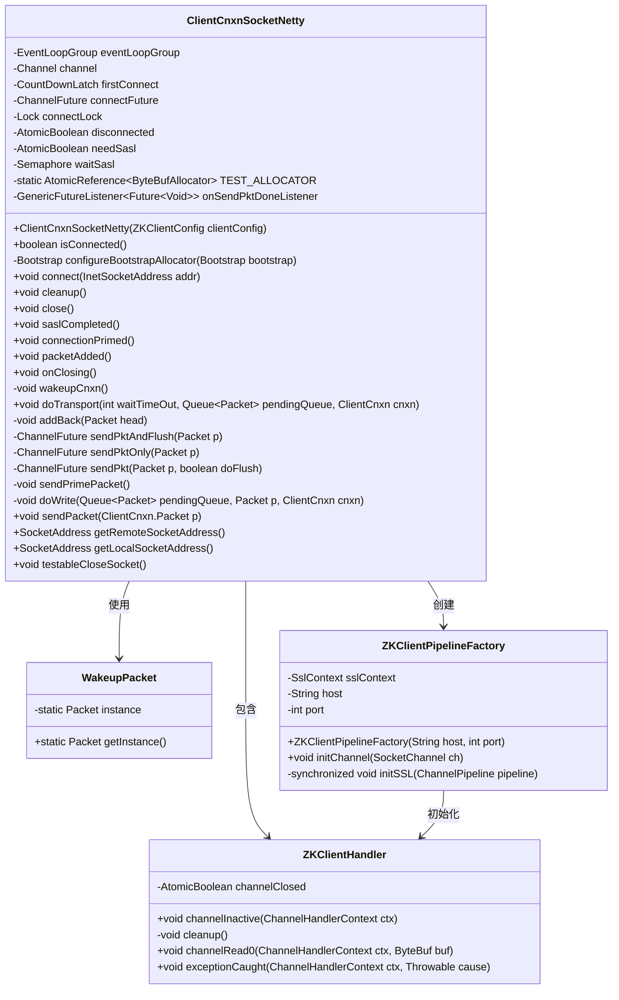
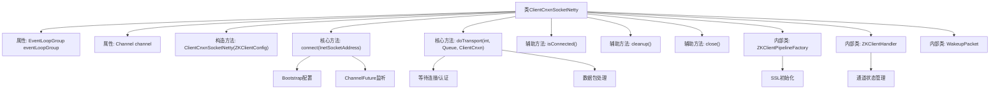
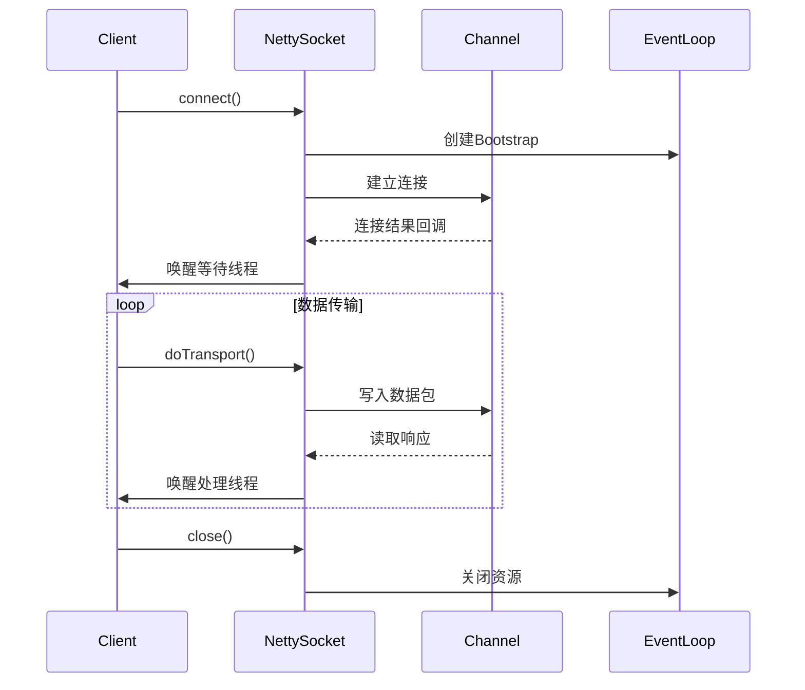

# 基础信息

|      |      |
|------|------|
| 名称 | ClientCnxnSocketNetty |
| 编码语言 | .java |
| 代码路径 | zookeeper/zookeeper-server/src/main/java/org/apache/zookeeper/ClientCnxnSocketNetty.java |
| 包名 | org.apache.zookeeper |
| 依赖项 | ['io.netty.bootstrap.Bootstrap', 'io.netty.buffer.ByteBuf', 'io.netty.buffer.ByteBufAllocator', 'io.netty.buffer.Unpooled', 'io.netty.channel.Channel', 'io.netty.channel.ChannelFuture', 'io.netty.channel.ChannelFutureListener', 'io.netty.channel.ChannelHandlerContext', 'io.netty.channel.ChannelInitializer', 'io.netty.channel.ChannelOption', 'io.netty.channel.ChannelPipeline', 'io.netty.channel.EventLoopGroup', 'io.netty.channel.SimpleChannelInboundHandler', 'io.netty.channel.socket.SocketChannel', 'io.netty.handler.ssl.SslContext', 'io.netty.util.concurrent.Future', 'io.netty.util.concurrent.GenericFutureListener', 'java.io.IOException', 'java.net.InetSocketAddress', 'java.net.SocketAddress', 'java.util.Iterator', 'java.util.Queue', 'java.util.concurrent.CountDownLatch', 'java.util.concurrent.Semaphore', 'java.util.concurrent.TimeUnit', 'java.util.concurrent.atomic.AtomicBoolean', 'java.util.concurrent.atomic.AtomicReference', 'java.util.concurrent.locks.Lock', 'java.util.concurrent.locks.ReentrantLock', 'javax.net.ssl.SSLException', 'org.apache.zookeeper.ClientCnxn.EndOfStreamException', 'org.apache.zookeeper.ClientCnxn.Packet', 'org.apache.zookeeper.client.ZKClientConfig', 'org.apache.zookeeper.common.ClientX509Util', 'org.apache.zookeeper.common.NettyUtils', 'org.apache.zookeeper.common.X509Exception', 'org.slf4j.Logger', 'org.slf4j.LoggerFactory'] |
| 概述说明 | ClientCnxnSocketNetty是ZooKeeper客户端基于Netty的网络连接实现，包含连接管理、数据包收发及SSL支持。核心功能包括连接建立、清理、数据读写及SASL认证处理，通过锁机制确保线程安全，支持异步IO操作。 |

# 说明

ClientCnxnSocketNetty是一个基于Netty框架实现的客户端网络连接类，用于处理与ZooKeeper服务器的通信。它包含连接管理、数据包发送、SSL支持等功能。主要组件包括EventLoopGroup、Channel、连接锁、原子状态标志等。关键方法包括connect()建立连接、doTransport()处理数据传输、cleanup()清理资源、sendPacket()发送数据包等。内部类ZKClientPipelineFactory负责初始化网络管道，ZKClientHandler处理网络事件。该类支持SASL认证，并通过锁机制确保线程安全，同时提供测试用的ByteBufAllocator配置接口。整体设计注重连接状态管理和异常处理。

# 类列表 Class Summary

| 名称   | 类型  | 说明 |
|-------|------|-------------|
| ClientCnxnSocketNetty | class | ClientCnxnSocketNetty是ZooKeeper客户端基于Netty的网络连接实现，包含连接管理、数据读写、SSL支持和SASL认证功能。 |

## 类 ClientCnxnSocketNetty

|      |      |
|------|------|
| 访问范围 | public |
| 类型 | class |
| 名称 | ClientCnxnSocketNetty |
| 说明 | ClientCnxnSocketNetty是ZooKeeper客户端基于Netty的网络连接实现，包含连接管理、数据读写、SSL支持和SASL认证功能。 |

### UML类图

这段代码实现了一个基于Netty的ZooKeeper客户端网络连接组件，主要功能包括：1) 使用Netty框架管理TCP连接；2) 处理SASL认证流程；3) 实现数据包的双向传输机制。核心类ClientCnxnSocketNetty通过事件循环组管理I/O操作，使用锁机制保证线程安全，并包含内部类处理SSL管道初始化和网络事件。整个设计采用非阻塞I/O模型，通过原子变量和同步工具实现多线程协调，同时提供了完善的连接生命周期管理和错误处理机制。

### 内部方法调用关系图

该流程图展示了ClientCnxnSocketNetty类的核心结构和交互关系。作为ZooKeeper客户端的Netty网络实现，它通过事件循环组管理异步IO操作，使用锁机制保证线程安全，包含完整的连接生命周期管理（连接建立、数据传输、异常处理和资源释放）。时序图则具体描述了连接建立过程和数据传输的异步交互机制，其中Bootstrap配置、ChannelFuture监听和SSL加密处理构成了关键路径。内部类ZKClientHandler负责处理网络事件和状态同步，体现了Netty的pipeline设计模式。

### 字段列表 Field List

| 名称  | 类型  | 说明 |
|-------|-------|------|
| channel | Channel | 私有通道变量channel声明。 |
| connectLock = new ReentrantLock() | Lock | 私有锁对象connectLock，使用可重入锁实现。 |
| LOG = LoggerFactory.getLogger(ClientCnxnSocketNetty.class) | Logger | 声明私有静态日志常量LOG，用于ClientCnxnSocketNetty类的日志记录。 |
| waitSasl = new Semaphore(0) | Semaphore | 私有信号量waitSasl初始化为0，用于同步控制。 |
| connectFuture | ChannelFuture | 私有成员变量connectFuture，类型为ChannelFuture。 |
| TEST_ALLOCATOR = new AtomicReference<>(null) | AtomicReference<ByteBufAllocator> | 私有静态原子引用TEST_ALLOCATOR初始化为空，用于存储ByteBufAllocator实例。 |
| disconnected = new AtomicBoolean() | AtomicBoolean | 声明一个私有不可变的AtomicBoolean变量disconnected，初始值为false。 |
| eventLoopGroup | EventLoopGroup | 私有最终事件循环组eventLoopGroup。 |
| firstConnect | CountDownLatch | 私有计数器锁，用于首次连接同步。 |
| onSendPktDoneListener = f -> {        if (f.isSuccess()) {            sentCount.getAndIncrement();        }    } | GenericFutureListener<Future<Void>> | 定义私有监听器onSendPktDoneListener，当异步操作成功时递增sentCount计数器。 |
| needSasl = new AtomicBoolean() | AtomicBoolean | 私有原子布尔变量needSasl，用于线程安全操作。 |

### 方法列表 Method List

| 名称  | 类型  | 说明 |
|-------|-------|------|
| sendPktOnly | ChannelFuture | 私有方法sendPktOnly发送数据包，调用sendPkt并返回ChannelFuture，可能抛出IOException。参数p为数据包，false表示不等待响应。 |
| connectionPrimed | void | 方法connectionPrimed被重写，当前为空实现。 |
| sendPrimePacket | void | 发送首个数据包并清空队列。 |
| close | void | 重写close方法，优雅关闭事件循环组。 |
| wakeupCnxn | void | 唤醒连接方法：检查Sasl认证需求并释放等待信号，若存在输出队列则添加唤醒包。 |
| cleanup | void | 清理方法：加锁后取消连接、关闭通道并清空队列中的唤醒包，最后释放锁。 |
| isConnected | boolean | 方法isConnected检查连接状态，使用锁确保线程安全，返回channel或connectFuture是否存在的布尔值。 |
| onClosing | void | 方法onClosing在关闭时执行：若firstConnect非空则计数减一，唤醒连接并记录日志"channel is told closing"。 |
| packetAdded | void | 覆盖方法packetAdded无操作，因添加数据包会自动唤醒netty连接，无需额外触发。 |
| sendPacket | void | 重写sendPacket方法，直接调用sendPktAndFlush发送数据包。 |
| sendPktAndFlush | ChannelFuture | 发送数据包并立即刷新，返回ChannelFuture，可能抛出IOException。 |
| doTransport | void | 方法doTransport处理传输逻辑：等待首次连接，检查SASL认证或获取队列数据包，验证连接状态，失败则回退数据包，成功则写入。最后更新状态。 |
| sendPkt | ChannelFuture | 方法sendPkt发送数据包，检查通道是否关闭，创建缓冲区并更新发送时间。根据doFlush决定立即发送或写入队列，添加发送完成监听器后返回结果。异常时抛出IO错误。 |
| addBack | void | 私有方法addBack将非空且非唤醒包的数据包head添加到outgoingQueue队列头部。 |
| saslCompleted | void | 方法saslCompleted完成SASL认证后，将needSasl设为false并释放waitSasl信号。 |
| configureBootstrapAllocator | Bootstrap | 私有方法`configureBootstrapAllocator`根据测试分配器是否存在配置Bootstrap的分配器选项。存在则设置，否则返回原Bootstrap。 |
| connect | void | 方法connect使用Netty建立TCP连接，配置Bootstrap参数，处理连接成功或失败逻辑，更新状态并唤醒等待线程。 |
| doWrite | void | 私有方法doWrite处理数据包写入：更新状态，循环发送非唤醒包，设置请求头xid并加入待处理队列，发送包后检查空队列跳出循环，最后若有发送则刷新通道。 |
| getRemoteSocketAddress | SocketAddress | 方法getRemoteSocketAddress返回通道的远程地址。若通道为空则返回null。 |
| getLocalSocketAddress | SocketAddress | 获取通道本地地址，若通道为空则返回空。 |
| testableCloseSocket | void | 重写方法testableCloseSocket，异步断开非空channel连接并等待完成。 |
| setTestAllocator | void | 静态方法setTestAllocator用于设置测试用的ByteBufAllocator，通过线程局部变量TEST_ALLOCATOR存储。 |
| clearTestAllocator | void | 清除测试分配器，将TEST_ALLOCATOR设为null。 |

