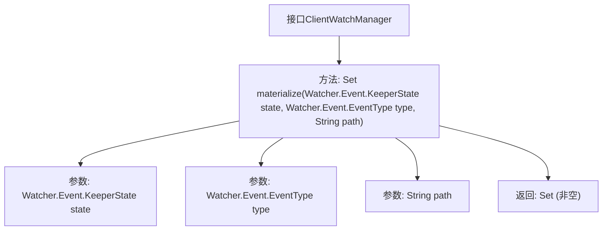

# 基础信息

|      |      |
|------|------|
| 名称 | ClientWatchManager |
| 编码语言 | .java |
| 代码路径 | zookeeper/zookeeper-server/src/main/java/org/apache/zookeeper/ClientWatchManager.java |
| 包名 | org.apache.zookeeper |
| 依赖项 | ['java.util.Set'] |
| 概述说明 | 客户端观察管理器接口，定义materialize方法，返回需通知的观察者集合，调用方负责实际通知，内部状态会更新。参数包括状态、类型和路径，返回非空集合。 |

# 说明

ClientWatchManager接口定义了一个materialize方法，用于返回需要被通知事件的观察者集合。该方法不直接通知观察者，但会更新内部结构，仿佛观察者已被触发。调用者负责后续通知工作。方法参数包括事件状态、类型和路径，返回值是非空的观察者集合，可能为空集。

# 类列表 Class Summary

| 名称   | 类型  | 说明 |
|-------|------|-------------|
| ClientWatchManager | interface | 客户端观察管理器接口，定义materialize方法，返回需通知的观察者集合，不触发通知但更新内部状态，调用者负责后续通知。参数包括状态、类型和路径，返回非空集合。 |


## 类 ClientWatchManager

|      |      |
|------|------|
| 访问范围 | public |
| 类型 | interface |
| 名称 | ClientWatchManager |
| 说明 | 客户端观察管理器接口，定义materialize方法，返回需通知的观察者集合，不触发通知但更新内部状态，调用者负责后续通知。参数包括状态、类型和路径，返回非空集合。 |


### UML类图

```mermaid
classDiagram
    class ClientWatchManager {
        <<Interface>>
        +Set~Watcher~ materialize(Watcher$Event$KeeperState state, Watcher$Event$EventType type, String path)
    }

    class Watcher {
        <<Interface>>
    }

    class "Watcher$Event" {
        <<Interface>>
    }

    ClientWatchManager --> Watcher : 依赖
    ClientWatchManager --> "Watcher$Event" : 依赖
```

这段类图展示了ClientWatchManager接口及其相关依赖关系。ClientWatchManager是一个接口，定义了materialize方法，该方法接收状态、事件类型和路径参数，返回一组Watcher对象。Watcher和Watcher$Event也是接口，分别表示监听器和事件类型。ClientWatchManager依赖于这两个接口来完成其功能，体现了观察者模式的设计思路，用于管理监听器并处理事件通知。


### 内部方法调用关系图



这段流程图描述了ClientWatchManager接口的核心结构，聚焦于materialize方法的定义和参数传递关系。该接口作为观察者模式的管理器，通过materialize方法在特定事件发生时（状态变更、事件类型、路径触发）返回待通知的Watcher集合，但不实际执行通知操作。流程图清晰展示了方法签名、三个关键参数（状态、类型、路径）以及必须返回非空集合的约束条件，体现了接口对观察者触发逻辑的抽象控制能力。

### 字段列表 Field List

| 名称  | 类型  | 说明 |
|-------|-------|------|

### 方法列表 Method List

| 名称  | 类型  | 说明 |
|-------|-------|------|
| materialize | Set<Watcher> | 方法materialize根据状态、事件类型和路径生成Watcher集合。 |


