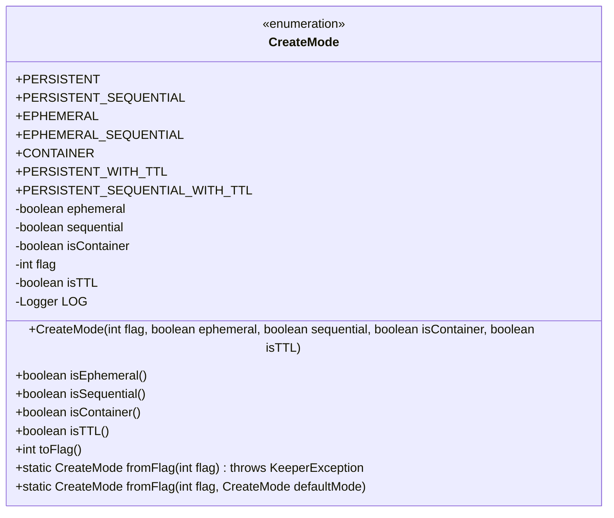

# 基础信息

|      |      |
|------|------|
| 名称 | CreateMode |
| 编码语言 | .java |
| 代码路径 | zookeeper/zookeeper-server/src/main/java/org/apache/zookeeper/CreateMode.java |
| 包名 | org.apache.zookeeper |
| 依赖项 | ['org.apache.yetus.audience.InterfaceAudience', 'org.slf4j.Logger', 'org.slf4j.LoggerFactory'] |
| 概述说明 | CreateMode枚举定义了ZooKeeper节点类型：持久、临时、容器及带TTL的变体，支持顺序编号，提供标志转换方法。 |

# 说明

这是一个描述ZooKeeper中CreateMode枚举类的总结。该枚举定义了七种节点创建模式：PERSISTENT（持久节点，客户端断开不删除）、PERSISTENT_SEQUENTIAL（持久顺序节点，名称追加递增数字）、EPHEMERAL（临时节点，客户端断开删除）、EPHEMERAL_SEQUENTIAL（临时顺序节点，名称追加递增数字）、CONTAINER（容器节点，子节点删除后可能被服务器删除）、PERSISTENT_WITH_TTL（带TTL的持久节点，未修改且无子节点时删除）、PERSISTENT_SEQUENTIAL_WITH_TTL（带TTL的持久顺序节点）。类提供了方法检查节点属性（如是否临时、顺序等），并支持通过标志值与枚举值互相转换。

# 类列表 Class Summary

| 名称   | 类型  | 说明 |
|-------|------|-------------|
| CreateMode | enum | CreateMode枚举定义了ZooKeeper节点创建模式：持久、临时、容器及带TTL的变体，支持顺序编号，提供标志转换方法。 |

## 类 CreateMode

|      |      |
|------|------|
| 访问范围 | @InterfaceAudience.Public;public |
| 类型 | enum |
| 名称 | CreateMode |
| 说明 | CreateMode枚举定义了ZooKeeper节点创建模式：持久、临时、容器及带TTL的变体，支持顺序编号，提供标志转换方法。 |

### UML类图

这段代码定义了一个枚举类`CreateMode`，用于表示ZooKeeper节点创建的不同模式。枚举值包括持久化节点、顺序节点、临时节点等7种类型，每种类型通过构造器初始化不同的属性组合（如是否临时、是否顺序等）。类提供了将整型标志转换为枚举值的方法`fromFlag()`，以及获取各属性的方法（如`isEphemeral()`）。该类主要用于控制ZooKeeper节点的生命周期特性和命名规则，例如临时节点会在客户端断开时自动删除，顺序节点会附加单调递增编号。

### 内部方法调用关系图

```mermaid
graph TD
    A["枚举类CreateMode"]
    B["枚举值: PERSISTENT(0, false, false, false, false)"]
    C["枚举值: PERSISTENT_SEQUENTIAL(2, false, true, false, false)"]
    D["枚举值: EPHEMERAL(1, true, false, false, false)"]
    E["枚举值: EPHEMERAL_SEQUENTIAL(3, true, true, false, false)"]
    F["枚举值: CONTAINER(4, false, false, true, false)"]
    G["枚举值: PERSISTENT_WITH_TTL(5, false, false, false, true)"]
    H["枚举值: PERSISTENT_SEQUENTIAL_WITH_TTL(6, false, true, false, true)"]
    I["属性: boolean ephemeral"]
    J["属性: boolean sequential"]
    K["属性: boolean isContainer"]
    L["属性: int flag"]
    M["属性: boolean isTTL"]
    N["构造方法: CreateMode(int, boolean, boolean, boolean, boolean)"]
    O["方法: isEphemeral()"]
    P["方法: isSequential()"]
    Q["方法: isContainer()"]
    R["方法: isTTL()"]
    S["方法: toFlag()"]
    T["静态方法: fromFlag(int) throws KeeperException"]
    U["静态方法: fromFlag(int, CreateMode)"]

    A --> B
    A --> C
    A --> D
    A --> E
    A --> F
    A --> G
    A --> H
    A --> I
    A --> J
    A --> K
    A --> L
    A --> M
    A --> N
    A --> O
    A --> P
    A --> Q
    A --> R
    A --> S
    A --> T
    A --> U
```

该流程图展示了ZooKeeper的CreateMode枚举类结构，包含7种节点创建模式枚举值（如持久节点、临时节点等），5个核心属性（如ephemeral标志、sequential标志等），1个构造方法和8个实例/静态方法。重点描述了不同创建模式的特性转换逻辑，特别是fromFlag()方法实现了整型标识到枚举值的双向映射，并处理异常情况。该枚举类主要用于控制ZooKeeper节点的生命周期特性和命名规则。

### 字段列表 Field List

| 名称  | 类型  | 说明 |
|-------|-------|------|

### 方法列表 Method List

| 名称  | 类型  | 说明 |
|-------|-------|------|

