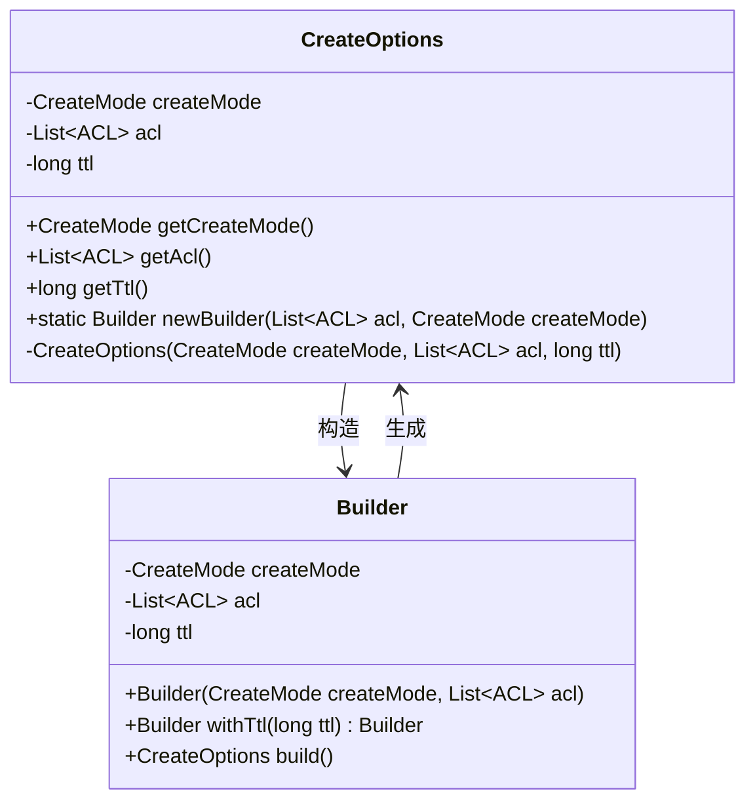
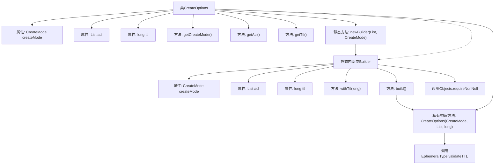

# 基础信息

|      |      |
|------|------|
| 名称 | CreateOptions |
| 编码语言 | .java |
| 代码路径 | zookeeper/zookeeper-server/src/main/java/org/apache/zookeeper/CreateOptions.java |
| 包名 | org.apache.zookeeper |
| 依赖项 | ['java.util.List', 'java.util.Objects', 'org.apache.zookeeper.data.ACL', 'org.apache.zookeeper.server.EphemeralType'] |
| 概述说明 | CreateOptions类用于创建节点配置，包含创建模式、ACL列表和TTL属性，通过Builder模式构建实例并验证参数。 |

# 说明

这是一个用于创建节点选项的Java类，包含三个主要属性：创建模式、访问控制列表和生存时间。类提供了获取这些属性的方法，并通过构建器模式构造实例。构建器允许设置生存时间并验证其有效性。创建模式指定节点是否为临时或顺序节点，访问控制列表定义节点权限，生存时间控制节点存在时长。构建时强制要求提供创建模式和访问控制列表。

# 类列表 Class Summary

| 名称   | 类型  | 说明 |
|-------|------|-------------|
| CreateOptions | class | CreateOptions类用于创建节点配置，包含创建模式、ACL列表和TTL参数，通过Builder模式构建实例并验证参数有效性。 |

## 类 CreateOptions

|      |      |
|------|------|
| 访问范围 | public |
| 类型 | class |
| 名称 | CreateOptions |
| 说明 | CreateOptions类用于创建节点配置，包含创建模式、ACL列表和TTL参数，通过Builder模式构建实例并验证参数有效性。 |

### UML类图

这段代码展示了一个典型的建造者模式实现，用于创建不可变的CreateOptions对象。CreateOptions类封装了节点创建的配置参数（创建模式、ACL列表和TTL值），通过私有的构造方法确保线程安全性。Builder内部类提供了链式调用的方式来逐步构建CreateOptions对象，其中newBuilder()是入口方法，withTtl()用于设置可选参数，build()执行最终的对象构建和参数验证。类图清晰地反映了这种设计模式中建造者与被建造对象之间的关系。

### 内部方法调用关系图

这段代码展示了一个典型的Builder模式实现，用于创建不可变的CreateOptions对象。流程图清晰地展示了主类CreateOptions及其静态内部类Builder的结构关系，包括属性、方法调用和验证逻辑。主类包含三个final属性和对应的getter方法，通过Builder类进行构造，Builder提供了链式调用的withTtl()方法和最终的build()方法，在构造过程中会进行非空校验和TTL验证。

### 字段列表 Field List

| 名称  | 类型  | 说明 |
|-------|-------|------|
| acl | List<ACL> | 私有成员变量，存储ACL列表。 |
| ttl | long | 私有长整型变量ttl，用于存储生存时间值。 |
| createMode | CreateMode | 私有不可变的创建模式变量。 |

### 方法列表 Method List

| 名称  | 类型  | 说明 |
|-------|-------|------|
| getAcl | List<ACL> | 获取ACL列表的方法，直接返回成员变量acl的值。 |
| getCreateMode | CreateMode | 方法getCreateMode返回createMode的值。 |
| getTtl | long | 这是一个Java方法，返回长整型变量ttl的值。 |
| newBuilder | Builder | 创建Builder静态方法，接收ACL列表和CreateMode参数，返回新Builder实例。 |

