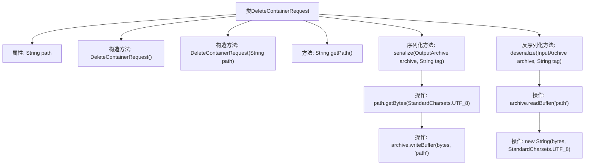

# 基础信息

|      |      |
|------|------|
| 名称 | DeleteContainerRequest |
| 编码语言 | .java |
| 代码路径 | zookeeper/zookeeper-server/src/main/java/org/apache/zookeeper/DeleteContainerRequest.java |
| 包名 | org.apache.zookeeper |
| 依赖项 | ['java.io.IOException', 'java.nio.charset.StandardCharsets', 'org.apache.jute.InputArchive', 'org.apache.jute.OutputArchive', 'org.apache.jute.Record'] |
| 概述说明 | 删除容器请求类，包含路径属性，提供序列化和反序列化方法。 |

# 说明

该内容定义了一个名为DeleteContainerRequest的公共类，实现了Record接口。类中包含一个私有字符串字段path，提供无参构造方法和带path参数的构造方法。提供了getPath方法获取path值。类重写了serialize和deserialize方法，分别用于将path字段以UTF-8编码序列化到输出存档，以及从输入存档中读取字节数组并解码为字符串赋值给path。整个过程处理了可能抛出的IOException异常。

# 类列表 Class Summary

| 名称   | 类型  | 说明 |
|-------|------|-------------|
| DeleteContainerRequest | class | DeleteContainerRequest类实现Record接口，包含路径字段path，提供构造方法、getter及序列化/反序列化方法。 |


## 类 DeleteContainerRequest

|      |      |
|------|------|
| 访问范围 | public |
| 类型 | class |
| 名称 | DeleteContainerRequest |
| 说明 | DeleteContainerRequest类实现Record接口，包含路径字段path，提供构造方法、getter及序列化/反序列化方法。 |


### UML类图

```mermaid
classDiagram
    class DeleteContainerRequest {
        -String path
        +DeleteContainerRequest()
        +DeleteContainerRequest(String path)
        +String getPath()
        +void serialize(OutputArchive archive, String tag) throws IOException
        +void deserialize(InputArchive archive, String tag) throws IOException
    }
    <<Interface>> Record
    DeleteContainerRequest ..|> Record : 实现
```

这段类图展示了DeleteContainerRequest类的结构，该类实现了Record接口。主要包含一个私有字符串字段path，两个构造函数（默认构造和带参构造），以及获取path的公有方法getPath()。此外，实现了Record接口的serialize和deserialize方法，用于序列化和反序列化操作，处理UTF-8编码的字节数据转换。类与接口之间用实线空心三角箭头表示实现关系，符合UML规范。


### 内部方法调用关系图



这段代码定义了一个DeleteContainerRequest类，实现了Record接口，主要用于处理容器删除请求的序列化和反序列化。类包含路径属性、两个构造方法、获取路径方法，以及关键的序列化/反序列化方法。序列化时将路径转为UTF-8字节写入存档，反序列化时则读取字节并转换回字符串。流程图清晰展示了类结构和方法间的调用关系，特别是序列化/反序列化过程中的数据转换步骤。

### 字段列表 Field List

| 名称  | 类型  | 说明 |
|-------|-------|------|
| path | String | 私有字符串变量path。 |

### 方法列表 Method List

| 名称  | 类型  | 说明 |
|-------|-------|------|
| getPath | String | 这是一个Java方法，返回字符串类型的path变量值。 |
| serialize | void | 重写serialize方法，将path转为UTF-8字节写入archive。 |
| deserialize | void | Java方法：从输入存档读取UTF-8字符串并赋值给path变量。 |


