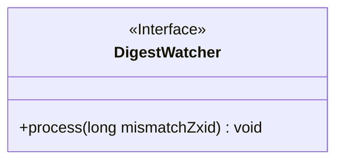
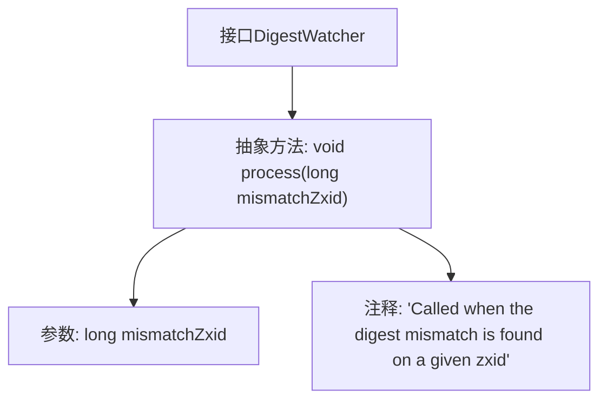

# 基础信息

|      |      |
|------|------|
| 名称 | DigestWatcher |
| 编码语言 | .java |
| 代码路径 | zookeeper/zookeeper-server/src/main/java/org/apache/zookeeper/DigestWatcher.java |
| 包名 | org.apache.zookeeper |
| 依赖项 | [] |
| 概述说明 | 摘要：DigestWatcher接口定义方法process，在zxid摘要不匹配时触发，参数为不匹配的zxid。 |

# 说明

这是一个名为DigestWatcher的公共接口，定义了一个处理摘要不匹配的方法。当在特定zxid（ZooKeeper事务ID）上发现摘要不匹配时，会调用process方法。该方法接受一个long类型的参数mismatchZxid，表示发生摘要不匹配时的zxid值。接口没有提供具体实现，仅声明了方法签名。

# 类列表 Class Summary

| 名称   | 类型  | 说明 |
|-------|------|-------------|
| DigestWatcher | interface | 摘要：DigestWatcher接口定义方法process，在zxid校验不匹配时调用，参数为不匹配的zxid。 |

## 类 DigestWatcher

|      |      |
|------|------|
| 访问范围 | public |
| 类型 | interface |
| 名称 | DigestWatcher |
| 说明 | 摘要：DigestWatcher接口定义方法process，在zxid校验不匹配时调用，参数为不匹配的zxid。 |

### UML类图

这段代码定义了一个名为`DigestWatcher`的接口，该接口包含一个方法`process`，用于处理在特定`zxid`（ZooKeeper事务ID）发生摘要不匹配时的逻辑。接口作为抽象规范，要求实现类必须提供`process`方法的具体实现，用于响应摘要校验失败的事件。该设计常用于分布式系统中数据一致性检查的场景，通过回调机制通知监控方处理异常情况。

### 内部方法调用关系图

这段流程图描述了DigestWatcher接口的结构，该接口定义了一个处理摘要不匹配事件的抽象方法process。方法接收表示发生不匹配时的zxid（ZooKeeper事务ID）的长整型参数，并通过注释说明该方法在检测到摘要不匹配时被调用。接口作为抽象类型，强制实现类必须提供具体的过程处理逻辑。

### 字段列表 Field List

| 名称  | 类型  | 说明 |
|-------|-------|------|

### 方法列表 Method List

| 名称  | 类型  | 说明 |
|-------|-------|------|
| process | void | 处理长整型参数mismatchZxid的方法。 |

