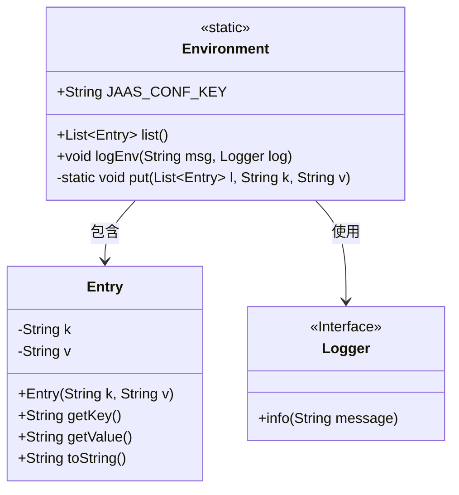
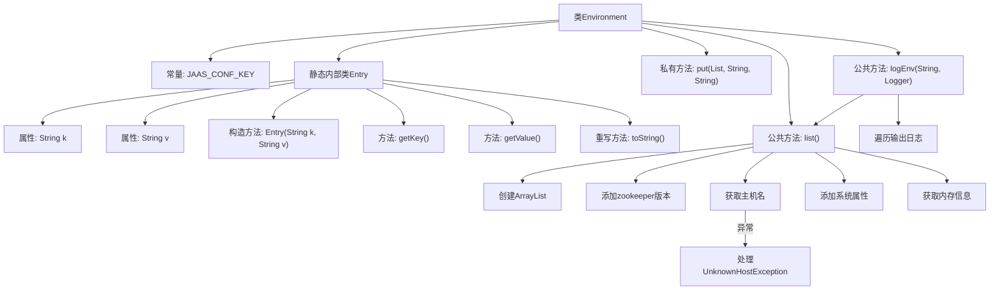

# 基础信息

|      |      |
|------|------|
| 名称 | Environment |
| 编码语言 | .java |
| 代码路径 | zookeeper/zookeeper-server/src/main/java/org/apache/zookeeper/Environment.java |
| 包名 | org.apache.zookeeper |
| 依赖项 | ['java.net.InetAddress', 'java.net.UnknownHostException', 'java.util.ArrayList', 'java.util.List', 'org.slf4j.Logger'] |
| 概述说明 | Java类Environment用于收集系统环境信息，包括Java版本、主机名、操作系统、用户信息和JVM内存等，并提供日志记录功能。 |

# 说明

该代码定义了一个Environment类，用于收集和记录系统环境信息。包含一个内部类Entry用于存储键值对，以及静态方法list()用于获取包括ZooKeeper版本、主机名、Java属性、操作系统信息、用户信息和JVM内存使用情况等详细环境数据。方法logEnv()可将这些信息通过日志输出。所有属性值都有默认值"<NA>"以防获取失败。

# 类列表 Class Summary

| 名称   | 类型  | 说明 |
|-------|------|-------------|
| Environment | class | 环境信息工具类，包含键值对Entry内部类，提供系统属性、内存信息收集功能，支持日志记录。 |

## 类 Environment

|      |      |
|------|------|
| 访问范围 | public |
| 类型 | class |
| 名称 | Environment |
| 说明 | 环境信息工具类，包含键值对Entry内部类，提供系统属性、内存信息收集功能，支持日志记录。 |

### UML类图

这段代码定义了一个环境信息收集工具类Environment，包含静态内部类Entry用于存储键值对。Environment类提供了list()方法收集系统环境信息（包括Java版本、操作系统、内存等），以及logEnv()方法将信息输出到日志。Entry类封装了键值对数据并提供了toString()方法。Logger接口用于日志记录，Environment类依赖Logger接口实现日志输出功能。

### 内部方法调用关系图

这段代码流程图展示了Environment类的完整结构，包含静态内部类Entry的定义和三个核心方法。list()方法通过收集系统环境信息(包括主机名、Java属性、内存状态等)构建Entry列表，logEnv()方法则遍历该列表输出日志。流程特别处理了主机名获取时的异常情况，并系统化地组织了各类环境参数的收集过程，最终以键值对形式输出。

### 字段列表 Field List

| 名称  | 类型  | 说明 |
|-------|-------|------|
| JAAS_CONF_KEY = "java.security.auth.login.config" | String | JAAS配置键常量，用于指定Java安全认证配置文件路径。 |

### 方法列表 Method List

| 名称  | 类型  | 说明 |
|-------|-------|------|
| put | void | 私有静态方法`put`，向列表`l`添加键值对`k`和`v`的新条目。 |
| list | List<Entry> | 静态方法list()收集系统信息，包括Zookeeper版本、主机名、Java环境、操作系统、用户目录及JVM内存使用情况，返回Entry列表。 |
| logEnv | void | 静态方法logEnv接收消息和日志对象，遍历环境变量列表并逐一记录为日志信息。 |

