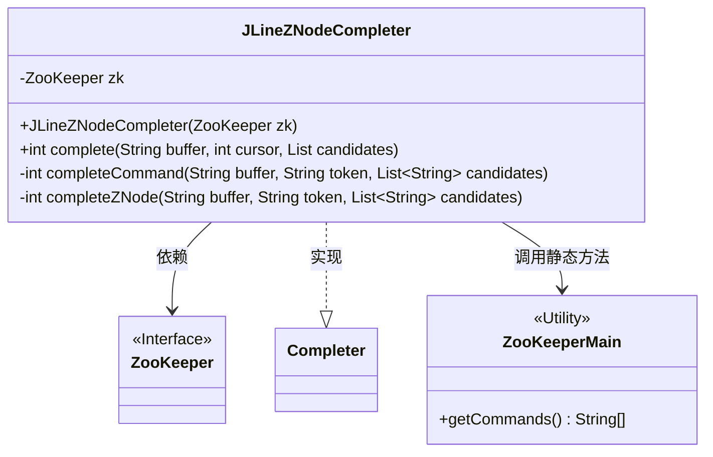
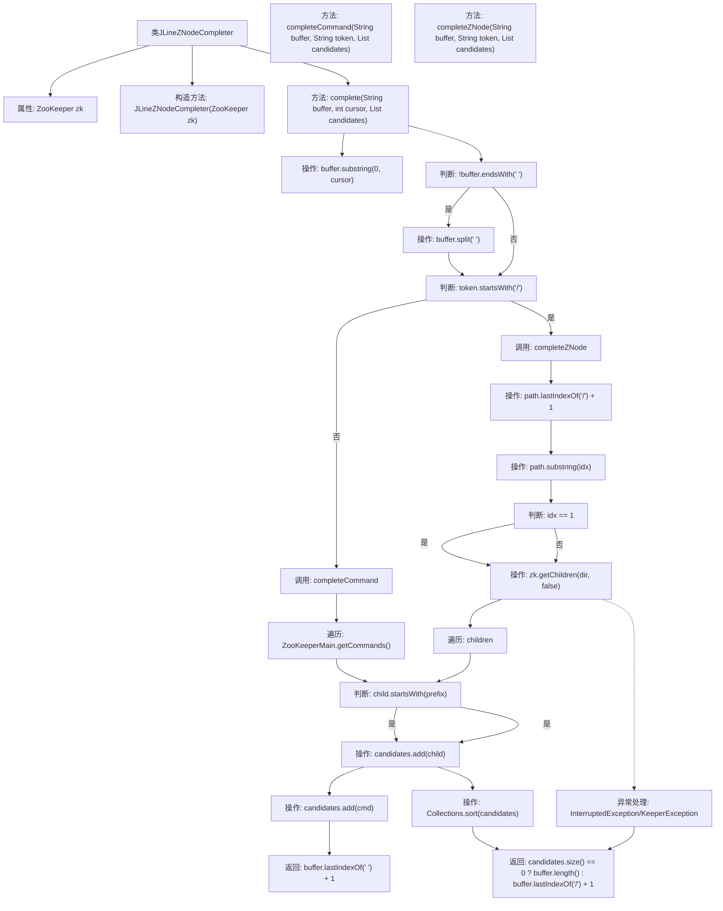

# 基础信息

|      |      |
|------|------|
| 名称 | JLineZNodeCompleter |
| 编码语言 | .java |
| 代码路径 | zookeeper/zookeeper-server/src/main/java/org/apache/zookeeper/JLineZNodeCompleter.java |
| 包名 | org.apache.zookeeper |
| 依赖项 | ['java.util.Collections', 'java.util.List', 'jline.console.completer.Completer'] |
| 概述说明 | JLineZNodeCompleter类实现ZooKeeper节点路径和命令的自动补全功能，通过解析输入路径或命令前缀匹配候选列表。 |

# 说明

JLineZNodeCompleter是一个实现Completer接口的类，用于为ZooKeeper命令行工具提供自动补全功能。它通过构造函数接收ZooKeeper实例，并实现complete方法处理补全逻辑。该方法根据输入缓冲区内容判断是补全ZooKeeper命令还是ZNode路径。补全命令时匹配ZooKeeperMain中的命令列表；补全ZNode路径时通过getChildren获取子节点并筛选匹配项。处理过程中会捕获InterruptedException和KeeperException异常，最后对候选结果排序并返回补全位置。

# 类列表 Class Summary

| 名称   | 类型  | 说明 |
|-------|------|-------------|
| JLineZNodeCompleter | class | JLineZNodeCompleter类实现命令和ZNode路径自动补全功能，基于ZooKeeper子节点和命令前缀匹配生成候选列表。 |

## 类 JLineZNodeCompleter

|      |      |
|------|------|
| 访问范围 | None |
| 类型 | class |
| 名称 | JLineZNodeCompleter |
| 说明 | JLineZNodeCompleter类实现命令和ZNode路径自动补全功能，基于ZooKeeper子节点和命令前缀匹配生成候选列表。 |

### UML类图

类图描述：JLineZNodeCompleter是一个实现了Completer接口的类，用于ZooKeeper路径和命令的自动补全。它包含一个ZooKeeper实例作为私有成员，通过complete()方法处理补全逻辑，内部通过completeCommand()和completeZNode()分别处理命令补全和ZNode路径补全。该类依赖ZooKeeper接口获取子节点数据，并调用ZooKeeperMain的静态方法获取可用命令列表。

### 内部方法调用关系图

这段代码流程图描述了JLineZNodeCompleter类的完整工作流程。该类主要用于实现ZooKeeper命令行补全功能，包含三个核心方法：complete()作为入口方法，根据输入内容判断是补全ZNode路径还是命令；completeCommand()处理命令补全逻辑，遍历所有可用命令进行匹配；completeZNode()处理ZNode路径补全，通过ZooKeeper API获取子节点并筛选匹配项。流程中包含了字符串处理、条件判断、异常捕获以及结果排序等关键步骤，最终返回补全建议列表和光标位置。整个流程体现了对ZooKeeper命令行交互的智能补全支持。

### 字段列表 Field List

| 名称  | 类型  | 说明 |
|-------|-------|------|
| zk | ZooKeeper | 私有ZooKeeper实例变量zk。 |

### 方法列表 Method List

| 名称  | 类型  | 说明 |
|-------|-------|------|
| complete | int | 方法complete处理字符串补全，根据光标位置提取末词段，若以/开头则补全ZNode，否则补全命令。 |
| completeCommand | int | 方法completeCommand用于补全命令：遍历ZooKeeper命令列表，匹配以token开头的命令并加入候选列表，返回buffer中最后一个空格后的位置。 |
| completeZNode | int | 方法completeZNode通过ZooKeeper获取子节点，匹配前缀并排序候选列表。成功返回匹配位置，失败返回0。 |

