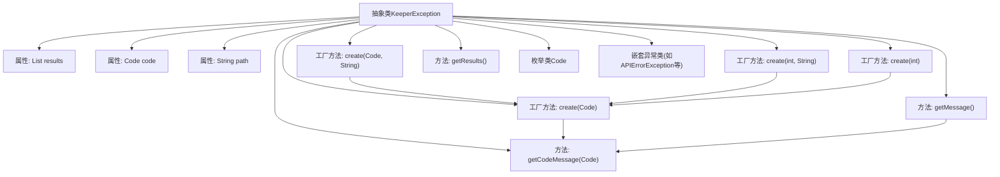

# 基础信息

|      |      |
|------|------|
| 名称 | KeeperException |
| 编码语言 | .java |
| 代码路径 | zookeeper/zookeeper-server/src/main/java/org/apache/zookeeper/KeeperException.java |
| 包名 | org.apache.zookeeper |
| 依赖项 | ['java.util.ArrayList', 'java.util.EnumSet', 'java.util.HashMap', 'java.util.List', 'java.util.Map', 'org.apache.yetus.audience.InterfaceAudience'] |
| 概述说明 | KeeperException是ZooKeeper的公共异常基类，包含多种错误代码和对应子类，用于处理系统错误、API错误和会话问题等。支持多请求结果存储和错误路径记录。 |

# 说明

KeeperException是一个抽象公共异常类，用于表示ZooKeeper操作中的各种错误。它包含错误码枚举Code、路径信息path和多请求结果列表results。通过工厂方法create可创建特定异常实例，支持多种错误类型如系统错误、连接丢失、会话过期等。每个错误类型有对应的异常子类，如ConnectionLossException、SessionExpiredException等。异常信息包含错误码描述和关联路径，3.1.0版本后废弃了部分旧API，改用枚举替代整型错误码。多请求异常可保留部分结果供检查。

# 类列表 Class Summary

| 名称   | 类型  | 说明 |
|-------|------|-------------|
| KeeperException | class | KeeperException是ZooKeeper的异常基类，包含多种错误类型如连接丢失、节点不存在等，通过枚举Code定义错误码，提供工厂方法创建具体异常，支持多请求结果存储。 |


## 类 KeeperException

|      |      |
|------|------|
| 访问范围 | @InterfaceAudience.Public;public abstract |
| 类型 | class |
| 名称 | KeeperException |
| 说明 | KeeperException是ZooKeeper的异常基类，包含多种错误类型如连接丢失、节点不存在等，通过枚举Code定义错误码，提供工厂方法创建具体异常，支持多请求结果存储。 |


### UML类图

```mermaid
classDiagram
    class KeeperException {
        <<abstract>>
        -List~OpResult~ results
        -Code code
        -String path
        +KeeperException(Code code)
        +KeeperException(Code code, String path)
        +static KeeperException create(Code code) KeeperException
        +static KeeperException create(Code code, String path) KeeperException
        +static KeeperException create(int code) KeeperException
        +static KeeperException create(int code, String path) KeeperException
        +void setCode(int code)
        +int getCode()
        +Code code()
        +String getPath()
        +String getMessage()
        +void setMultiResults(List~OpResult~ results)
        +List~OpResult~ getResults()
    }

    class Code {
        <<enumeration>>
        +OK
        +SYSTEMERROR
        +RUNTIMEINCONSISTENCY
        +DATAINCONSISTENCY
        +CONNECTIONLOSS
        +MARSHALLINGERROR
        +UNIMPLEMENTED
        +OPERATIONTIMEOUT
        +BADARGUMENTS
        +NEWCONFIGNOQUORUM
        +RECONFIGINPROGRESS
        +UNKNOWNSESSION
        +APIERROR
        +NONODE
        +NOAUTH
        +BADVERSION
        +NOCHILDRENFOREPHEMERALS
        +NODEEXISTS
        +NOTEMPTY
        +SESSIONEXPIRED
        +INVALIDCALLBACK
        +INVALIDACL
        +AUTHFAILED
        +SESSIONMOVED
        +NOTREADONLY
        +EPHEMERALONLOCALSESSION
        +NOWATCHER
        +RECONFIGDISABLED
        +SESSIONCLOSEDREQUIRESASLAUTH
        +REQUESTTIMEOUT
        +QUOTAEXCEEDED
        +THROTTLEDOP
        +int intValue()
        +static Code get(int code)
    }

    interface CodeDeprecated {
        <<Interface>>
        +Ok
        +SystemError
        +RuntimeInconsistency
        +DataInconsistency
        +ConnectionLoss
        +MarshallingError
        +Unimplemented
        +OperationTimeout
        +BadArguments
        +UnknownSession
        +NewConfigNoQuorum
        +ReconfigInProgress
        +APIError
        +NoNode
        +NoAuth
        +BadVersion
        +NoChildrenForEphemerals
        +NodeExists
        +NotEmpty
        +SessionExpired
        +InvalidCallback
        +InvalidACL
        +AuthFailed
        +EphemeralOnLocalSession
    }

    class APIErrorException
    class AuthFailedException
    class BadArgumentsException
    class BadVersionException
    class ConnectionLossException
    class DataInconsistencyException
    class InvalidACLException
    class InvalidCallbackException
    class MarshallingErrorException
    class NoAuthException
    class NewConfigNoQuorum
    class ReconfigInProgress
    class NoChildrenForEphemeralsException
    class NodeExistsException
    class NoNodeException
    class NotEmptyException
    class OperationTimeoutException
    class RuntimeInconsistencyException
    class SessionExpiredException
    class UnknownSessionException
    class SessionMovedException
    class NotReadOnlyException
    class EphemeralOnLocalSessionException
    class SystemErrorException
    class UnimplementedException
    class NoWatcherException
    class ReconfigDisabledException
    class SessionClosedRequireAuthException
    class RequestTimeoutException
    class QuotaExceededException
    class ThrottledOpException

    CodeDeprecated <|-- Code
    KeeperException <|-- APIErrorException
    KeeperException <|-- AuthFailedException
    KeeperException <|-- BadArgumentsException
    KeeperException <|-- BadVersionException
    KeeperException <|-- ConnectionLossException
    KeeperException <|-- DataInconsistencyException
    KeeperException <|-- InvalidACLException
    KeeperException <|-- InvalidCallbackException
    KeeperException <|-- MarshallingErrorException
    KeeperException <|-- NoAuthException
    KeeperException <|-- NewConfigNoQuorum
    KeeperException <|-- ReconfigInProgress
    KeeperException <|-- NoChildrenForEphemeralsException
    KeeperException <|-- NodeExistsException
    KeeperException <|-- NoNodeException
    KeeperException <|-- NotEmptyException
    KeeperException <|-- OperationTimeoutException
    KeeperException <|-- RuntimeInconsistencyException
    KeeperException <|-- SessionExpiredException
    KeeperException <|-- UnknownSessionException
    KeeperException <|-- SessionMovedException
    KeeperException <|-- NotReadOnlyException
    KeeperException <|-- EphemeralOnLocalSessionException
    KeeperException <|-- SystemErrorException
    KeeperException <|-- UnimplementedException
    KeeperException <|-- NoWatcherException
    KeeperException <|-- ReconfigDisabledException
    KeeperException <|-- SessionClosedRequireAuthException
    KeeperException <|-- RequestTimeoutException
    KeeperException <|-- QuotaExceededException
    KeeperException <|-- ThrottledOpException

    KeeperException --> Code : 使用
    KeeperException --> CodeDeprecated : 依赖
```

这段代码定义了一个ZooKeeper异常体系，其中KeeperException作为抽象基类，包含错误码、路径和操作结果等核心属性，通过工厂方法create()创建具体异常实例。Code枚举类定义了所有可能的错误类型，取代了旧版的int常量（CodeDeprecated接口）。系统包含30+种具体异常类（如NoNodeException、SessionExpiredException等），每个对应特定的错误码，形成完整的异常层次结构。该设计支持多请求结果保留、错误码转换和国际化消息处理，适用于分布式协调服务的错误处理场景。


### 内部方法调用关系图



这段代码是ZooKeeper客户端异常处理的核心类KeeperException，它定义了所有可能的ZooKeeper错误类型。通过枚举类Code管理错误码，使用工厂模式创建具体异常实例。类结构包含30多种具体异常子类，每个对应特定的错误场景。流程图展示了主类与属性、工厂方法、工具方法和子类之间的关系，体现了完善的错误处理机制和向后兼容设计。

### 字段列表 Field List

| 名称  | 类型  | 说明 |
|-------|-------|------|
| path | String | 私有字符串变量path。 |
| results | List<OpResult> | 私有列表变量results，存储OpResult类型元素。 |
| code | Code | 私有代码变量code。 |

### 方法列表 Method List

| 名称  | 类型  | 说明 |
|-------|-------|------|
| create | KeeperException | 静态方法创建KeeperException，指定错误码和路径，返回异常实例。 |
| create | KeeperException | 废弃方法：根据code创建KeeperException，内部调用Code.get转换。 |
| create | KeeperException | 废弃方法：根据code和path创建KeeperException实例。 |
| getCodeMessage | String | 静态方法getCodeMessage根据Code枚举返回对应错误信息字符串，涵盖系统错误、运行时异常、连接丢失、配置问题、权限错误等40多种状态码的简短描述，未知错误返回"Unknown error"。 |
| create | KeeperException | 静态方法根据错误码返回对应异常实例，覆盖系统错误、运行时不一致、连接丢失等场景，无效码抛出非法参数异常。 |
| getResults | List<OpResult> | 获取结果列表，非空时返回副本，否则返回空。 |
| setCode | void | 废弃方法setCode，用Code.get(code)设置成员变量code。 |
| setMultiResults | void | 方法setMultiResults接收List<OpResult>参数，赋值给成员变量results。 |
| getPath | String | 方法返回字符串类型的path变量值。 |
| getCode | int | 废弃方法getCode，返回code.code的值。 |
| code | Code | 公开方法code()返回code变量。 |
| getMessage | String | 重写getMessage方法，根据path是否为空返回不同错误信息，包含错误码和路径（如有）。 |


