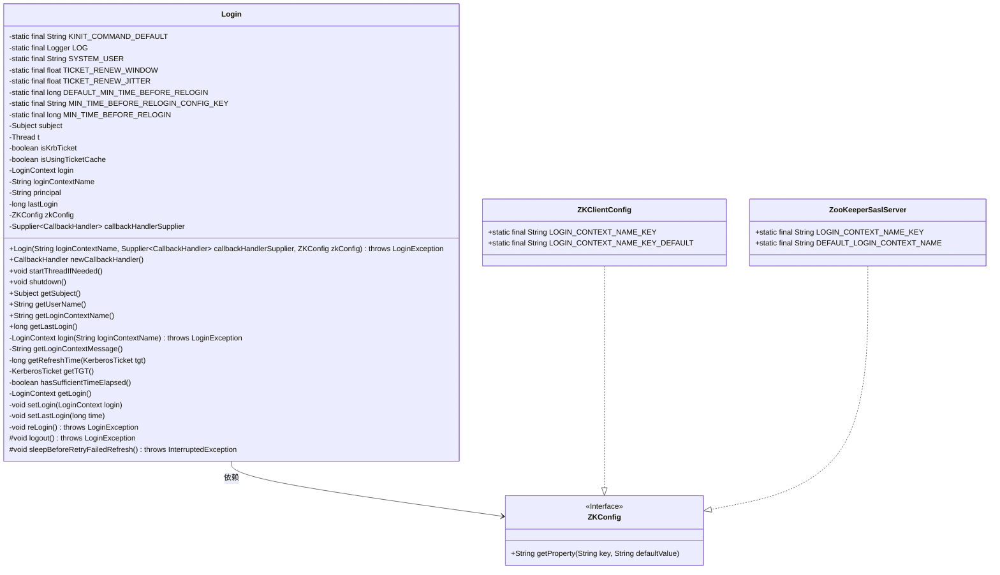
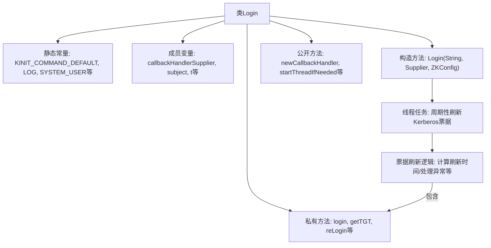
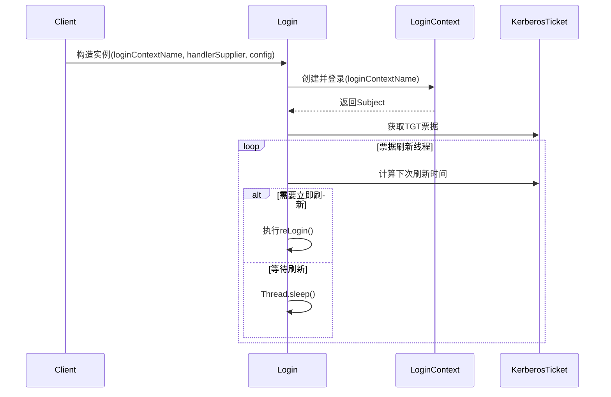

# 基础信息

|      |      |
|------|------|
| 名称 | Login |
| 编码语言 | .java |
| 代码路径 | zookeeper/zookeeper-server/src/main/java/org/apache/zookeeper/Login.java |
| 包名 | org.apache.zookeeper |
| 依赖项 | ['java.util.Date', 'java.util.Set', 'java.util.concurrent.ThreadLocalRandom', 'java.util.function.Supplier', 'javax.security.auth.Subject', 'javax.security.auth.callback.CallbackHandler', 'javax.security.auth.kerberos.KerberosPrincipal', 'javax.security.auth.kerberos.KerberosTicket', 'javax.security.auth.login.AppConfigurationEntry', 'javax.security.auth.login.Configuration', 'javax.security.auth.login.LoginContext', 'javax.security.auth.login.LoginException', 'org.apache.zookeeper.client.ZKClientConfig', 'org.apache.zookeeper.common.Time', 'org.apache.zookeeper.common.ZKConfig', 'org.apache.zookeeper.server.ZooKeeperSaslServer', 'org.slf4j.Logger', 'org.slf4j.LoggerFactory'] |
| 概述说明 | Kerberos登录类，管理TGT刷新线程，支持票据缓存和定时续订，确保认证不过期。包含登录、注销、续订逻辑，处理时钟同步和异常情况。 |

# 说明

该代码实现了一个Kerberos登录管理类Login，主要用于处理Kerberos票据的初始认证和定期刷新。关键功能包括：通过LoginContext进行Kerberos认证，维护Subject对象存储凭证信息；启动后台线程按TGT票据有效期80%的时间窗口自动刷新票据，并考虑5%的随机抖动；支持票据缓存和kinit命令刷新机制；提供最小重登录时间间隔保护（默认1分钟）；处理时钟偏差等异常情况；包含登录状态检查、凭证获取、重新登录和注销等方法。系统通过JAAS配置指定登录上下文，支持客户端和服务端场景，具有线程安全设计和完善的错误处理机制。

# 类列表 Class Summary

| 名称   | 类型  | 说明 |
|-------|------|-------------|
| Login | class | Login类实现Kerberos认证管理，包含TGT自动刷新线程、登录/注销逻辑及配置参数，支持票据缓存和最小重登时间控制。 |

## 类 Login

|      |      |
|------|------|
| 访问范围 | public |
| 类型 | class |
| 名称 | Login |
| 说明 | Login类实现Kerberos认证管理，包含TGT自动刷新线程、登录/注销逻辑及配置参数，支持票据缓存和最小重登时间控制。 |

### UML类图

这段代码实现了一个Kerberos登录管理类Login，主要用于处理Kerberos票据的初始登录、定期刷新和重新登录。类中维护了登录状态、票据信息、刷新线程等核心功能，通过ZKConfig接口获取配置信息，支持客户端和服务端两种配置方式。关键方法包括票据刷新时间计算(getRefreshTime)、票据获取(getTGT)、重新登录(reLogin)等，通过后台线程实现自动票据维护，确保认证持续有效。类设计考虑了线程安全、异常处理和多种配置场景。

### 内部方法调用关系图

该流程图展示了Login类的核心结构和票据刷新机制。类包含Kerberos认证所需的静态配置、线程管理成员变量和多种操作方法。构造方法初始化登录上下文并启动后台刷新线程，该线程通过复杂的时间计算逻辑（考虑票据有效期、最小刷新间隔和随机抖动）实现周期性票据更新。时序图重点呈现了从初始化到持续刷新的完整生命周期，包括与JAAS LoginContext的交互和自主刷新策略的执行过程。整个设计确保了Kerberos票据在有效期内自动维护，同时处理了时钟偏差、登录异常等边缘情况。

### 字段列表 Field List

| 名称  | 类型  | 说明 |
|-------|-------|------|
| isUsingTicketCache = false | boolean | 使用票证缓存状态标志，默认关闭。 |
| KINIT_COMMAND_DEFAULT = "/usr/bin/kinit" | String | 私有静态常量KINIT_COMMAND_DEFAULT值为"/usr/bin/kinit"。 |
| LOG = LoggerFactory.getLogger(Login.class) | Logger | 定义Login类的私有静态日志常量LOG。 |
| zkConfig | ZKConfig | 私有不可变的ZKConfig配置对象。 |
| isKrbTicket = false | boolean | 私有布尔变量isKrbTicket初始值为false。 |
| TICKET_RENEW_JITTER = 0.05f | float | 定义票据续订时间抖动系数为5%。 |
| login = null | LoginContext | 声明一个私有LoginContext对象login，初始值为null。 |
| principal = null | String | 声明私有字符串变量principal，初始值为null。 |
| loginContextName = null | String | 私有字符串变量loginContextName初始化为null。 |
| lastLogin = Time.currentElapsedTime() - MIN_TIME_BEFORE_RELOGIN | long | 变量lastLogin记录上次登录时间，计算方式为当前时间减去最小重登间隔。 |
| TICKET_RENEW_WINDOW = 0.80f | float | 定义常量TICKET_RENEW_WINDOW，值为0.80，表示票证续订窗口时间比例。 |
| t = null | Thread | 私有线程变量t未初始化。 |
| DEFAULT_MIN_TIME_BEFORE_RELOGIN = 1 * 60 * 1000L | long | 定义默认最小重新登录时间间隔为1分钟。 |
| callbackHandlerSupplier | Supplier<CallbackHandler> | 私有成员，类型为Supplier<CallbackHandler>，用于提供回调处理器实例。 |
| MIN_TIME_BEFORE_RELOGIN_CONFIG_KEY = "zookeeper.kerberos.minReLoginTimeMs" | String | 配置键定义：控制ZooKeeper Kerberos重新登录最小时间间隔。 |
| MIN_TIME_BEFORE_RELOGIN = Long.getLong(      MIN_TIME_BEFORE_RELOGIN_CONFIG_KEY, DEFAULT_MIN_TIME_BEFORE_RELOGIN) | long | 定义静态常量MIN_TIME_BEFORE_RELOGIN，通过系统属性获取配置值，默认使用DEFAULT_MIN_TIME_BEFORE_RELOGIN。 |
| SYSTEM_USER = System.getProperty("user.name", "<NA>") | String | 定义静态常量SYSTEM_USER，值为系统属性user.name，默认值"<NA>"。 |
| subject = null | Subject | 声明一个私有Subject对象变量，初始值为null。 |

### 方法列表 Method List

| 名称  | 类型  | 说明 |
|-------|-------|------|
| getLogin | LoginContext | 获取登录信息的方法，返回私有变量login。 |
| setLastLogin | void | 这是一个私有方法，用于设置最后登录时间，参数为长整型时间值。 |
| getTGT | KerberosTicket | 私有同步方法getTGT从主体凭证中查找并返回Kerberos TGT票据，匹配服务器名为krbtgt/realm@realm的票据，未找到返回null。 |
| login | LoginContext | 私有同步方法login接收登录上下文名，若为空抛出异常。创建并执行登录，成功后记录日志并返回上下文对象。 |
| getUserName | String | 该方法检查用户主体(principal)是否为空或空字符串，若是则返回系统用户(SYSTEM_USER)，否则返回用户主体值。 |
| getSubject | Subject | 获取subject对象的方法。 |
| getRefreshTime | long | 方法计算Kerberos票据刷新时间，基于起始和过期时间，考虑随机抖动因子。若计算时间超过过期时间则返回当前时间，否则返回计算值。 |
| startThreadIfNeeded | void | 检查线程对象t非空时启动线程。 |
| getLastLogin | long | 获取最后登录时间的方法，返回long类型值lastLogin。 |
| hasSufficientTimeElapsed | boolean | 检查是否距上次登录足够时间：若未达最小间隔则警告并返回false；否则更新最后登录时间并返回true。 |
| logout | void | 这是一个受保护的同步方法，用于安全登出。仅在用户已登录（subject非空且包含主体信息）时调用logout，避免Java 9及以上版本的NPE问题。参考ZOOKEEPER-4477问题。 |
| newCallbackHandler | CallbackHandler | 该方法返回一个由callbackHandlerSupplier提供的CallbackHandler实例。 |
| shutdown | void | 该方法用于安全关闭线程：检查线程存在且存活时，中断线程并等待其结束，捕获中断异常并记录日志。 |
| setLogin | void | 设置登录上下文对象。 |
| getLoginContextName | String | 获取登录上下文名称的方法，返回字符串类型值。 |
| getLoginContextMessage | String | 方法根据配置类型返回不同格式的登录上下文信息字符串，包含键名和默认值。 |
| reLogin | void | 私有同步方法reLogin用于Kerberos重新登录：检查票据状态，验证登录上下文，若时间足够则先登出再重新登录，更新凭证并记录日志。 |
| sleepBeforeRetryFailedRefresh | void | 方法sleepBeforeRetryFailedRefresh在失败刷新前休眠10秒。 |

