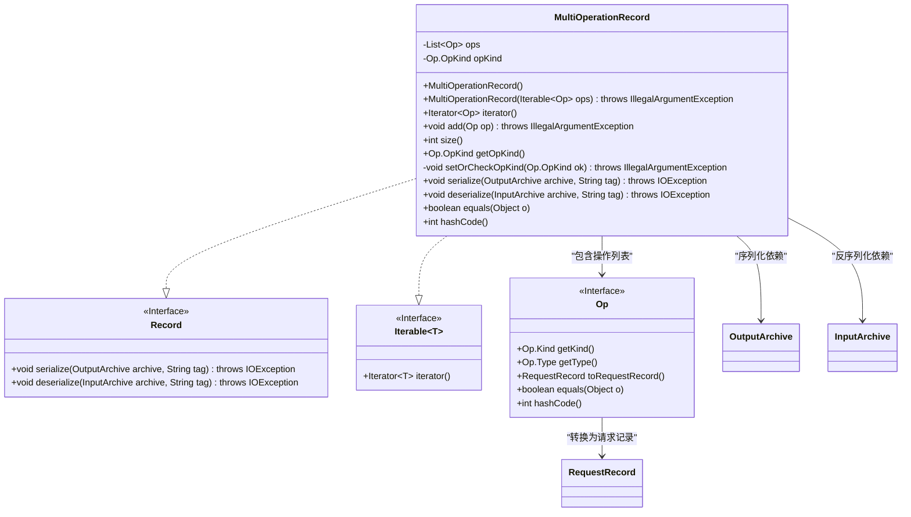
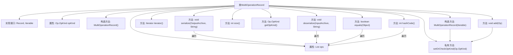

# 基础信息

|      |      |
|------|------|
| 名称 | MultiOperationRecord |
| 编码语言 | .java |
| 代码路径 | zookeeper/zookeeper-server/src/main/java/org/apache/zookeeper/MultiOperationRecord.java |
| 包名 | org.apache.zookeeper |
| 依赖项 | ['java.io.IOException', 'java.util.ArrayList', 'java.util.Iterator', 'java.util.List', 'org.apache.jute.InputArchive', 'org.apache.jute.OutputArchive', 'org.apache.jute.Record', 'org.apache.zookeeper.proto.CheckVersionRequest', 'org.apache.zookeeper.proto.CreateRequest', 'org.apache.zookeeper.proto.CreateTTLRequest', 'org.apache.zookeeper.proto.DeleteRequest', 'org.apache.zookeeper.proto.GetChildrenRequest', 'org.apache.zookeeper.proto.GetDataRequest', 'org.apache.zookeeper.proto.MultiHeader', 'org.apache.zookeeper.proto.SetDataRequest'] |
| 概述说明 | MultiOperationRecord类实现Record和Iterable接口，管理Op操作列表，确保操作类型一致，支持序列化和反序列化，提供迭代、添加、大小查询及相等性检查功能。 |

# 说明

MultiOperationRecord类实现了Record和Iterable接口，用于管理多个操作（Op）的集合。它包含一个操作列表和操作类型字段，确保所有操作类型一致。提供添加操作、获取操作类型、序列化和反序列化功能。序列化时处理多种操作类型（如创建、删除、设置数据等），反序列化时解析对应请求并添加操作。类还实现了equals和hashCode方法，用于比较操作列表的相等性。

# 类列表 Class Summary

| 名称   | 类型  | 说明 |
|-------|------|-------------|
| MultiOperationRecord | class | MultiOperationRecord类实现Record接口，支持存储和操作多个Op对象，确保操作类型一致，提供序列化和反序列化功能，并重写equals和hashCode方法。 |

## 类 MultiOperationRecord

|      |      |
|------|------|
| 访问范围 | public |
| 类型 | class |
| 名称 | MultiOperationRecord |
| 说明 | MultiOperationRecord类实现Record接口，支持存储和操作多个Op对象，确保操作类型一致，提供序列化和反序列化功能，并重写equals和hashCode方法。 |

### UML类图

类图描述：
MultiOperationRecord类实现了Record和Iterable<Op>接口，用于管理一组操作(Op)的集合。它通过opKind字段确保所有操作类型一致，提供序列化/反序列化功能(依赖OutputArchive/InputArchive)，并实现了集合操作(add/size/iterator)和对象比较(equals/hashCode)方法。该类严格校验操作类型，防止混合读写操作，并通过Op接口与具体操作类型交互，支持多种ZooKeeper操作类型(Create/Delete/SetData等)的处理。

### 内部方法调用关系图

这段代码定义了一个名为MultiOperationRecord的类，实现了Record和Iterable<Op>接口。该类主要用于管理操作记录集合，包含两个构造方法和多个成员方法。核心功能包括：通过add方法添加操作并校验操作类型一致性，序列化/反序列化操作记录，以及实现集合的迭代、相等性判断和哈希计算。特别注意其通过setOrCheckOpKind方法确保所有操作类型一致，并在序列化/反序列化时处理多种ZooKeeper操作类型。流程图清晰展示了类结构与主要方法调用关系，突出了集合遍历和类型校验的关键逻辑。

### 字段列表 Field List

| 名称  | 类型  | 说明 |
|-------|-------|------|
| ops = new ArrayList<>() | List<Op> | 私有列表变量ops，初始化为ArrayList，用于存储Op类型元素。 |
| opKind = null | Op.OpKind | 私有操作类型变量opKind初始化为null。 |

### 方法列表 Method List

| 名称  | 类型  | 说明 |
|-------|-------|------|
| iterator | Iterator<Op> | 重写iterator方法，返回ops集合的迭代器。 |
| add | void | 这是一个Java方法，用于向集合ops中添加操作对象op。方法会先检查操作类型，若类型不符则抛出IllegalArgumentException异常。 |
| size | int | 该方法返回集合ops的大小。 |
| getOpKind | Op.OpKind | 获取操作类型的方法，返回opKind值。 |
| setOrCheckOpKind | void | 方法检查或设置操作类型，若已存在且与新类型不同则抛出异常，禁止读写操作混合。 |
| serialize | void | 序列化方法，遍历操作列表，根据类型序列化请求记录，无效类型抛出异常，最后写入结束标记。 |
| deserialize | void | 方法反序列化输入存档，处理多种操作类型如创建、删除、设置数据等，验证模式并添加对应操作，异常时抛出IO错误。 |
| equals | boolean | 重写equals方法，检查对象是否相同或同为MultiOperationRecord实例，比较ops列表元素是否完全一致。 |
| hashCode | int | 重写hashCode方法，初始值1023，遍历ops数组，每个元素hashCode与当前值计算后更新，最终返回结果。 |

