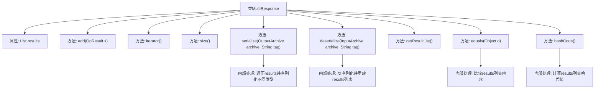

# 基础信息

|      |      |
|------|------|
| 名称 | MultiResponse |
| 编码语言 | .java |
| 代码路径 | zookeeper/zookeeper-server/src/main/java/org/apache/zookeeper/MultiResponse.java |
| 包名 | org.apache.zookeeper |
| 依赖项 | ['java.io.IOException', 'java.util.ArrayList', 'java.util.Iterator', 'java.util.List', 'org.apache.jute.InputArchive', 'org.apache.jute.OutputArchive', 'org.apache.jute.Record', 'org.apache.zookeeper.proto.Create2Response', 'org.apache.zookeeper.proto.CreateResponse', 'org.apache.zookeeper.proto.ErrorResponse', 'org.apache.zookeeper.proto.GetChildrenResponse', 'org.apache.zookeeper.proto.GetDataResponse', 'org.apache.zookeeper.proto.MultiHeader', 'org.apache.zookeeper.proto.SetDataResponse'] |
| 概述说明 | MultiResponse类实现Record和Iterable接口，管理OpResult列表，支持序列化和反序列化操作响应，包括创建、删除、获取数据等类型，并重写equals和hashCode方法。 |

# 说明

MultiResponse类实现了Record和Iterable接口，用于管理多个操作结果的集合。它包含一个OpResult列表，提供添加、遍历和获取结果数量的方法。序列化方法根据操作类型处理不同响应，包括创建、删除、设置数据、获取子节点等，并处理错误情况。反序列化方法读取存档数据并重建结果列表。类还实现了equals和hashCode方法，确保对象比较和哈希计算的正确性。该类主要用于处理多种ZooKeeper操作的批量响应。

# 类列表 Class Summary

| 名称   | 类型  | 说明 |
|-------|------|-------------|
| MultiResponse | class | MultiResponse类实现Record和Iterable接口，用于存储和序列化多个OpResult操作结果，支持添加、遍历及序列化/反序列化多种操作类型响应。 |


## 类 MultiResponse

|      |      |
|------|------|
| 访问范围 | public |
| 类型 | class |
| 名称 | MultiResponse |
| 说明 | MultiResponse类实现Record和Iterable接口，用于存储和序列化多个OpResult操作结果，支持添加、遍历及序列化/反序列化多种操作类型响应。 |


### UML类图

```mermaid
classDiagram
    class MultiResponse {
        -List~OpResult~ results
        +add(OpResult x) void
        +iterator() Iterator~OpResult~
        +size() int
        +serialize(OutputArchive archive, String tag) void
        +deserialize(InputArchive archive, String tag) void
        +getResultList() List~OpResult~
        +equals(Object o) boolean
        +hashCode() int
    }

    class Record {
        <<Interface>>
        +serialize(OutputArchive archive, String tag) void
        +deserialize(InputArchive archive, String tag) void
    }

    class OpResult {
        <<Interface>>
        +getType() int
    }

    class OpResult$CreateResult {
        +getPath() String
        +getStat() Stat
    }

    class OpResult$SetDataResult {
        +getStat() Stat
    }

    class OpResult$GetChildrenResult {
        +getChildren() List~String~
    }

    class OpResult$GetDataResult {
        +getData() byte[]
        +getStat() Stat
    }

    class OpResult$ErrorResult {
        +getErr() int
    }

    class OpResult$DeleteResult {
    }

    class OpResult$CheckResult {
    }

    class MultiHeader {
        +serialize(OutputArchive archive, String tag) void
        +deserialize(InputArchive archive, String tag) void
        +getDone() boolean
        +getType() int
    }

    class CreateResponse {
        +serialize(OutputArchive archive, String tag) void
        +deserialize(InputArchive archive, String tag) void
        +getPath() String
    }

    class Create2Response {
        +serialize(OutputArchive archive, String tag) void
        +deserialize(InputArchive archive, String tag) void
        +getPath() String
        +getStat() Stat
    }

    class SetDataResponse {
        +serialize(OutputArchive archive, String tag) void
        +deserialize(InputArchive archive, String tag) void
        +getStat() Stat
    }

    class GetChildrenResponse {
        +serialize(OutputArchive archive, String tag) void
        +deserialize(InputArchive archive, String tag) void
        +getChildren() List~String~
    }

    class GetDataResponse {
        +serialize(OutputArchive archive, String tag) void
        +deserialize(InputArchive archive, String tag) void
        +getData() byte[]
        +getStat() Stat
    }

    class ErrorResponse {
        +serialize(OutputArchive archive, String tag) void
        +deserialize(InputArchive archive, String tag) void
        +getErr() int
    }

    MultiResponse ..|> Record : 实现
    MultiResponse ..|> Iterable~OpResult~ : 实现
    MultiResponse --> OpResult : 包含
    MultiResponse --> MultiHeader : 使用
    MultiResponse --> CreateResponse : 使用
    MultiResponse --> Create2Response : 使用
    MultiResponse --> SetDataResponse : 使用
    MultiResponse --> GetChildrenResponse : 使用
    MultiResponse --> GetDataResponse : 使用
    MultiResponse --> ErrorResponse : 使用
    OpResult <|-- OpResult$CreateResult : 继承
    OpResult <|-- OpResult$SetDataResult : 继承
    OpResult <|-- OpResult$GetChildrenResult : 继承
    OpResult <|-- OpResult$GetDataResult : 继承
    OpResult <|-- OpResult$ErrorResult : 继承
    OpResult <|-- OpResult$DeleteResult : 继承
    OpResult <|-- OpResult$CheckResult : 继承
```

这段代码展示了一个`MultiResponse`类，它实现了`Record`和`Iterable<OpResult>`接口，用于处理多种操作结果的集合。该类包含序列化和反序列化方法，能够根据不同的操作类型（如创建、删除、设置数据等）处理相应的响应。`MultiResponse`通过`OpResult`的子类来存储不同类型操作的结果，并使用`MultiHeader`来标识操作的开始和结束。类图中清晰地展示了类之间的继承、实现和依赖关系，以及各个类的成员方法。


### 内部方法调用关系图



这段代码实现了一个支持多种操作结果的复合响应类MultiResponse，它实现了Record和Iterable接口。核心功能包括：通过add()方法收集操作结果，提供序列化/反序列化方法处理不同类型的结果（如Create/Delete/SetData等），以及实现集合比较和哈希计算。流程图展示了类结构及其主要方法调用关系，特别突出了对results列表的遍历处理和类型转换逻辑。

### 字段列表 Field List

| 名称  | 类型  | 说明 |
|-------|-------|------|
| results = new ArrayList<>() | List<OpResult> | 声明一个私有列表变量results，用于存储OpResult类型的对象。 |

### 方法列表 Method List

| 名称  | 类型  | 说明 |
|-------|-------|------|
| size | int | 该方法返回结果集合的大小。 |
| getResultList | List<OpResult> | 方法getResultList返回结果列表results。 |
| add | void | 这是一个Java方法，功能是将OpResult对象x添加到results集合中。 |
| iterator | Iterator<OpResult> | 重写iterator方法，返回results的迭代器。 |
| equals | boolean | 重写equals方法，检查对象是否为MultiResponse实例，比较results列表元素是否相等，确保长度和内容一致。 |
| hashCode | int | 重写hashCode方法，基于results大小和元素哈希值计算组合哈希。 |
| deserialize | void | 该方法反序列化输入存档，根据操作类型处理不同响应并存入结果列表。支持创建、删除、设置数据、检查、获取子节点、获取数据和错误等操作类型。 |
| serialize | void | 序列化方法，处理不同类型操作结果，包括创建、删除、设置数据、获取子节点等，错误处理，最后写入结束标记。 |


