# 基础信息

|      |      |
|------|------|
| 名称 | Op |
| 编码语言 | .java |
| 代码路径 | zookeeper/zookeeper-server/src/main/java/org/apache/zookeeper/Op.java |
| 包名 | org.apache.zookeeper |
| 依赖项 | ['java.util.Arrays', 'java.util.Iterator', 'java.util.List', 'org.apache.jute.Record', 'org.apache.zookeeper.common.PathUtils', 'org.apache.zookeeper.data.ACL', 'org.apache.zookeeper.data.Stat', 'org.apache.zookeeper.proto.CheckVersionRequest', 'org.apache.zookeeper.proto.CreateRequest', 'org.apache.zookeeper.proto.CreateTTLRequest', 'org.apache.zookeeper.proto.DeleteRequest', 'org.apache.zookeeper.proto.GetChildrenRequest', 'org.apache.zookeeper.proto.GetDataRequest', 'org.apache.zookeeper.proto.SetDataRequest', 'org.apache.zookeeper.server.EphemeralType'] |
| 概述说明 | 抽象类Op定义ZooKeeper操作，包含创建、删除、更新、检查、获取子节点和数据等方法，支持事务和读取操作类型。 |

# 说明

Op是一个抽象类，定义了ZooKeeper操作的基本结构，包含类型、路径和操作种类枚举。提供了多种静态工厂方法创建不同操作实例，如create、delete、setData、check、getChildren和getData。每个操作类继承Op并实现equals、hashCode、toRequestRecord和withChroot方法。操作分为TRANSACTION和READ两种类型，支持路径验证和请求记录生成。内部类包括Create、CreateTTL、Delete、SetData、Check、GetChildren和GetData，分别处理特定操作逻辑。

# 类列表 Class Summary

| 名称   | 类型  | 说明 |
|-------|------|-------------|
| Op | class | 抽象类Op定义了ZooKeeper操作类型，包括创建、删除、更新、检查、获取子节点和数据等操作，支持路径、数据、ACL、版本等参数，并包含内部类实现具体操作逻辑。 |


## 类 Op

|      |      |
|------|------|
| 访问范围 | public abstract |
| 类型 | class |
| 名称 | Op |
| 说明 | 抽象类Op定义了ZooKeeper操作类型，包括创建、删除、更新、检查、获取子节点和数据等操作，支持路径、数据、ACL、版本等参数，并包含内部类实现具体操作逻辑。 |


### UML类图

```mermaid
classDiagram
    class Op {
        <<abstract>>
        +enum OpKind { TRANSACTION, READ }
        -int type
        -String path
        -OpKind opKind
        -Op(int type, String path, OpKind opKind)
        +static Op create(String path, byte[] data, List~ACL~ acl, int flags) Op
        +static Op create(String path, byte[] data, List~ACL~ acl, int flags, long ttl) Op
        +static Op create(String path, byte[] data, List~ACL~ acl, CreateMode createMode) Op
        +static Op create(String path, byte[] data, List~ACL~ acl, CreateMode createMode, long ttl) Op
        +static Op create(String path, byte[] data, CreateOptions options, int defaultOpCode) Op
        +static Op create(String path, byte[] data, CreateOptions options) Op
        +static Op delete(String path, int version) Op
        +static Op setData(String path, byte[] data, int version) Op
        +static Op check(String path, int version) Op
        +static Op getChildren(String path) Op
        +static Op getData(String path) Op
        +int getType()
        +String getPath()
        +OpKind getKind()
        +abstract Record toRequestRecord()
        +abstract Op withChroot(String addRootPrefix)
        +void validate() throws KeeperException
    }

    class Create {
        -byte[] data
        -List~ACL~ acl
        -int flags
        -Create(String path, byte[] data, List~ACL~ acl, int flags)
        -Create(String path, byte[] data, List~ACL~ acl, int flags, int defaultOpCode)
        -Create(String path, byte[] data, List~ACL~ acl, CreateMode createMode)
        -Create(String path, byte[] data, List~ACL~ acl, CreateMode createMode, int defaultOpCode)
        +boolean equals(Object o)
        +int hashCode()
        +Record toRequestRecord()
        +Op withChroot(String path)
        +void validate() throws KeeperException
    }

    class CreateTTL {
        -long ttl
        -CreateTTL(String path, byte[] data, List~ACL~ acl, int flags, long ttl)
        -CreateTTL(String path, byte[] data, List~ACL~ acl, CreateMode createMode, long ttl)
        +boolean equals(Object o)
        +int hashCode()
        +Record toRequestRecord()
        +Op withChroot(String path)
        +void validate() throws KeeperException
    }

    class Delete {
        -int version
        -Delete(String path, int version)
        +boolean equals(Object o)
        +int hashCode()
        +Record toRequestRecord()
        +Op withChroot(String path)
    }

    class SetData {
        -byte[] data
        -int version
        -SetData(String path, byte[] data, int version)
        +boolean equals(Object o)
        +int hashCode()
        +Record toRequestRecord()
        +Op withChroot(String path)
    }

    class Check {
        -int version
        -Check(String path, int version)
        +boolean equals(Object o)
        +int hashCode()
        +Record toRequestRecord()
        +Op withChroot(String path)
    }

    class GetChildren {
        -GetChildren(String path)
        +boolean equals(Object o)
        +int hashCode()
        +Record toRequestRecord()
        +Op withChroot(String path)
    }

    class GetData {
        -GetData(String path)
        +boolean equals(Object o)
        +int hashCode()
        +Record toRequestRecord()
        +Op withChroot(String path)
    }

    Op <|-- Create
    Op <|-- CreateTTL
    Op <|-- Delete
    Op <|-- SetData
    Op <|-- Check
    Op <|-- GetChildren
    Op <|-- GetData
    Create <|-- CreateTTL
```

这段代码定义了一个抽象类Op及其多个子类，用于表示ZooKeeper操作。Op类提供了创建、删除、更新、检查等操作的静态工厂方法，每个具体操作由相应的子类实现。类图展示了Op作为基类与各个子类之间的继承关系，以及子类之间的继承关系（如CreateTTL继承自Create）。这些类封装了ZooKeeper操作所需的数据和行为，包括路径、版本号、ACL列表等属性，以及验证、序列化等方法。


### 内部方法调用关系图

```mermaid
graph TD
    A["抽象类Op"]
    B["枚举OpKind: TRANSACTION, READ"]
    C["私有属性: int type, String path, OpKind opKind"]
    D["私有构造方法: Op(int type, String path, OpKind opKind)"]
    E["静态工厂方法: create() x5版本"]
    F["静态工厂方法: delete()"]
    G["静态工厂方法: setData()"]
    H["静态工厂方法: check()"]
    I["静态工厂方法: getChildren()"]
    J["静态工厂方法: getData()"]
    K["抽象方法: toRequestRecord()"]
    L["抽象方法: withChroot()"]
    M["验证方法: validate()"]
    N["内部类Create"]
    O["内部类CreateTTL"]
    P["内部类Delete"]
    Q["内部类SetData"]
    R["内部类Check"]
    S["内部类GetChildren"]
    T["内部类GetData"]

    A --> B
    A --> C
    A --> D
    A --> E
    A --> F
    A --> G
    A --> H
    A --> I
    A --> J
    A --> K
    A --> L
    A --> M
    A --> N
    A --> O
    A --> P
    A --> Q
    A --> R
    A --> S
    A --> T

    N -->|继承| A
    O -->|继承| N
    P -->|继承| A
    Q -->|继承| A
    R -->|继承| A
    S -->|继承| A
    T -->|继承| A
```



这段代码是ZooKeeper客户端操作的核心抽象类，定义了多种节点操作类型（创建/删除/更新/检查/读取）的工厂方法和基础结构。流程图展示了Op类的完整结构，包含7个内部类实现具体操作，所有操作共享基础属性和验证逻辑。关键设计是通过抽象工厂模式创建不同类型的操作实例，每个操作都实现自己的序列化(toRequestRecord)和路径处理(withChroot)逻辑，同时支持事务性和只读操作区分(OpKind)。

### 字段列表 Field List

| 名称  | 类型  | 说明 |
|-------|-------|------|
| path | String | 私有字符串变量path。 |
| opKind | OpKind | 私有操作类型变量opKind。 |
| type | int | 私有整型变量type。 |

### 方法列表 Method List

| 名称  | 类型  | 说明 |
|-------|-------|------|
| create | Op | 静态方法`create`根据`createMode`是否为TTL模式，返回不同的`Op`实例：TTL模式返回`CreateTTL`，否则返回`Create`。参数包括路径、数据、ACL列表、创建模式和TTL值。 |
| getType | int | 这是一个Java方法，返回整型变量type的值。 |
| validate | void | 验证路径有效性，无效时抛出KeeperException异常。 |
| create | Op | 这是一个静态工厂方法，根据参数创建不同的操作对象。若模式含TTL则返回CreateTTL实例，否则返回Create实例。参数包括路径、数据、ACL列表、标志和TTL。 |
| getKind | OpKind | 这是一个Java方法，返回操作类型opKind。 |
| getPath | String | 这是一个Java方法，返回字符串类型的path变量值。 |
| create | Op | Java方法：创建ZooKeeper节点操作，接收路径、数据字节数组和选项参数，默认使用create2操作码。 |
| getData | Op | 公开静态方法getData，接收字符串参数path，返回新建的GetData对象实例。 |
| check | Op | 这是一个Java静态方法，名为check，接收路径字符串和版本号参数，返回一个Check类型对象。方法简洁，直接创建并返回新实例。 |
| create | Op | 创建静态方法`create`，接收路径、数据、ACL列表和标志参数，返回新建的`Create`对象实例。 |
| toRequestRecord | Record | 抽象方法，将对象转换为请求记录。 |
| withChroot | Op | Op withChroot(String addRootPrefix) 方法用于更改根目录路径，参数addRootPrefix指定新根目录前缀。 |
| getChildren | Op | 定义静态方法getChildren，接收路径参数path，返回新建的GetChildren对象实例。 |
| delete | Op | 静态方法delete接收路径和版本参数，返回Delete操作实例。 |
| setData | Op | 这是一个静态方法，用于创建并返回一个设置数据的操作对象，参数包括路径、字节数据和版本号。 |
| create | Op | 创建Op对象的方法，参数包括路径、数据、ACL列表和创建模式。 |
| create | Op | 静态方法create根据options的CreateMode是否为TTL，返回CreateTTL或Create实例，包含路径、数据、ACL、模式及TTL或默认操作码。 |


