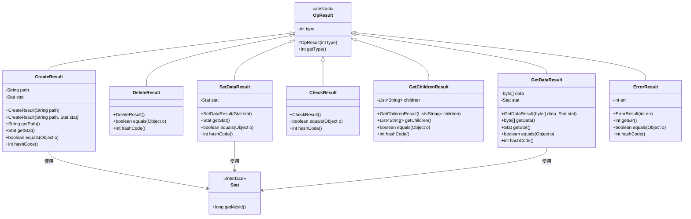

# 基础信息

|      |      |
|------|------|
| 名称 | OpResult |
| 编码语言 | .java |
| 代码路径 | zookeeper/zookeeper-server/src/main/java/org/apache/zookeeper/OpResult.java |
| 包名 | org.apache.zookeeper |
| 依赖项 | ['java.util.Arrays', 'java.util.List', 'org.apache.zookeeper.data.Stat'] |
| 概述说明 | OpResult抽象类定义了操作结果基类，包含类型字段和getType方法。其子类包括CreateResult（含路径和状态）、DeleteResult（无额外数据）、SetDataResult（含状态）、CheckResult（无额外数据）、GetChildrenResult（含子节点列表）、GetDataResult（含数据和状态）、ErrorResult（含错误码）。每个子类实现equals和hashCode方法。 |

# 说明

OpResult是一个抽象基类，封装了ZooKeeper操作结果的通用结构，包含类型标识字段和获取方法。其子类针对不同操作类型提供特定功能：CreateResult存储路径和状态信息，DeleteResult无附加数据，SetDataResult包含更新后的状态，CheckResult用于版本校验，GetChildrenResult返回子节点列表，GetDataResult包含节点数据和状态，ErrorResult记录错误码。所有子类均实现equals和hashCode方法以确保正确比较和哈希计算。

# 类列表 Class Summary

| 名称   | 类型  | 说明 |
|-------|------|-------------|
| OpResult | class | OpResult抽象类及其子类表示ZooKeeper操作结果，包含类型、路径、状态、子节点列表、数据或错误码等，各子类实现equals和hashCode方法。 |

## 类 OpResult

|      |      |
|------|------|
| 访问范围 | public abstract |
| 类型 | class |
| 名称 | OpResult |
| 说明 | OpResult抽象类及其子类表示ZooKeeper操作结果，包含类型、路径、状态、子节点列表、数据或错误码等，各子类实现equals和hashCode方法。 |

### UML类图

这段代码描述了一个抽象类OpResult及其多个子类，用于表示ZooKeeper操作的不同结果类型。OpResult作为基类包含操作类型标识，其子类如CreateResult、GetDataResult等分别处理特定操作的结果数据，包括路径、状态信息、子节点列表等。所有子类都实现了equals和hashCode方法，并可能依赖Stat接口获取状态信息。该设计通过继承和多态实现了不同类型操作结果的统一处理。

### 内部方法调用关系图

```mermaid
graph TD
    A["抽象类OpResult"]
    B["属性: int type"]
    C["构造方法: OpResult(int type)"]
    D["方法: int getType()"]
    E["静态子类CreateResult"]
    F["静态子类DeleteResult"]
    G["静态子类SetDataResult"]
    H["静态子类CheckResult"]
    I["静态子类GetChildrenResult"]
    J["静态子类GetDataResult"]
    K["静态子类ErrorResult"]

    A --> B
    A --> C
    A --> D
    A --> E
    A --> F
    A --> G
    A --> H
    A --> I
    A --> J
    A --> K

    E --> L["属性: String path"]
    E --> M["属性: Stat stat"]
    E --> N["构造方法: CreateResult(String path)"]
    E --> O["构造方法: CreateResult(String path, Stat stat)"]
    E --> P["方法: String getPath()"]
    E --> Q["方法: Stat getStat()"]
    E --> R["重写方法: boolean equals(Object o)"]
    E --> S["重写方法: int hashCode()"]

    F --> T["构造方法: DeleteResult()"]
    F --> U["重写方法: boolean equals(Object o)"]
    F --> V["重写方法: int hashCode()"]

    G --> W["属性: Stat stat"]
    G --> X["构造方法: SetDataResult(Stat stat)"]
    G --> Y["方法: Stat getStat()"]
    G --> Z["重写方法: boolean equals(Object o)"]
    G --> AA["重写方法: int hashCode()"]

    H --> AB["构造方法: CheckResult()"]
    H --> AC["重写方法: boolean equals(Object o)"]
    H --> AD["重写方法: int hashCode()"]

    I --> AE["属性: List<String> children"]
    I --> AF["构造方法: GetChildrenResult(List<String> children)"]
    I --> AG["方法: List<String> getChildren()"]
    I --> AH["重写方法: boolean equals(Object o)"]
    I --> AI["重写方法: int hashCode()"]

    J --> AJ["属性: byte[] data"]
    J --> AK["属性: Stat stat"]
    J --> AL["构造方法: GetDataResult(byte[] data, Stat stat)"]
    J --> AM["方法: byte[] getData()"]
    J --> AN["方法: Stat getStat()"]
    J --> AO["重写方法: boolean equals(Object o)"]
    J --> AP["重写方法: int hashCode()"]

    K --> AQ["属性: int err"]
    K --> AR["构造方法: ErrorResult(int err)"]
    K --> AS["方法: int getErr()"]
    K --> AT["重写方法: boolean equals(Object o)"]
    K --> AU["重写方法: int hashCode()"]
```

该流程图展示了抽象类OpResult及其7个静态子类的完整结构。OpResult作为基类包含类型属性和获取类型的方法，各子类分别处理不同操作类型（创建、删除、设置数据等）的结果数据。每个子类都实现了equals和hashCode方法，并包含特定于操作的属性和方法。CreateResult和GetDataResult等子类还包含复杂的状态比较逻辑，流程图清晰地反映了类之间的继承关系和内部方法调用层级。

### 字段列表 Field List

| 名称  | 类型  | 说明 |
|-------|-------|------|
| type | int | 私有整型变量type。 |

### 方法列表 Method List

| 名称  | 类型  | 说明 |
|-------|-------|------|
| getType | int | 方法返回整型变量type的值。 |

