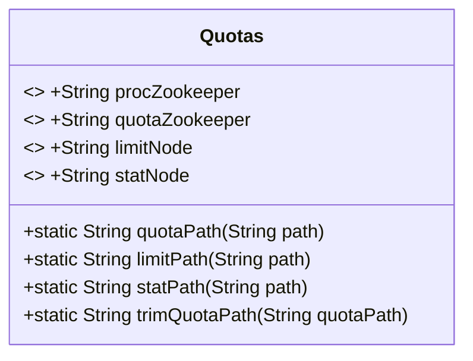
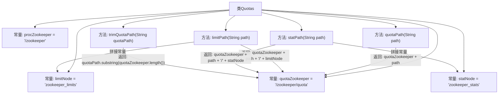

# 基础信息

|      |      |
|------|------|
| 名称 | Quotas |
| 编码语言 | .java |
| 代码路径 | zookeeper/zookeeper-server/src/main/java/org/apache/zookeeper/Quotas.java |
| 包名 | org.apache.zookeeper |
| 依赖项 | [] |
| 概述说明 | Quotas类定义了ZooKeeper配额管理的常量和方法，包括配额路径、限制节点路径、状态节点路径的生成与解析。 |

# 说明

该代码定义了一个名为Quotas的类，用于管理ZooKeeper配额相关的路径。类中包含四个静态常量：procZookeeper表示管理节点路径，quotaZookeeper表示配额管理节点路径，limitNode和statNode分别表示限制节点和状态节点名称。提供了四个静态方法：quotaPath用于生成配额路径，limitPath用于生成限制路径，statPath用于生成状态路径，trimQuotaPath用于从配额路径中提取实际路径。这些方法均基于quotaZookeeper常量构建路径，并处理字符串拼接和截取操作。

# 类列表 Class Summary

| 名称   | 类型  | 说明 |
|-------|------|-------------|
| Quotas | class | Quotas类定义了Zookeeper配额管理的常量和方法，包括配额路径、限制节点、状态节点及相关路径处理方法。 |

## 类 Quotas

|      |      |
|------|------|
| 访问范围 | public |
| 类型 | class |
| 名称 | Quotas |
| 说明 | Quotas类定义了Zookeeper配额管理的常量和方法，包括配额路径、限制节点、状态节点及相关路径处理方法。 |

### UML类图

这段代码定义了一个名为Quotas的工具类，主要用于管理ZooKeeper中的配额路径。类中包含四个静态常量字符串字段，分别表示ZooKeeper的管理节点、配额节点、限制节点和统计节点的路径。类提供了四个静态方法：quotaPath用于生成配额路径，limitPath用于生成限制路径，statPath用于生成统计路径，trimQuotaPath用于从配额路径中提取实际路径。这些方法都是纯工具方法，不涉及对象状态，因此设计为静态方法。整个类的作用是为ZooKeeper配额管理提供路径操作的工具函数。

### 内部方法调用关系图

这段代码定义了一个ZooKeeper配额管理工具类，包含4个静态常量和4个路径处理方法。常量定义了ZooKeeper的管理节点路径和配额限制节点名称，方法则提供了配额路径的构造与解析功能：quotaPath()拼接基础路径，limitPath()和statPath()分别生成限制节点和统计节点的完整路径，trimQuotaPath()则用于从配额路径中提取原始路径。所有方法都围绕quotaZookeeper常量进行路径操作，形成清晰的层级调用关系。

### 字段列表 Field List

| 名称  | 类型  | 说明 |
|-------|-------|------|
| statNode = "zookeeper_stats" | String | 定义静态常量statNode，值为"zookeeper_stats"。 |
| procZookeeper = "/zookeeper" | String | 静态常量procZookeeper定义为字符串"/zookeeper"。 |
| limitNode = "zookeeper_limits" | String | 静态常量limitNode定义为"zookeeper_limits"。 |
| quotaZookeeper = "/zookeeper/quota" | String | 静态常量quotaZookeeper存储ZooKeeper配额路径字符串"/zookeeper/quota"。 |

### 方法列表 Method List

| 名称  | 类型  | 说明 |
|-------|-------|------|
| statPath | String | 静态方法statPath拼接路径，将quotaZookeeper、输入path和statNode组合成完整路径。 |
| trimQuotaPath | String | 静态方法trimQuotaPath用于截取quotaPath字符串，去除前缀quotaZookeeper部分后返回剩余内容。 |
| quotaPath | String | 静态方法quotaPath将输入路径与预设的quotaZookeeper路径拼接后返回。 |
| limitPath | String | 该代码定义了一个静态方法`limitPath`，用于拼接配额ZooKeeper路径、输入路径和限制节点，生成完整路径。 |

