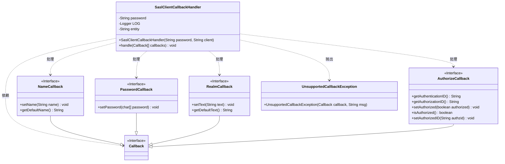
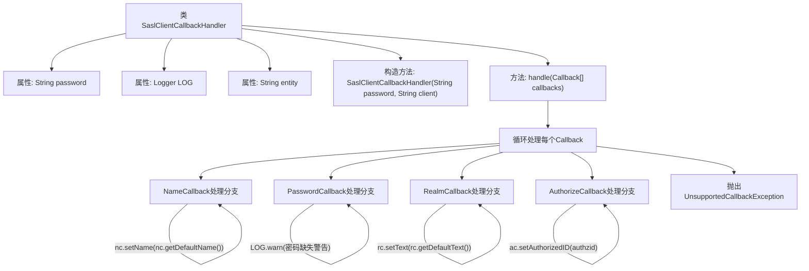

# 基础信息

|      |      |
|------|------|
| 名称 | SaslClientCallbackHandler |
| 编码语言 | .java |
| 代码路径 | zookeeper/zookeeper-server/src/main/java/org/apache/zookeeper/SaslClientCallbackHandler.java |
| 包名 | org.apache.zookeeper |
| 依赖项 | ['javax.security.auth.callback.Callback', 'javax.security.auth.callback.CallbackHandler', 'javax.security.auth.callback.NameCallback', 'javax.security.auth.callback.PasswordCallback', 'javax.security.auth.callback.UnsupportedCallbackException', 'javax.security.sasl.AuthorizeCallback', 'javax.security.sasl.RealmCallback', 'org.slf4j.Logger', 'org.slf4j.LoggerFactory'] |
| 概述说明 | SaslClientCallbackHandler处理SASL回调，支持Name、Password、Realm和Authorize回调。若无密码会记录警告，提示Kerberos配置问题。 |

# 说明

该代码定义了一个SaslClientCallbackHandler类，实现了CallbackHandler接口，用于处理SASL认证过程中的回调。类中包含密码和实体名称字段，构造函数接收这两个参数。handle方法处理不同类型的回调：对NameCallback设置默认名称；对PasswordCallback设置密码，若无密码则记录警告日志，提示配置Kerberos票据缓存或手动刷新TGT；对RealmCallback设置默认文本；对AuthorizeCallback检查授权ID是否匹配认证ID；其他回调类型抛出异常。日志警告详细说明了Kerberos配置和票据刷新步骤。

# 类列表 Class Summary

| 名称   | 类型  | 说明 |
|-------|------|-------------|
| SaslClientCallbackHandler | class | SaslClientCallbackHandler类处理SASL客户端回调，支持NameCallback、PasswordCallback、RealmCallback和AuthorizeCallback。密码为空时警告需配置Kerberos票据缓存或手动刷新TGT。 |

## 类 SaslClientCallbackHandler

|      |      |
|------|------|
| 访问范围 | public |
| 类型 | class |
| 名称 | SaslClientCallbackHandler |
| 说明 | SaslClientCallbackHandler类处理SASL客户端回调，支持NameCallback、PasswordCallback、RealmCallback和AuthorizeCallback。密码为空时警告需配置Kerberos票据缓存或手动刷新TGT。 |

### UML类图

这段代码展示了一个SASL客户端回调处理器(SaslClientCallbackHandler)的实现，它处理不同类型的认证回调(Callback)。类图清晰地呈现了该处理器与各种回调接口(NameCallback、PasswordCallback等)的交互关系，以及异常处理机制。处理器通过handle方法接收回调数组，根据不同类型执行相应操作：设置用户名、密码、域信息或授权验证，对于不支持的回调类型抛出UnsupportedCallbackException。该设计遵循了SASL认证框架的标准接口规范，实现了灵活的回调处理机制。

### 内部方法调用关系图

这段代码是SASL客户端回调处理器实现，主要用于处理Kerberos认证过程中的各种回调请求。流程图展示了类结构和主要处理逻辑，包括四种回调类型（Name/Password/Realm/Authorize）的分支处理，以及不支持的异常处理。核心方法handle()通过遍历回调数组，针对不同类型回调执行相应操作：设置默认名称、处理密码凭证、配置领域信息或进行授权验证，对于无法识别的回调类型会抛出异常。密码缺失时会记录详细的警告日志指导用户配置Kerberos票据缓存。

### 字段列表 Field List

| 名称  | 类型  | 说明 |
|-------|-------|------|
| LOG = LoggerFactory.getLogger(SaslClientCallbackHandler.class) | Logger | 声明一个私有静态不可变日志对象LOG，用于SaslClientCallbackHandler类的日志记录。 |
| password = null | String | 声明一个私有字符串变量password，初始值为null。 |
| entity | String | 私有字符串类型变量entity，不可修改。 |

### 方法列表 Method List

| 名称  | 类型  | 说明 |
|-------|-------|------|
| handle | void | 处理回调数组，支持NameCallback、PasswordCallback、RealmCallback和AuthorizeCallback。若密码未设置，提示配置Kerberos票据缓存或手动刷新TGT。不支持的Callback抛出异常。 |

