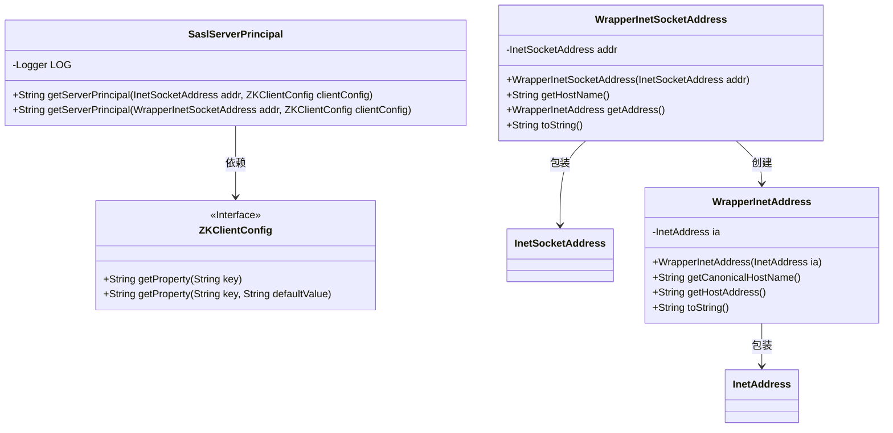
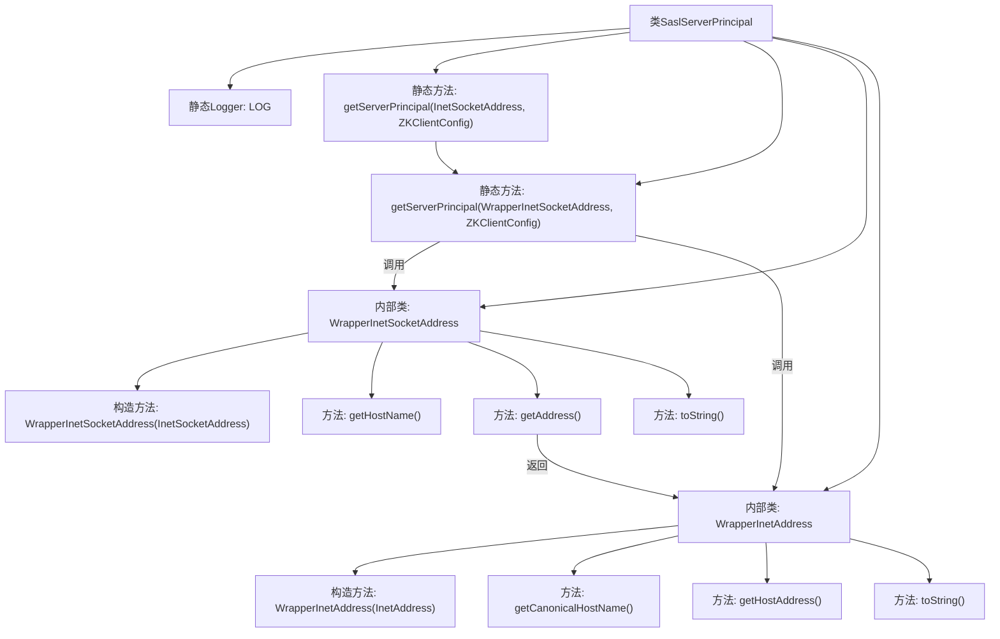

# 基础信息

|      |      |
|------|------|
| 名称 | SaslServerPrincipal |
| 编码语言 | .java |
| 代码路径 | zookeeper/zookeeper-server/src/main/java/org/apache/zookeeper/SaslServerPrincipal.java |
| 包名 | org.apache.zookeeper |
| 依赖项 | ['java.net.InetAddress', 'java.net.InetSocketAddress', 'org.apache.zookeeper.client.ZKClientConfig', 'org.slf4j.Logger', 'org.slf4j.LoggerFactory'] |
| 概述说明 | SaslServerPrincipal类用于获取SASL客户端的服务器主体名称，支持配置和主机名规范化，包含测试用的地址包装类。 |

# 说明

SaslServerPrincipal类用于获取SASL客户端的服务器主体名称。主要方法getServerPrincipal接收主机地址和客户端配置，返回主体名称。若配置中已指定主体名称则直接返回，否则根据配置的用户名和主机名生成。支持主机名规范化处理，通过WrapperInetSocketAddress和WrapperInetAddress包装类绕过final限制以便测试。规范化失败时抛出异常，成功则使用规范化的主机名构建主体名称。日志记录用于调试和错误处理。

# 类列表 Class Summary

| 名称   | 类型  | 说明 |
|-------|------|-------------|
| SaslServerPrincipal | class | SaslServerPrincipal类用于获取SASL客户端的服务器主体名称，支持配置和主机名规范化，包含测试用包装类。 |

## 类 SaslServerPrincipal

|      |      |
|------|------|
| 访问范围 | public |
| 类型 | class |
| 名称 | SaslServerPrincipal |
| 说明 | SaslServerPrincipal类用于获取SASL客户端的服务器主体名称，支持配置和主机名规范化，包含测试用包装类。 |

### UML类图

这段代码主要实现了SASL服务器主体的获取逻辑，包含一个主类SaslServerPrincipal和两个包装类WrapperInetSocketAddress、WrapperInetAddress。主类通过ZKClientConfig获取配置信息，并根据地址处理规则生成服务器主体名称。包装类用于绕过final方法限制以便测试，分别对InetSocketAddress和InetAddress进行封装。整体设计通过分层包装实现配置解析与地址规范化处理。

### 内部方法调用关系图

该流程图展示了SaslServerPrincipal类的核心结构，包含两个静态方法和两个用于单元测试的内部包装类。主方法getServerPrincipal通过WrapperInetSocketAddress处理网络地址，根据客户端配置决定是否规范

### 字段列表 Field List

| 名称  | 类型  | 说明 |
|-------|-------|------|
| LOG = LoggerFactory.getLogger(SaslServerPrincipal.class) | Logger | 声明一个私有静态日志常量，用于记录SaslServerPrincipal类的日志信息。 |

### 方法列表 Method List

| 名称  | 类型  | 说明 |
|-------|-------|------|
| getServerPrincipal | String | 这是一个静态方法，用于通过封装后的网络地址和ZK客户端配置获取服务器主体信息。方法接受InetSocketAddress和ZKClientConfig参数，内部调用重载方法处理。 |
| getServerPrincipal | String | 方法getServerPrincipal根据配置和地址信息生成服务器主体名。优先使用配置的主体名，否则组合用户名和主机名（可选规范化）。规范化失败时使用原主机名。返回格式为"用户名/主机名"。 |

