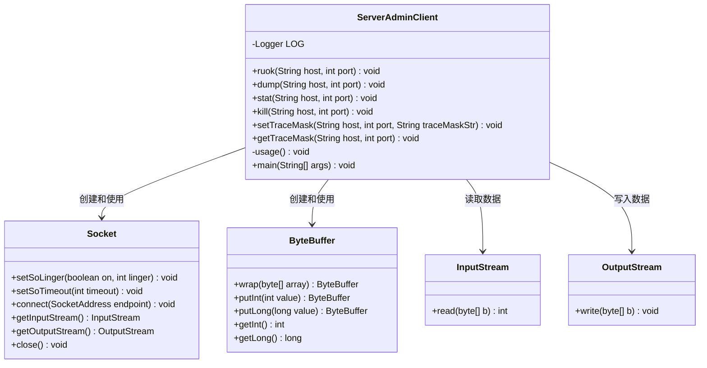
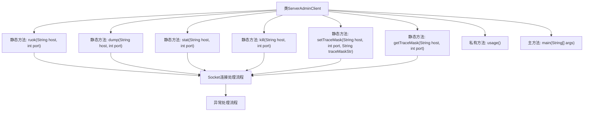

# 基础信息

|      |      |
|------|------|
| 名称 | ServerAdminClient |
| 编码语言 | .java |
| 代码路径 | zookeeper/zookeeper-server/src/main/java/org/apache/zookeeper/ServerAdminClient.java |
| 包名 | org.apache.zookeeper |
| 依赖项 | ['java.nio.charset.StandardCharsets.UTF_8', 'java.io.IOException', 'java.io.InputStream', 'java.io.OutputStream', 'java.net.InetSocketAddress', 'java.net.Socket', 'java.nio.ByteBuffer', 'org.apache.yetus.audience.InterfaceAudience', 'org.slf4j.Logger', 'org.slf4j.LoggerFactory'] |
| 概述说明 | ServerAdminClient类提供与服务器交互的功能，包括ruok、stat、dump、kill、setTraceMask和getTraceMask操作，通过Socket连接执行命令并返回结果。 |

# 说明

ServerAdminClient是一个公开类，提供多种服务器管理功能。它包含ruok、dump、stat、kill、setTraceMask和getTraceMask方法，均通过Socket与指定主机和端口通信。每个方法发送特定请求并接收响应，处理异常并记录日志。setTraceMask和getTraceMask涉及长整型掩码操作。main方法解析命令行参数并调用相应功能，支持操作包括检查状态、获取统计、终止服务及设置跟踪掩码。所有方法均遵循相同模式：建立连接、发送请求、处理响应并确保资源释放。

# 类列表 Class Summary

| 名称   | 类型  | 说明 |
|-------|------|-------------|
| ServerAdminClient | class | ServerAdminClient类提供服务器管理功能，包括ruok、stat、dump、kill、gettracemask和settracemask操作，通过Socket连接执行命令并返回结果。 |

## 类 ServerAdminClient

|      |      |
|------|------|
| 访问范围 | @InterfaceAudience.Public;public |
| 类型 | class |
| 名称 | ServerAdminClient |
| 说明 | ServerAdminClient类提供服务器管理功能，包括ruok、stat、dump、kill、gettracemask和settracemask操作，通过Socket连接执行命令并返回结果。 |

### UML类图

这段代码定义了一个`ServerAdminClient`类，用于与服务器进行管理交互。该类提供了多个静态方法（如`ruok`、`dump`、`stat`等）来执行不同的管理操作，每个方法都通过创建`Socket`连接与服务器通信，使用`ByteBuffer`处理二进制数据，并通过`InputStream`和`OutputStream`进行数据读写。类中还包含一个`main`方法作为入口点，根据命令行参数调用相应的操作方法。整体设计简洁，但缺乏异常处理的细节，且所有方法都是静态的，可能不利于测试和扩展。

### 内部方法调用关系图

这段代码是ZooKeeper的ServerAdminClient类实现，提供了6个核心管理命令(ruok/dump/stat/kill/setTraceMask/getTraceMask)的TCP通信实现。所有方法都遵循相同模式：创建Socket连接->发送4字节命令->读取响应->关闭连接，其中setTraceMask需要额外参数。main方法根据输入参数路由到对应操作，包含基本的参数校验和错误处理。流程图清晰展示了类结构和方法间的调用关系，特别突出了Socket操作和异常处理的通用模式。

### 字段列表 Field List

| 名称  | 类型  | 说明 |
|-------|-------|------|
| LOG = LoggerFactory.getLogger(ServerAdminClient.class) | Logger | 声明ServerAdminClient类的私有静态日志常量LOG，使用LoggerFactory获取日志实例。 |

### 方法列表 Method List

| 名称  | 类型  | 说明 |
|-------|-------|------|
| usage | void | 这是一个ZooKeeper服务器管理客户端的用法说明，用于执行操作如检查状态、获取统计信息、终止服务等。 |
| main | void | Java主函数，接收参数执行不同操作：获取/设置追踪掩码、检查状态、终止、统计、转储。参数不足时提示用法。 |
| getTraceMask | void | Java方法通过Socket连接获取跟踪掩码，发送请求并读取响应，处理异常并关闭连接。 |
| setTraceMask | void | 静态方法setTraceMask通过Socket连接设置远程主机的跟踪掩码，发送8进制掩码并验证返回结果，处理异常并关闭连接。 |
| stat | void | Java方法stat通过Socket连接主机和端口，发送"stat"请求并读取响应，处理异常后关闭连接。 |
| ruok | void | Java方法ruok通过Socket连接发送"ruok"请求到指定主机和端口，读取4字节响应并打印结果，处理异常并确保关闭连接。 |
| kill | void | 该方法通过Socket连接向指定主机和端口发送"kill"命令，接收并打印响应结果，处理异常并确保资源释放。 |
| dump | void | Java方法dump通过Socket连接指定主机和端口，发送"dump"请求并接收响应，处理异常后关闭连接。 |

