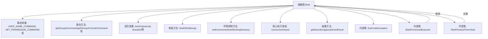
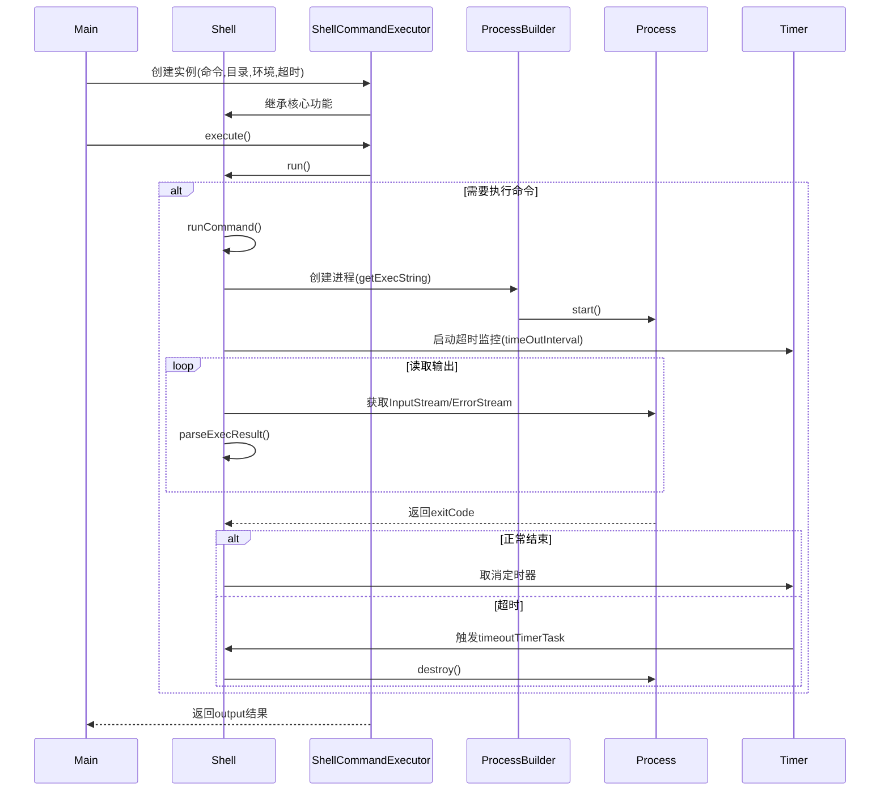

# 基础信息

|      |      |
|------|------|
| 名称 | Shell |
| 编码语言 | .java |
| 代码路径 | zookeeper/zookeeper-server/src/main/java/org/apache/zookeeper/Shell.java |
| 包名 | org.apache.zookeeper |
| 依赖项 | ['java.io.BufferedReader', 'java.io.File', 'java.io.IOException', 'java.io.InputStreamReader', 'java.nio.charset.StandardCharsets', 'java.util.Map', 'java.util.Timer', 'java.util.TimerTask', 'java.util.concurrent.atomic.AtomicBoolean', 'org.apache.commons.io.FileUtils', 'org.apache.zookeeper.common.Time', 'org.apache.zookeeper.server.ExitCode', 'org.slf4j.Logger', 'org.slf4j.LoggerFactory'] |
| 概述说明 | Shell类提供Unix命令执行功能，包括用户、组、权限管理命令，支持超时控制和环境设置，可执行命令并处理输出。 |

# 说明

这是一个抽象类Shell，提供了执行Unix命令的通用功能。它包含获取用户信息、组信息、设置权限和所有权的命令常量，以及处理超时、环境变量和工作目录的方法。类中定义了执行命令的核心逻辑，包括进程管理、超时控制、错误流处理和结果解析。派生类ShellCommandExecutor实现了具体命令执行，支持自定义超时和环境变量。此外，还提供了静态方法execCommand简化命令调用。整个设计支持跨平台操作，特别处理了Windows和Linux子系统(WSL)的兼容性问题。

# 类列表 Class Summary

| 名称   | 类型  | 说明 |
|-------|------|-------------|
| Shell | class | Shell类提供Unix命令执行功能，包括用户组查询、权限设置、超时控制和进程管理，支持环境变量和工作目录设置，适用于命令行操作封装。 |


## 类 Shell

|      |      |
|------|------|
| 访问范围 | public abstract |
| 类型 | class |
| 名称 | Shell |
| 说明 | Shell类提供Unix命令执行功能，包括用户组查询、权限设置、超时控制和进程管理，支持环境变量和工作目录设置，适用于命令行操作封装。 |


### UML类图

```mermaid
classDiagram
    class Shell {
        <<abstract>>
        -LOG: Logger
        +USER_NAME_COMMAND: String
        +SET_PERMISSION_COMMAND: String
        +SET_OWNER_COMMAND: String
        +SET_GROUP_COMMAND: String
        +ULIMIT_COMMAND: String
        +WINDOWS: boolean
        -timeOutInterval: long
        -timedOut: AtomicBoolean
        -interval: long
        -lastTime: long
        -environment: Map~String,String~
        -dir: File
        -process: Process
        -exitCode: int
        -completed: AtomicBoolean
        +Shell()
        +Shell(long interval)
        +getGroupsCommand() String[]
        +getGroupsForUserCommand(String user) String[]
        +getGET_PERMISSION_COMMAND() String[]
        +getUlimitMemoryCommand(int memoryLimit) String[]
        +isWsl() boolean
        #setEnvironment(Map~String,String~ env) void
        #setWorkingDirectory(File dir) void
        #run() void
        -runCommand() void
        {abstract}#getExecString() String[]
        {abstract}#parseExecResult(BufferedReader lines) void
        +getProcess() Process
        +getExitCode() int
        +isTimedOut() boolean
        -setTimedOut() void
        +execCommand(String... cmd) String
        +execCommand(Map~String,String~ env, String[] cmd, long timeout) String
        +execCommand(Map~String,String~ env, String... cmd) String
    }

    class ExitCodeException {
        -exitCode: int
        +ExitCodeException(int exitCode, String message)
        +getExitCode() int
    }

    class ShellCommandExecutor {
        -command: String[]
        -output: StringBuffer
        +ShellCommandExecutor(String[] execString)
        +ShellCommandExecutor(String[] execString, File dir)
        +ShellCommandExecutor(String[] execString, File dir, Map~String,String~ env)
        +ShellCommandExecutor(String[] execString, File dir, Map~String,String~ env, long timeout)
        +execute() void
        #getExecString() String[]
        #parseExecResult(BufferedReader lines) void
        +getOutput() String
        +toString() String
    }

    class ShellTimeoutTimerTask {
        -shell: Shell
        +ShellTimeoutTimerTask(Shell shell)
        +run() void
    }

    Shell --> ExitCodeException : 抛出异常
    Shell <|-- ShellCommandExecutor : 继承
    Shell *-- ShellTimeoutTimerTask : 包含
```

这段代码描述了一个抽象类Shell及其子类ShellCommandExecutor，用于执行Unix/Linux系统命令。Shell类封装了命令执行、超时控制、环境变量设置等功能，而ShellCommandExecutor提供了具体的命令执行实现。ExitCodeException用于处理命令执行异常，ShellTimeoutTimerTask实现超时控制。该设计支持跨平台命令执行（通过WINDOWS标志区分），包含权限管理、用户组查询等常见系统操作功能。


### 内部方法调用关系图





该流程图展示了Shell抽象类的核心结构和执行流程。类结构包含静态命令常量、环境控制方法、命令执行核心逻辑以及三个关键内部类。时序图详细描述了从命令执行请求到结果返回的全过程，包括超时监控机制和异常处理路径。整个设计实现了跨平台的Shell命令执行能力，支持环境变量配置、工作目录设置和超时控制，通过抽象方法强制子类实现具体命令解析逻辑，体现了良好的扩展性和安全性设计。

### 字段列表 Field List

| 名称  | 类型  | 说明 |
|-------|-------|------|
| interval | long | 私有长整型变量interval。 |
| completed | AtomicBoolean | 私有原子布尔变量，用于线程安全标记完成状态。 |
| WINDOWS /* borrowed from Path.WINDOWS */ = System.getProperty("os.name").startsWith("Windows") | boolean | 定义静态常量WINDOWS，判断当前操作系统是否为Windows。 |
| ULIMIT_COMMAND = "ulimit" | String | 定义常量字符串ULIMIT_COMMAND，值为"ulimit"。 |
| SET_PERMISSION_COMMAND = "chmod" | String | 定义静态常量SET_PERMISSION_COMMAND，值为"chmod"。 |
| environment | Map<String, String> | 私有环境变量映射，键值对存储。 |
| SET_GROUP_COMMAND = "chgrp" | String | 定义静态常量字符串SET_GROUP_COMMAND，值为"chgrp"。 |
| process | Process | 私有进程对象声明。 |
| exitCode | int | 私有整型变量exitCode，用于存储退出状态码。 |
| timedOut | AtomicBoolean | 声明了一个原子布尔变量timedOut，用于线程安全操作。 |
| SET_OWNER_COMMAND = "chown" | String | 定义常量字符串SET_OWNER_COMMAND，值为"chown"。 |
| LOG = LoggerFactory.getLogger(Shell.class) | Logger | 定义Shell类的私有静态日志对象LOG，使用LoggerFactory获取Logger实例。 |
| USER_NAME_COMMAND = "whoami" | String | 定义常量USER_NAME_COMMAND，值为"whoami"。 |
| dir | File | 私有文件目录变量dir。 |
| timeOutInterval = 0L | long | 定义长整型超时间隔变量，初始值为0。 |
| lastTime | long | 声明一个私有长整型变量lastTime。 |

### 方法列表 Method List

| 名称  | 类型  | 说明 |
|-------|-------|------|
| getGroupsCommand | String[] | 这是一个Java静态方法，返回执行Linux系统"groups"命令的字符串数组，用于获取用户所属组。 |
| setEnvironment | void | 设置环境变量方法，接收字符串键值对映射并赋值给类成员变量environment。 |
| getGroupsForUserCommand | String[] | Java方法`getGroupsForUserCommand`定义：通过bash执行`id -Gn`命令获取指定用户的组信息，返回命令字符串数组。 |
| getProcess | Process | 获取当前进程对象的方法。 |
| getExitCode | int | 该方法返回一个整型的退出码。 |
| isTimedOut | boolean | 检查是否超时，返回布尔值。 |
| setTimedOut | void | 方法setTimedOut将timedOut标志设为true，表示超时状态。 |
| execCommand | String | 静态方法execCommand接收可变字符串参数cmd，可能抛出IOException，调用同名方法并传入null、cmd和0L后返回结果。 |
| execCommand | String | 执行Shell命令的方法，接收环境变量、命令数组和超时参数，返回命令输出结果。 |
| execCommand | String | 静态方法execCommand接收环境变量Map和命令字符串数组，调用重载方法执行命令，超时设为0，可能抛出IOException。 |
| runCommand | void | 执行命令并处理超时和输出流，捕获错误信息，最终检查退出码并清理资源。 |
| isWsl | boolean | 检查当前系统是否为WSL：若非Windows且存在/proc/version文件且内容含"microsoft"则返回true，否则false。 |
| getExecString | String[] | 这是一个抽象方法，用于获取执行命令的字符串数组。 |
| setWorkingDirectory | void | 设置工作目录方法，将输入文件对象赋值给类变量dir。 |
| run | void | 方法run()检查时间间隔，未到期则退出；否则重置exitCode并执行runCommand()。 |
| parseExecResult | void | 抽象方法parseExecResult，参数为BufferedReader，可能抛出IOException异常。 |
| getGET_PERMISSION_COMMAND | String[] | 获取权限命令方法：返回字符串数组，Windows用"ls"，其他系统用"/bin/ls"，参数"-ld"。 |
| getUlimitMemoryCommand | String[] | 方法根据内存限制生成ulimit命令，Windows下返回null，其他系统返回设置内存限制的命令。 |


