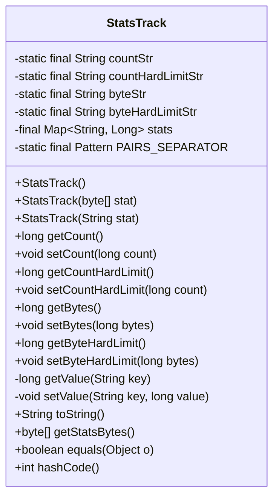
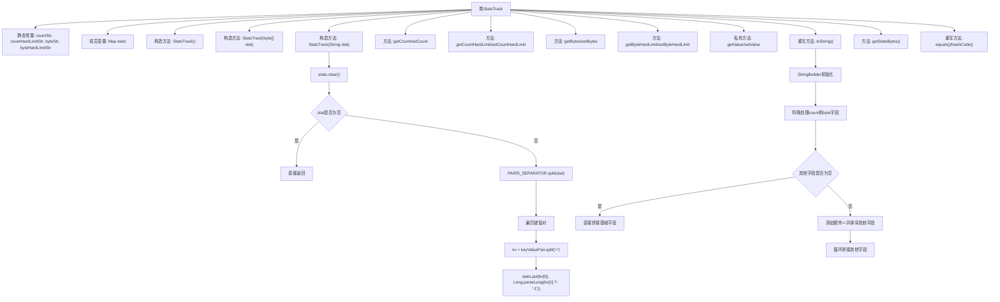

# 基础信息

|      |      |
|------|------|
| 名称 | StatsTrack |
| 编码语言 | .java |
| 代码路径 | zookeeper/zookeeper-server/src/main/java/org/apache/zookeeper/StatsTrack.java |
| 包名 | org.apache.zookeeper |
| 依赖项 | ['java.nio.charset.StandardCharsets', 'java.util.ArrayList', 'java.util.Collections', 'java.util.HashMap', 'java.util.Map', 'java.util.Objects', 'java.util.regex.Pattern', 'org.apache.zookeeper.common.StringUtils'] |
| 概述说明 | StatsTrack类用于统计配额数据，支持节点数和字节数的软硬限制设置与获取，通过字符串或字节数组初始化，提供toString方法生成兼容旧版本的统计字符串。 |

# 说明

StatsTrack类用于跟踪配额统计信息，包含节点数和字节数的计数及其硬限制。通过键值对字符串初始化，支持获取和设置count、countHardLimit、bytes、byteHardLimit等值。内部使用HashMap存储数据，提供toString方法生成兼容旧版本的特定格式字符串。包含equals和hashCode方法用于对象比较，支持字节数组与字符串的相互转换。

# 类列表 Class Summary

| 名称   | 类型  | 说明 |
|-------|------|-------------|
| StatsTrack | class | StatsTrack类用于统计跟踪，支持设置和获取节点数、字节数及其硬限制，通过键值对字符串初始化，提供toString方法生成兼容旧版本的统计字符串。 |

## 类 StatsTrack

|      |      |
|------|------|
| 访问范围 | public |
| 类型 | class |
| 名称 | StatsTrack |
| 说明 | StatsTrack类用于统计跟踪，支持设置和获取节点数、字节数及其硬限制，通过键值对字符串初始化，提供toString方法生成兼容旧版本的统计字符串。 |

### UML类图

该代码定义了一个`StatsTrack`类，用于跟踪和统计节点数量与字节数的配额信息。类中包含多个静态常量字符串用于标识不同类型的统计项，以及一个`Map`用于存储键值对形式的统计信息。提供了多种构造方法，支持从字符串或字节数组初始化统计信息。类中还包含获取和设置各类统计值的方法，以及`toString`方法用于生成特定格式的统计字符串，确保向后兼容性。此外，还重写了`equals`和`hashCode`方法以便于对象比较。

### 内部方法调用关系图

该流程图展示了StatsTrack类的完整结构，重点描述了三个构造方法的初始化流程和toString()方法的特殊处理逻辑。类通过HashMap存储四种配额统计指标（常规计数/硬限制计数/常规字节/硬限制字节），其中构造方法支持空参数、字节数组和字符串三种初始化方式。toString()方法采用特殊格式保证向后兼容性，强制将count和bytes字段放在最前面并用逗号分隔，其他字段用分号分隔并添加额外等号以兼容旧版解析器。

### 字段列表 Field List

| 名称  | 类型  | 说明 |
|-------|-------|------|
| countHardLimitStr = "countHardLimit" | String | 私有静态常量字符串countHardLimitStr值为"countHardLimit"。 |
| PAIRS_SEPARATOR = Pattern.compile("[,;]+") | Pattern | 定义私有静态常量PAIRS_SEPARATOR，使用正则表达式匹配逗号或分号作为分隔符。 |
| stats = new HashMap<>() | Map<String, Long> | 私有哈希映射变量stats，键为字符串，值为长整型。 |
| byteHardLimitStr = "byteHardLimit" | String | 私有静态常量字符串byteHardLimitStr，值为"byteHardLimit"。 |
| countStr = "count" | String | 私有静态常量字符串countStr，值为"count"。 |
| byteStr = "bytes" | String | 私有静态常量字符串byteStr值为"bytes"。 |

### 方法列表 Method List

| 名称  | 类型  | 说明 |
|-------|-------|------|
| getCount | long | 获取计数值的方法，返回长整型结果。 |
| getStatsBytes | byte[] | 方法`getStatsBytes`将对象字符串转为UTF-8字节数组返回。 |
| setBytes | void | 设置字节数方法，通过调用setValue将输入的长整型bytes值存入byteStr变量。 |
| setByteHardLimit | void | 设置字节硬限制方法，通过参数bytes设定值。 |
| getValue | long | 这是一个私有方法，通过键获取长整型数值。若键不存在则返回-1，否则返回对应值。 |
| toString | String | 重写toString方法，优先处理count和byte字段，其余字段排序后以分号分隔追加。 |
| getBytes | long | 获取字节数值的方法，返回指定变量的长整型值。 |
| hashCode | int | 重写hashCode方法，使用Objects.hash计算stats的哈希值。 |
| setCountHardLimit | void | 设置计数硬限制的方法，通过参数count更新countHardLimitStr的值。 |
| setValue | void | 私有方法setValue，接收字符串key和长整型value，将键值对存入stats映射中。 |
| setCount | void | 设置count值的方法，调用setValue函数传入countStr和count参数。 |
| getCountHardLimit | long | 获取计数硬限制值的方法，调用getValue处理countHardLimitStr参数并返回结果。 |
| equals | boolean | 重写equals方法，先检查对象是否相同或类型匹配，再比较stats属性是否相等。 |
| getByteHardLimit | long | 获取字节硬限制值的方法，返回长整型数值。 |

