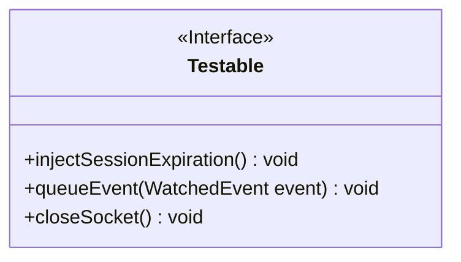
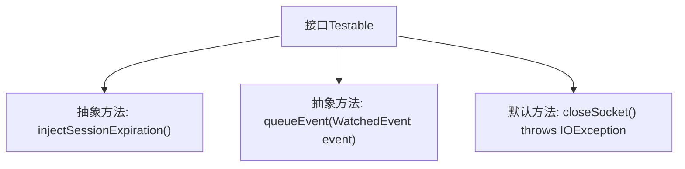

# 基础信息

|      |      |
|------|------|
| 名称 | Testable |
| 编码语言 | .java |
| 代码路径 | zookeeper/zookeeper-server/src/main/java/org/apache/zookeeper/Testable.java |
| 包名 | org.apache.zookeeper |
| 依赖项 | ['java.io.IOException'] |
| 概述说明 | Testable接口定义了测试ZooKeeper的方法：注入会话过期、插入事件到队列、关闭客户端连接套接字。 |

# 说明

该内容定义了一个名为Testable的公共接口，包含三个方法。injectSessionExpiration方法用于模拟ZooKeeper实例会话过期的行为。queueEvent方法允许将指定事件插入事件队列，参数为WatchedEvent类型的事件。closeSocket是一个默认方法，用于测试时关闭ClientCnxn套接字，可能抛出IOException异常。接口整体提供了测试ZooKeeper相关功能的操作。

# 类列表 Class Summary

| 名称   | 类型  | 说明 |
|-------|------|-------------|
| Testable | interface | Testable接口定义了测试ZooKeeper的方法：注入会话过期、插入事件到队列、关闭客户端连接套接字。 |

## 类 Testable

|      |      |
|------|------|
| 访问范围 | public |
| 类型 | interface |
| 名称 | Testable |
| 说明 | Testable接口定义了测试ZooKeeper的方法：注入会话过期、插入事件到队列、关闭客户端连接套接字。 |

### UML类图

这段类图描述了一个名为Testable的接口，该接口定义了三个方法：injectSessionExpiration()用于模拟会话过期，queueEvent()用于向事件队列插入事件，closeSocket()是默认方法用于关闭客户端连接。接口通过<<Interface>>标记明确标识，所有方法均为公有且无实现细节（除默认方法外），体现了对ZooKeeper客户端连接测试行为的抽象。

### 内部方法调用关系图

这段流程图描述了Testable接口的结构，包含两个抽象方法injectSessionExpiration()和queueEvent()，以及一个默认方法closeSocket()。该接口主要用于模拟ZooKeeper客户端连接的各种异常场景，包括会话过期、事件注入和强制关闭Socket连接，为测试提供可控的故障注入能力。方法间无直接调用关系，均为独立的功能点定义。

### 字段列表 Field List

| 名称  | 类型  | 说明 |
|-------|-------|------|

### 方法列表 Method List

| 名称  | 类型  | 说明 |
|-------|-------|------|
| injectSessionExpiration | void | 方法声明：注入会话过期处理逻辑。 |
| queueEvent | void | 方法`queueEvent`用于将`WatchedEvent`事件加入队列，以便后续处理。 |
| closeSocket | void | 关闭套接字并可能抛出IO异常。 |

