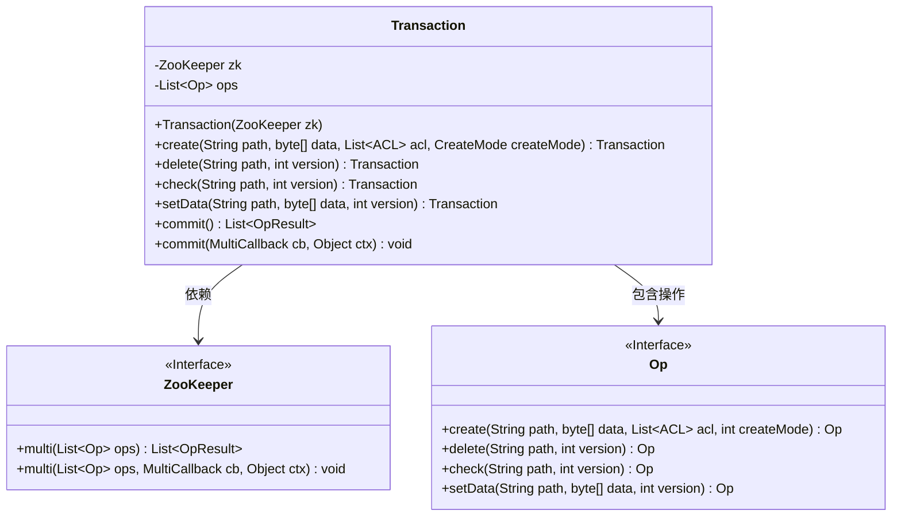
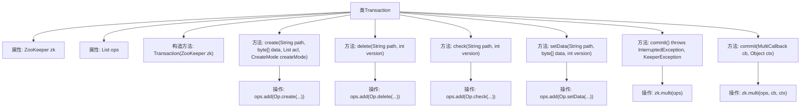

# 基础信息

|      |      |
|------|------|
| 名称 | Transaction |
| 编码语言 | .java |
| 代码路径 | zookeeper/zookeeper-server/src/main/java/org/apache/zookeeper/Transaction.java |
| 包名 | org.apache.zookeeper |
| 依赖项 | ['java.util.ArrayList', 'java.util.List', 'org.apache.yetus.audience.InterfaceAudience', 'org.apache.zookeeper.AsyncCallback.MultiCallback', 'org.apache.zookeeper.data.ACL'] |
| 概述说明 | Transaction类用于ZooKeeper事务操作，支持创建、删除、检查和设置数据操作，提供同步和异步提交方法。 |

# 说明

这是一个公开的Transaction类，用于在ZooKeeper客户端中执行原子性事务操作。类中包含一个ZooKeeper实例和操作列表。提供创建节点、删除节点、检查节点版本和设置节点数据的方法，每个方法都将对应操作添加到列表中。支持同步提交（返回操作结果列表）和异步提交（使用回调函数）两种方式提交事务。所有操作会作为原子性事务一次性执行。

# 类列表 Class Summary

| 名称   | 类型  | 说明 |
|-------|------|-------------|
| Transaction | class | Transaction类用于ZooKeeper事务操作，支持创建、删除、检查和设置数据操作，提供同步和异步提交方法。 |

## 类 Transaction

|      |      |
|------|------|
| 访问范围 | @InterfaceAudience.Public;public |
| 类型 | class |
| 名称 | Transaction |
| 说明 | Transaction类用于ZooKeeper事务操作，支持创建、删除、检查和设置数据操作，提供同步和异步提交方法。 |

### UML类图

这段代码展示了一个ZooKeeper事务处理类Transaction，它封装了对ZooKeeper的原子性操作。Transaction类通过维护一个操作列表(ops)来支持创建、删除、检查和设置数据等操作，最后通过commit方法批量提交。该类依赖于ZooKeeper接口实现多操作提交，并使用Op接口表示具体操作。设计采用了流畅接口模式，支持链式调用，同时提供了同步和异步两种提交方式。

### 内部方法调用关系图

这段代码定义了一个ZooKeeper事务类Transaction，用于批量执行多个操作（创建、删除、检查、设置数据）。流程图展示了类的结构，包括两个私有属性（zk和ops列表）、一个受保护的构造函数，以及五个公共方法。其中四个方法（create/delete/check/setData）用于添加不同类型的操作到ops列表，两个commit方法分别以同步和异步方式执行事务。所有操作最终通过zk.multi()方法提交执行，体现了ZooKeeper事务的原子性特性。

### 字段列表 Field List

| 名称  | 类型  | 说明 |
|-------|-------|------|
| ops = new ArrayList<>() | List<Op> | 私有列表变量ops，用于存储Op类型元素，初始化为空ArrayList。 |
| zk | ZooKeeper | 私有ZooKeeper实例变量zk。 |

### 方法列表 Method List

| 名称  | 类型  | 说明 |
|-------|-------|------|
| delete | Transaction | 方法delete接收路径和版本号，添加删除操作到ops列表并返回当前对象。 |
| create | Transaction | 创建事务方法：接收路径、数据、ACL列表和创建模式，生成创建操作并返回当前事务对象。 |
| check | Transaction | 方法`check`添加路径和版本检查操作到事务中，返回当前事务对象。 |
| setData | Transaction | 方法setData用于设置路径path的数据data和版本version，操作加入ops列表后返回当前对象。 |
| commit | List<OpResult> | Java方法`commit()`调用ZooKeeper的`multi()`执行批量操作，返回操作结果列表，可能抛出中断或ZooKeeper异常。 |
| commit | void | 这是一个Java方法，名为commit，接受MultiCallback回调对象和Object上下文参数，调用zk的multi方法处理操作队列。 |

