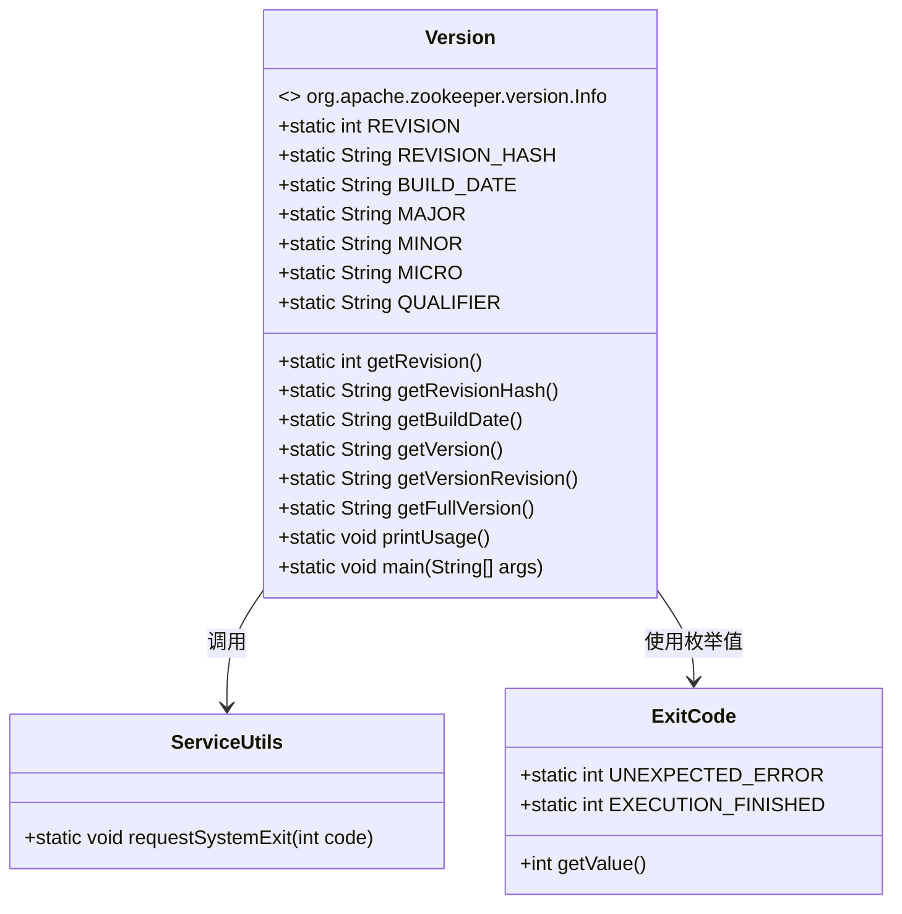

# 基础信息

|      |      |
|------|------|
| 名称 | Version |
| 编码语言 | .java |
| 代码路径 | zookeeper/zookeeper-server/src/main/java/org/apache/zookeeper/Version.java |
| 包名 | org.apache.zookeeper |
| 依赖项 | ['edu.umd.cs.findbugs.annotations.SuppressFBWarnings', 'org.apache.zookeeper.server.ExitCode', 'org.apache.zookeeper.util.ServiceUtils'] |
| 概述说明 | 这是一个ZooKeeper版本信息类，提供获取版本号、修订哈希、构建日期的方法，支持命令行参数输出不同格式的版本信息。 |

# 说明

该代码定义了一个Version类，用于管理ZooKeeper的版本信息。类中提供了多个静态方法获取版本相关数据：getRevision方法已废弃，建议使用getRevisionHash；getVersion返回主版本号；getVersionRevision返回带Git哈希的版本；getFullVersion返回完整版本信息。main方法支持命令行参数--short、--revision和--full来输出不同格式的版本信息，无参数时默认输出完整版本。代码还包含版本兼容性说明和废弃方法的替代方案。

# 类列表 Class Summary

| 名称   | 类型  | 说明 |
|-------|------|-------------|
| Version | class | ZooKeeper版本类，提供版本号、修订哈希、构建日期查询功能，支持命令行参数输出不同格式版本信息。 |


## 类 Version

|      |      |
|------|------|
| 访问范围 | public |
| 类型 | class |
| 名称 | Version |
| 说明 | ZooKeeper版本类，提供版本号、修订哈希、构建日期查询功能，支持命令行参数输出不同格式版本信息。 |


### UML类图



这段代码定义了一个Version类，实现了org.apache.zookeeper.version.Info接口，主要用于管理Zookeeper的版本信息。它包含多个静态方法用于获取版本号、修订哈希、构建日期等，并通过main方法支持命令行参数来输出不同格式的版本信息。类中使用了ServiceUtils和ExitCode两个外部类来实现系统退出功能，并处理了多种命令行参数情况。代码还包含废弃方法和详细的注释说明版本历史变更。


### 内部方法调用关系图

```mermaid
graph TD
    A["类Version"]
    B["废弃方法: getRevision()"]
    C["方法: getRevisionHash()"]
    D["方法: getBuildDate()"]
    E["方法: getVersion()"]
    F["方法: getVersionRevision()"]
    G["方法: getFullVersion()"]
    H["方法: printUsage()"]
    I["主方法: main(String[] args)"]
    J["条件分支: args长度检查"]
    K["输出: getFullVersion()"]
    L["输出: getVersion()"]
    M["输出: getVersionRevision()"]
    N["系统退出: ServiceUtils.requestSystemExit"]

    A --> B
    A --> C
    A --> D
    A --> E
    A --> F
    A --> G
    A --> H
    A --> I
    I --> J
    J -->|args.length=0| K
    J -->|args[0]='--full'| K
    J -->|args[0]='--short'| L
    J -->|args[0]='--revision'| M
    J -->|其他情况| H
    K --> N
    L --> N
    M --> N
    H --> N
```

这段代码是Apache ZooKeeper的版本信息工具类，主要提供版本号、修订哈希、构建日期等信息的获取和输出功能。流程图展示了类中方法的调用关系，特别是main方法根据输入参数的不同分支逻辑：无参数或"--full"时输出完整版本信息，"--short"输出基础版本号，"--revision"输出带修订哈希的版本号，其他情况则打印使用说明。所有分支最终都会调用系统退出方法，但退出码会根据不同路径有所区别（图中未展示该细节）。

### 字段列表 Field List

| 名称  | 类型  | 说明 |
|-------|-------|------|

### 方法列表 Method List

| 名称  | 类型  | 说明 |
|-------|-------|------|
| getVersion | String | 静态方法getVersion返回版本字符串，格式为"主版本.次版本.微版本"，若QUALIFIER非空则追加"-QUALIFIER"。忽略冗余空值检查警告。 |
| getBuildDate | String | 这是一个静态方法，返回构建日期常量BUILD_DATE的值。 |
| main | void | Java主函数，根据参数输出版本信息：无参数或--full输出完整版，--short输出版本，--revision输出修订版，否则提示用法。 |
| getRevision | int | 废弃的静态方法getRevision，返回REVISION值。 |
| getVersionRevision | String | 静态方法getVersionRevision返回版本号与修订哈希值的拼接字符串，格式为"版本号-哈希值"。 |
| getRevisionHash | String | 这是一个静态方法，返回常量REVISION_HASH的值。 |
| getFullVersion | String | 该方法返回完整版本信息，包含版本修订号和构建日期。 |
| printUsage | void | 静态方法printUsage输出Zookeeper版本查询用法，无参数时默认打印完整版本信息，随后请求系统异常退出。 |


