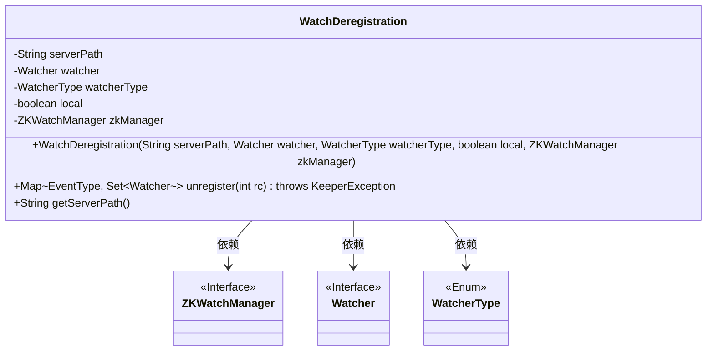
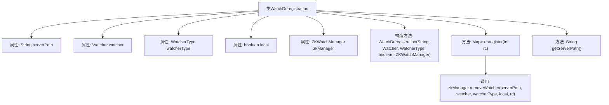

# 基础信息

|      |      |
|------|------|
| 名称 | WatchDeregistration |
| 编码语言 | .java |
| 代码路径 | zookeeper/zookeeper-server/src/main/java/org/apache/zookeeper/WatchDeregistration.java |
| 包名 | org.apache.zookeeper |
| 依赖项 | ['java.util.Map', 'java.util.Set', 'org.apache.zookeeper.Watcher.Event.EventType', 'org.apache.zookeeper.Watcher.WatcherType'] |
| 概述说明 | WatchDeregistration类用于取消ZooKeeper路径上的监听器注册，包含路径、监听器、类型等属性，提供取消注册和获取路径的方法。 |

# 说明

WatchDeregistration类用于管理ZooKeeper监听器的注销操作。它包含五个关键字段：serverPath表示监听路径，watcher是待注销的监听器，watcherType指定监听类型，local标志是否本地监听，zkManager是核心管理组件。核心方法unregister通过调用zkManager.removeWatcher实现监听器注销，并返回事件类型与监听器的映射集合。辅助方法getServerPath提供路径查询功能。该类封装了监听器注销所需的所有参数和操作逻辑。

# 类列表 Class Summary

| 名称   | 类型  | 说明 |
|-------|------|-------------|
| WatchDeregistration | class | WatchDeregistration类用于取消ZooKeeper路径上的监听器注册，包含路径、监听器、类型等属性，提供取消注册和获取路径的方法。 |

## 类 WatchDeregistration

|      |      |
|------|------|
| 访问范围 | public |
| 类型 | class |
| 名称 | WatchDeregistration |
| 说明 | WatchDeregistration类用于取消ZooKeeper路径上的监听器注册，包含路径、监听器、类型等属性，提供取消注册和获取路径的方法。 |

### UML类图

这段类图展示了WatchDeregistration类的结构及其依赖关系。该类用于管理ZooKeeper监视器的注销操作，包含5个私有字段（包括路径、监视器对象、类型标记等）和3个公有方法。通过组合方式依赖ZKWatchManager接口实现核心功能，同时关联Watcher接口和WatcherType枚举类型。核心方法unregister()通过调用zkManager移除指定路径的监视器，并返回事件类型与监视器的映射集合。

### 内部方法调用关系图

这段代码描述了一个用于取消ZooKeeper监听器注册的WatchDeregistration类。该类包含5个私有属性：serverPath表示服务器路径，watcher是监听器对象，watcherType指定监听器类型，local标志是否为本地监听，zkManager是ZooKeeper监听管理器。核心方法unregister()通过调用zkManager.removeWatcher()实现监听器移除，getServerPath()用于获取服务器路径。流程图清晰地展示了类结构与主要方法调用关系，特别是unregister()方法对zkManager的依赖调用。

### 字段列表 Field List

| 名称  | 类型  | 说明 |
|-------|-------|------|
| zkManager | ZKWatchManager | 私有成员变量zkManager，类型为ZKWatchManager。 |
| watcherType | WatcherType | 私有不可变的WatcherType类型变量watcherType。 |
| watcher | Watcher | 私有Watcher类型变量watcher。 |
| serverPath | String | 私有字符串变量serverPath，不可修改。 |
| local | boolean | 私有布尔类型变量local，不可修改。 |

### 方法列表 Method List

| 名称  | 类型  | 说明 |
|-------|-------|------|
| unregister | Map<EventType, Set<Watcher>> | 移除指定路径的观察者，返回事件类型与观察者集合的映射，可能抛出KeeperException异常。 |
| getServerPath | String | 获取服务器路径的方法，返回字符串类型变量serverPath。 |

