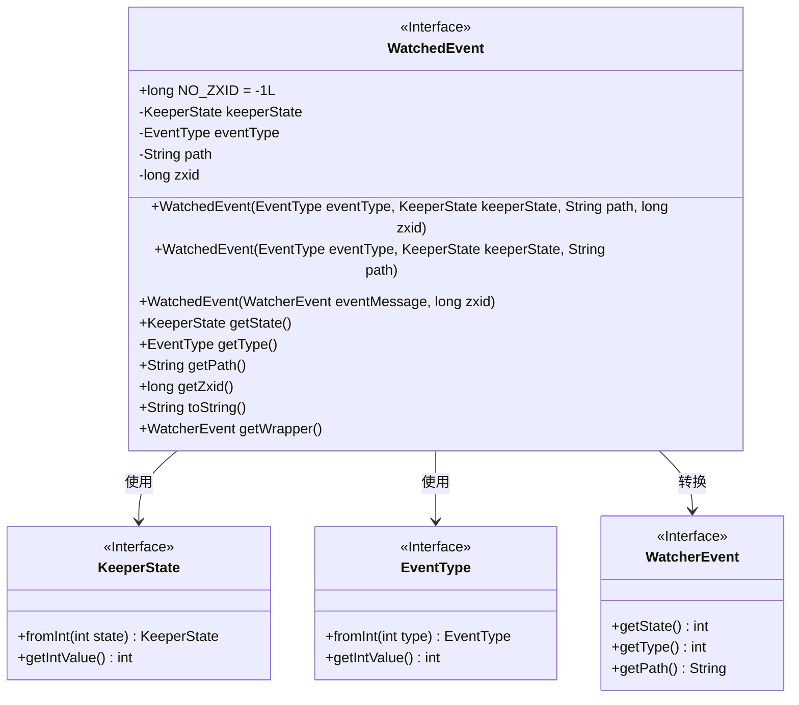
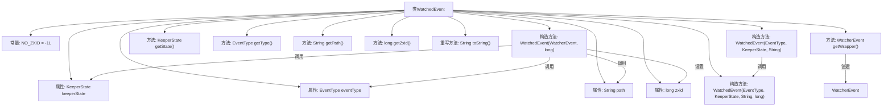

# 基础信息

|      |      |
|------|------|
| 名称 | WatchedEvent |
| 编码语言 | .java |
| 代码路径 | zookeeper/zookeeper-server/src/main/java/org/apache/zookeeper/WatchedEvent.java |
| 包名 | org.apache.zookeeper |
| 依赖项 | ['org.apache.yetus.audience.InterfaceAudience', 'org.apache.zookeeper.Watcher.Event.EventType', 'org.apache.zookeeper.Watcher.Event.KeeperState', 'org.apache.zookeeper.proto.WatcherEvent'] |
| 概述说明 | WatchedEvent类用于封装监视事件，包含状态、类型、路径和事务ID，提供构造、转换和获取方法。 |

# 说明

WatchedEvent是一个公开类，用于表示监视事件，包含状态、类型、路径和zxid等属性。它提供了多个构造方法，支持从网络传输的WatcherEvent转换，并包含获取状态、类型、路径和zxid的方法。zxid仅在特定事件类型时有效，否则返回NO_ZXID。此外，还提供了转换为网络传输格式的方法和字符串表示方法。

# 类列表 Class Summary

| 名称   | 类型  | 说明 |
|-------|------|-------------|
| WatchedEvent | class | 公开类WatchedEvent用于监控事件，包含状态、类型、路径和zxid属性，提供构造方法和获取方法，支持网络传输转换。 |

## 类 WatchedEvent

|      |      |
|------|------|
| 访问范围 | @InterfaceAudience.Public;public |
| 类型 | class |
| 名称 | WatchedEvent |
| 说明 | 公开类WatchedEvent用于监控事件，包含状态、类型、路径和zxid属性，提供构造方法和获取方法，支持网络传输转换。 |

### UML类图

这段代码定义了一个`WatchedEvent`类，用于表示ZooKeeper中的监视事件。该类包含事件类型、状态、路径和事务ID等属性，并提供了构造方法、获取属性值的方法以及转换为网络传输格式的方法。`WatchedEvent`依赖于`KeeperState`、`EventType`和`WatcherEvent`接口来获取和转换事件的状态和类型信息。该类主要用于处理ZooKeeper中的监视事件，包括事件的创建、属性获取和网络传输格式的转换。

### 内部方法调用关系图

这段代码定义了一个ZooKeeper的WatchedEvent类，用于封装监视事件的相关信息。该类包含四个核心属性（keeperState、eventType、path、zxid）和三种构造方法，支持从网络传输的WatcherEvent转换。主要功能包括获取事件状态/类型/路径/事务ID，生成可序列化的WatcherEvent对象，以及重写toString()方法。特别处理了zxid的默认值（NO_ZXID）和网络传输封装逻辑，适用于ZooKeeper客户端服务端交互场景。

### 字段列表 Field List

| 名称  | 类型  | 说明 |
|-------|-------|------|
| zxid | long | 私有长整型变量zxid。 |
| NO_ZXID = -1L | long | 该代码定义了一个静态不可变常量NO_ZXID，值为-1L，表示无效的ZXID标识符。 |
| eventType | EventType | 私有不可变事件类型字段。 |
| keeperState | KeeperState | 私有不可变的KeeperState状态变量。 |
| path | String | 私有字符串变量path，不可修改。 |

### 方法列表 Method List

| 名称  | 类型  | 说明 |
|-------|-------|------|
| getState | KeeperState | 方法getState返回KeeperState类型的keeperState变量值。 |
| getPath | String | 这是一个Java方法，返回字符串类型的path变量值。 |
| getZxid | long | 这是一个Java方法，返回长整型变量zxid的值。 |
| getType | EventType | 获取事件类型的方法，返回eventType。 |
| toString | String | 重写toString方法，返回包含keeperState、eventType、path和zxid的字符串。 |
| getWrapper | WatcherEvent | 方法getWrapper返回一个WatcherEvent对象，包含事件类型、状态和路径的整数值。 |

