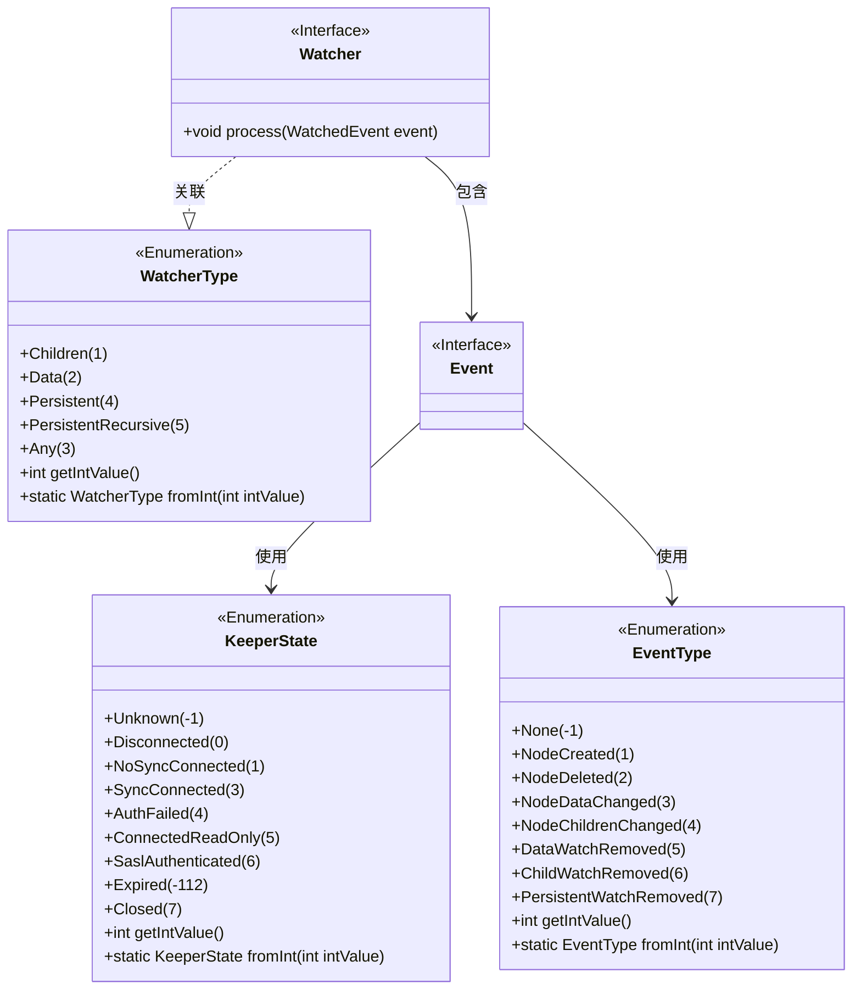
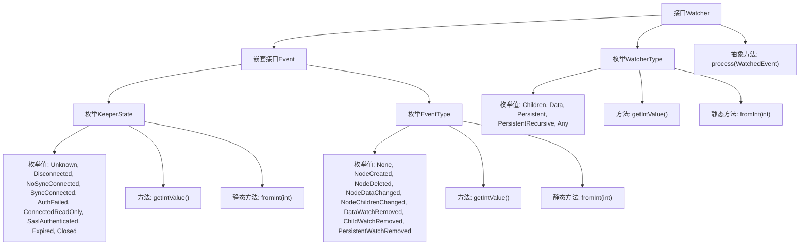

# 基础信息

|      |      |
|------|------|
| 名称 | Watcher |
| 编码语言 | .java |
| 代码路径 | zookeeper/zookeeper-server/src/main/java/org/apache/zookeeper/Watcher.java |
| 包名 | org.apache.zookeeper |
| 依赖项 | ['org.apache.yetus.audience.InterfaceAudience'] |
| 概述说明 | Watcher接口定义了ZooKeeper事件状态(KeeperState)、事件类型(EventType)和监视器类型(WatcherType)的枚举，并提供整数转换方法。核心功能是处理WatchedEvent事件。 |

# 说明

Watcher接口定义了ZooKeeper客户端的事件监听机制，包含三个核心部分。Event接口描述了可能的事件状态和类型，其中KeeperState枚举列举了客户端连接状态，如Disconnected、SyncConnected、AuthFailed等；EventType枚举定义了节点事件类型，如NodeCreated、NodeDataChanged等。WatcherType枚举则区分了监听器类型，包括Children、Data、Persistent等。process方法用于处理接收到的WatchedEvent事件。所有枚举均支持整数值转换，便于网络传输。

# 类列表 Class Summary

| 名称   | 类型  | 说明 |
|-------|------|-------------|
| Watcher | interface | Watcher接口定义了ZooKeeper事件监听机制，包含KeeperState（连接状态如Disconnected、SyncConnected等）、EventType（节点事件如NodeCreated、NodeDeleted等）和WatcherType（监听类型如Children、Data等），通过process方法处理事件。 |

## 类 Watcher

|      |      |
|------|------|
| 访问范围 | @InterfaceAudience.Public;public |
| 类型 | interface |
| 名称 | Watcher |
| 说明 | Watcher接口定义了ZooKeeper事件监听机制，包含KeeperState（连接状态如Disconnected、SyncConnected等）、EventType（节点事件如NodeCreated、NodeDeleted等）和WatcherType（监听类型如Children、Data等），通过process方法处理事件。 |

### UML类图

这段代码定义了一个ZooKeeper的Watcher接口及其相关枚举类型。Watcher接口包含一个嵌套接口Event和枚举类型WatcherType，Event接口又包含两个枚举类型KeeperState和EventType，分别表示ZooKeeper的连接状态和事件类型。KeeperState枚举定义了8种连接状态，EventType枚举定义了8种事件类型，WatcherType枚举定义了5种监视器类型。所有枚举都提供了整数值转换方法，用于网络传输。该设计用于处理ZooKeeper客户端与服务器之间的状态变更和事件通知。

### 内部方法调用关系图

这段代码定义了一个ZooKeeper的Watcher接口及其相关嵌套结构和枚举。Watcher接口包含一个嵌套接口Event，Event中又定义了KeeperState和EventType两个枚举，分别表示ZooKeeper连接状态和事件类型。Watcher自身还定义了WatcherType枚举来表示不同类型的监视器。核心功能是通过process方法处理WatchedEvent事件，各枚举都提供了整数值转换和获取的方法。整体结构清晰地组织了ZooKeeper客户端事件处理的相关类型和状态。

### 字段列表 Field List

| 名称  | 类型  | 说明 |
|-------|-------|------|

### 方法列表 Method List

| 名称  | 类型  | 说明 |
|-------|-------|------|
| process | void | 处理WatchedEvent事件的接口方法。 |

