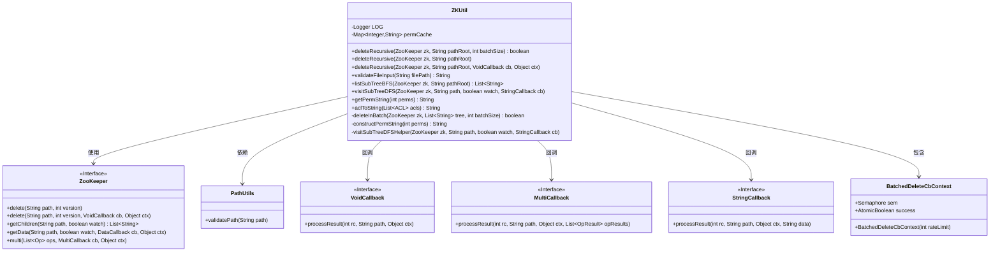
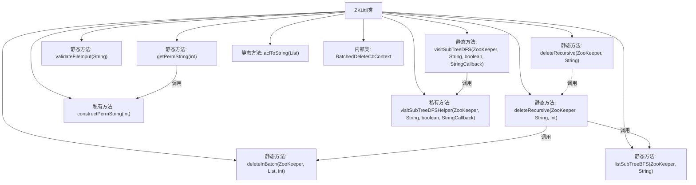
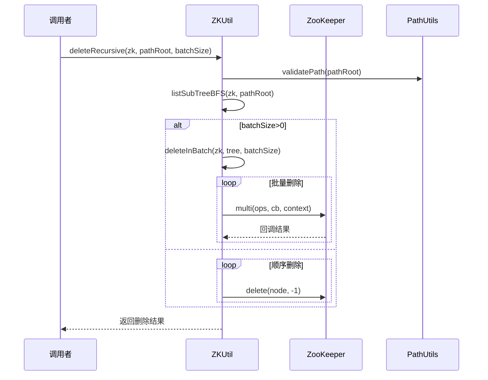

# 基础信息

|      |      |
|------|------|
| 名称 | ZKUtil |
| 编码语言 | .java |
| 代码路径 | zookeeper/zookeeper-server/src/main/java/org/apache/zookeeper/ZKUtil.java |
| 包名 | org.apache.zookeeper |
| 依赖项 | ['java.io.File', 'java.util.ArrayDeque', 'java.util.ArrayList', 'java.util.Collections', 'java.util.List', 'java.util.Map', 'java.util.Queue', 'java.util.concurrent.ConcurrentHashMap', 'java.util.concurrent.Semaphore', 'java.util.concurrent.atomic.AtomicBoolean', 'org.apache.zookeeper.AsyncCallback.MultiCallback', 'org.apache.zookeeper.AsyncCallback.StringCallback', 'org.apache.zookeeper.AsyncCallback.VoidCallback', 'org.apache.zookeeper.KeeperException.Code', 'org.apache.zookeeper.common.PathUtils', 'org.apache.zookeeper.data.ACL', 'org.slf4j.Logger', 'org.slf4j.LoggerFactory'] |
| 概述说明 | ZKUtil类提供ZooKeeper工具方法，包括递归删除节点、批量删除、BFS/DFS遍历子树、权限字符串转换及ACL格式化功能。支持同步/异步操作，批量删除优化性能。 |

# 说明

ZKUtil类提供了一系列ZooKeeper实用方法，主要包括递归删除节点、遍历子树、权限处理等功能。deleteRecursive方法支持同步和异步批量删除子树，通过BFS遍历获取所有子节点路径。listSubTreeBFS和visitSubTreeDFS分别实现广度优先和深度优先遍历。validateFileInput验证文件路径有效性。getPermString和aclToString处理ACL权限的字符串表示，将权限位转换为可读字符串。类内部使用并发缓存优化权限字符串生成，并包含批量删除的回调处理机制。所有方法都进行路径有效性校验并处理异常情况。

# 类列表 Class Summary

| 名称   | 类型  | 说明 |
|-------|------|-------------|
| ZKUtil | class | ZKUtil类提供ZooKeeper工具方法，包括递归删除节点（支持批量异步操作）、BFS/DFS遍历子树、权限字符串转换及文件输入验证。关键点：批量删除优化性能，兼容旧版API，非原子性遍历需注意并发。 |

## 类 ZKUtil

|      |      |
|------|------|
| 访问范围 | public |
| 类型 | class |
| 名称 | ZKUtil |
| 说明 | ZKUtil类提供ZooKeeper工具方法，包括递归删除节点（支持批量异步操作）、BFS/DFS遍历子树、权限字符串转换及文件输入验证。关键点：批量删除优化性能，兼容旧版API，非原子性遍历需注意并发。 |

### UML类图

这段代码是ZooKeeper工具类ZKUtil的实现，主要提供了递归删除节点、遍历子树、权限字符串转换等功能。类图中包含ZKUtil核心类及其内部类BatchedDeleteCbContext，同时展示了与ZooKeeper接口、PathUtils工具类以及各种回调接口(VoidCallback/MultiCallback/StringCallback)的交互关系。ZKUtil通过组合模式实现批量删除功能，并采用回调机制处理异步操作，整体设计体现了对ZooKeeper API的高层次封装。

### 内部方法调用关系图

该流程图展示了ZKUtil类的核心方法调用关系，重点描述了递归删除ZooKeeper节点的两种模式（批量异步和顺序同步）。时序图则具体呈现了deleteRecursive方法的执行过程，包括路径验证、BFS遍历子树、根据batchSize选择删除策略等关键步骤。类结构包含8个公共方法和3个私有方法，其中批量删除通过内部类BatchedDeleteCbContext实现并发控制，权限处理采用缓存优化机制。

### 字段列表 Field List

| 名称  | 类型  | 说明 |
|-------|-------|------|
| LOG = LoggerFactory.getLogger(ZKUtil.class) | Logger | ZKUtil类中定义了一个私有静态日志记录器LOG，用于记录日志信息。 |
| permCache = new ConcurrentHashMap<>() | Map<Integer, String> | 私有静态常量permCache，使用ConcurrentHashMap存储整数到字符串的映射，确保线程安全。 |

### 方法列表 Method List

| 名称  | 类型  | 说明 |
|-------|-------|------|
| deleteRecursive | void | 递归删除ZooKeeper路径及其所有子节点，先删除叶子节点再处理根节点，使用BFS遍历子节点树。 |
| deleteInBatch | boolean | 批量删除ZooKeeper节点树的方法，按批次处理，使用信号量控制并发，支持快速失败，返回操作结果。 |
| deleteRecursive | boolean | 递归删除ZooKeeper节点树，支持批量删除或逐个删除子节点，先删叶子节点再删根节点。 |
| validateFileInput | String | 静态方法验证文件输入：检查文件是否存在、可读且非目录，返回错误信息或null。 |
| visitSubTreeDFS | void | 静态方法visitSubTreeDFS通过ZooKeeper客户端递归遍历子树，先获取节点数据再调用回调函数，最后辅助遍历子节点。参数含路径、监视标志和回调接口。 |
| listSubTreeBFS | List<String> | 该方法使用广度优先搜索遍历ZooKeeper节点路径，返回所有子节点列表。从根路径开始，逐层遍历子节点并构建完整路径，避免根路径拼接错误。 |
| deleteRecursive | void | 递归删除ZooKeeper指定路径及其子节点，batchSize=0保持旧客户端兼容性。 |
| getPermString | String | 静态方法getPermString通过permCache缓存权限字符串，若未命中则调用constructPermString生成新字符串。 |
| visitSubTreeDFSHelper | void | 这是一个使用深度优先搜索遍历ZooKeeper子树的辅助方法。它递归访问每个子节点，排序后处理并回调结果。忽略已删除节点异常。 |
| constructPermString | String | 静态方法根据权限位生成字符串：c（创建）、d（删除）、r（读取）、w（写入）、a（管理）。 |
| aclToString | String | 将ACL列表转换为字符串，格式为"方案:ID:权限"，循环拼接每个ACL元素。 |

