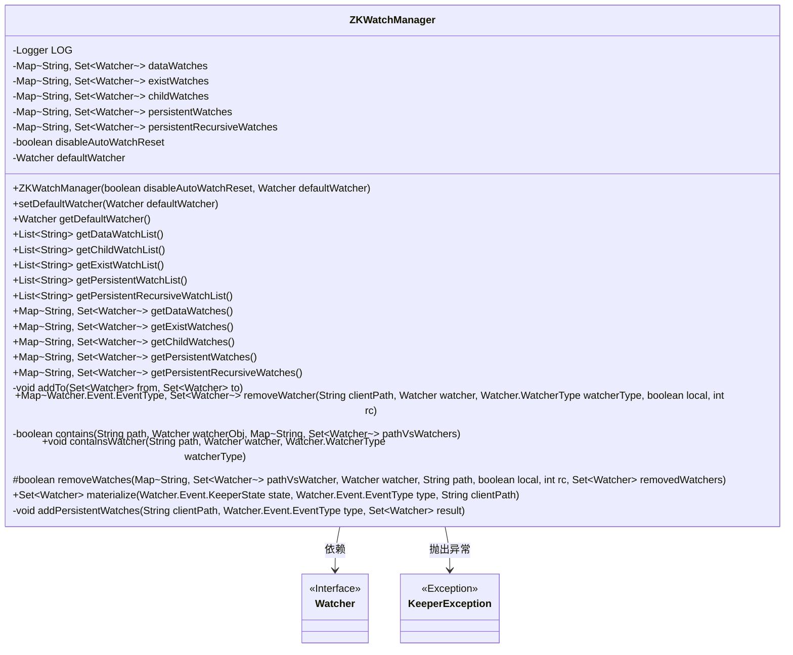

# 基础信息

|      |      |
|------|------|
| 名称 | ZKWatchManager |
| 编码语言 | .java |
| 代码路径 | zookeeper/zookeeper-server/src/main/java/org/apache/zookeeper/ZKWatchManager.java |
| 包名 | org.apache.zookeeper |
| 依赖项 | ['java.util.ArrayList', 'java.util.HashMap', 'java.util.HashSet', 'java.util.List', 'java.util.Map', 'java.util.Set', 'org.apache.zookeeper.server.watch.PathParentIterator', 'org.slf4j.Logger', 'org.slf4j.LoggerFactory'] |
| 概述说明 | ZKWatchManager管理ZooKeeper客户端监听器，包含数据、子节点、持久化等五种监听类型，支持添加、移除和验证监听器，并在事件触发时生成对应监听器集合。 |

# 说明

ZKWatchManager是一个实现ClientWatchManager接口的类，用于管理ZooKeeper客户端的不同类型监视器。它维护了五种类型的监视器映射：数据监视器、存在监视器、子节点监视器、持久监视器和持久递归监视器。该类提供了设置和获取默认监视器的方法，以及获取各类型监视器列表的方法。核心功能包括移除指定路径的监视器、验证监视器是否存在，以及根据事件类型和状态实例化相应的监视器集合。特别处理了持久递归监视器的子节点事件过滤逻辑，确保符合其语义要求。所有操作都通过同步块保证线程安全。

# 类列表 Class Summary

| 名称   | 类型  | 说明 |
|-------|------|-------------|
| ZKWatchManager | class | ZKWatchManager类管理多种类型的Watcher，包括数据、存在性、子节点、持久及递归持久监听器，提供添加、移除和查询功能，支持同步操作和事件触发处理。 |

## 类 ZKWatchManager

|      |      |
|------|------|
| 访问范围 | None |
| 类型 | class |
| 名称 | ZKWatchManager |
| 说明 | ZKWatchManager类管理多种类型的Watcher，包括数据、存在性、子节点、持久及递归持久监听器，提供添加、移除和查询功能，支持同步操作和事件触发处理。 |

### UML类图

这段代码展示了一个ZooKeeper的监视管理器`ZKWatchManager`，它实现了`ClientWatchManager`接口，用于管理不同类型的监视器（Watcher）。该类通过多个`Map`结构分别存储数据监视、存在监视、子节点监视、持久监视和持久递归监视，提供了对这些监视器的添加、移除、查询和验证功能。`ZKWatchManager`通过同步块确保线程安全，并处理各种ZooKeeper事件类型，如节点创建、删除、数据变更等。当事件发生时，`materialize`方法会收集相关的监视器并触发它们。该类还处理了监视器的自动重置和持久性监视的特殊逻辑。

### 内部方法调用关系图

```mermaid
graph TD
    A["类ZKWatchManager"]
    B["属性: Map<String, Set<Watcher>> dataWatches"]
    C["属性: Map<String, Set<Watcher>> existWatches"]
    D["属性: Map<String, Set<Watcher>> childWatches"]
    E["属性: Map<String, Set<Watcher>> persistentWatches"]
    F["属性: Map<String, Set<Watcher>> persistentRecursiveWatches"]
    G["属性: boolean disableAutoWatchReset"]
    H["属性: Watcher defaultWatcher"]
    I["构造方法: ZKWatchManager(boolean, Watcher)"]
    J["方法: setDefaultWatcher(Watcher)"]
    K["方法: getDefaultWatcher()"]
    L["方法: getDataWatchList()"]
    M["方法: getChildWatchList()"]
    N["方法: getExistWatchList()"]
    O["方法: getPersistentWatchList()"]
    P["方法: getPersistentRecursiveWatchList()"]
    Q["方法: removeWatcher(String, Watcher, WatcherType, boolean, int)"]
    R["方法: containsWatcher(String, Watcher, WatcherType)"]
    S["方法: materialize(Event.KeeperState, Event.EventType, String)"]
    T["私有方法: addTo(Set<Watcher>, Set<Watcher>)"]
    U["私有方法: contains(String, Watcher, Map<String, Set<Watcher>>)"]
    V["私有方法: removeWatches(Map<String, Set<Watcher>>, Watcher, String, boolean, int, Set<Watcher>)"]
    W["私有方法: addPersistentWatches(String, Event.EventType, Set<Watcher>)"]

    A --> B
    A --> C
    A --> D
    A --> E
    A --> F
    A --> G
    A --> H
    A --> I
    A --> J
    A --> K
    A --> L
    A --> M
    A --> N
    A --> O
    A --> P
    A --> Q
    A --> R
    A --> S
    A --> T
    A --> U
    A --> V
    A --> W
    Q --> U
    Q --> V
    R --> U
    S --> T
    S --> W
```

这段代码是ZooKeeper客户端观察者管理器实现，主要用于管理五种类型的Watcher（数据变更、节点存在、子节点变更、持久化、递归持久化）。核心功能包括：通过synchronized保证线程安全的Watcher操作，支持按路径和类型精确移除Watcher，实现事件触发时的Watcher实例化(materialize)逻辑，并处理持久化Watcher的特殊场景。所有Watcher操作都通过双重检查机制确保数据一致性，异常处理遵循ZooKeeper的规范。

### 字段列表 Field List

| 名称  | 类型  | 说明 |
|-------|-------|------|
| dataWatches = new HashMap<>() | Map<String, Set<Watcher>> | 私有哈希映射，键为字符串，值为Watcher集合，用于存储数据监视器。 |
| existWatches = new HashMap<>() | Map<String, Set<Watcher>> | 私有映射变量existWatches，键为字符串，值为Watcher集合，使用HashMap初始化。 |
| persistentRecursiveWatches = new HashMap<>() | Map<String, Set<Watcher>> | 私有最终映射，键为字符串，值为观察者集合，用于持久递归监视。 |
| childWatches = new HashMap<>() | Map<String, Set<Watcher>> | 私有哈希表childWatches，键为字符串，值为Watcher集合。 |
| LOG = LoggerFactory.getLogger(ZKWatchManager.class) | Logger | ZKWatchManager类中定义了一个私有静态常量LOG，用于日志记录。 |
| defaultWatcher | Watcher | 私有易变监视器默认实例。 |
| persistentWatches = new HashMap<>() | Map<String, Set<Watcher>> | 私有哈希映射，键为字符串，值为Watcher集合，用于持久化监控。 |
| disableAutoWatchReset | boolean | 私有布尔变量，禁用自动监视重置。 |

### 方法列表 Method List

| 名称  | 类型  | 说明 |
|-------|-------|------|
| getPersistentRecursiveWatchList | List<String> | 获取持久递归监视列表的同步方法，返回键集的副本。 |
| getDataWatchList | List<String> | 同步获取数据监视列表的键集合，返回新ArrayList副本。 |
| contains | boolean | 检查路径对应的监视器集合中是否存在指定监视器。若集合为空或路径无效返回false，否则检查集合是否包含该监视器。 |
| getExistWatches | Map<String, Set<Watcher>> | 获取当前存在的监视器集合映射。返回类型为Map<String, Set<Watcher>>。 |
| getPersistentWatchList | List<String> | 方法getPersistentWatchList同步返回persistentWatches的键集合副本。 |
| addPersistentWatches | void | 方法`addPersistentWatches`处理持久化监听：同步添加路径监听至结果集，递归模式下过滤子节点变更事件，避免重复通知。 |
| containsWatcher | void | 方法检查指定路径和类型的监视器是否存在，若不存在则抛出异常。处理五种监视器类型，同步访问不同监视器集合。 |
| getExistWatchList | List<String> | 同步获取现有监控列表，返回键集合的副本。 |
| getPersistentWatches | Map<String, Set<Watcher>> | 该方法返回一个映射，键为字符串，值为观察者集合，用于获取持久观察者列表。 |
| getDefaultWatcher | Watcher | 方法getDefaultWatcher返回默认的defaultWatcher实例。 |
| getChildWatches | Map<String, Set<Watcher>> | 方法getChildWatches返回类型为Map<String, Set<Watcher>>的childWatches变量。 |
| setDefaultWatcher | void | 设置默认观察者方法，将传入的defaultWatcher赋值给当前对象的defaultWatcher属性。 |
| getPersistentRecursiveWatches | Map<String, Set<Watcher>> | 获取持久递归监视器的映射表。 |
| materialize | Set<Watcher> | 方法materialize根据ZooKeeper事件类型处理Watcher集合。None类型时收集所有Watcher并可选清除数据；其他类型如NodeDataChanged等则移除对应路径的Watcher并加入结果。异常事件抛出错误。返回处理后的Watcher集合。 |
| getDataWatches | Map<String, Set<Watcher>> | 获取数据监视器的映射表，键为字符串，值为监视器集合。 |
| getChildWatchList | List<String> | 这是一个同步方法，返回子监控列表的副本，确保线程安全。 |
| addTo | void | 私有方法将非空集合from的元素全部添加到集合to中。 |
| removeWatches | boolean | 方法removeWatches根据条件移除指定路径的监视器。若非本地操作且返回码非OK则抛异常。成功移除后返回true，否则false。 |
| removeWatcher | Map<Watcher.Event.EventType, Set<Watcher>> | 该方法用于移除指定路径的Watcher，根据watcherType同步操作不同Watcher集合，若未找到则抛出异常，返回移除的Watcher集合。 |

