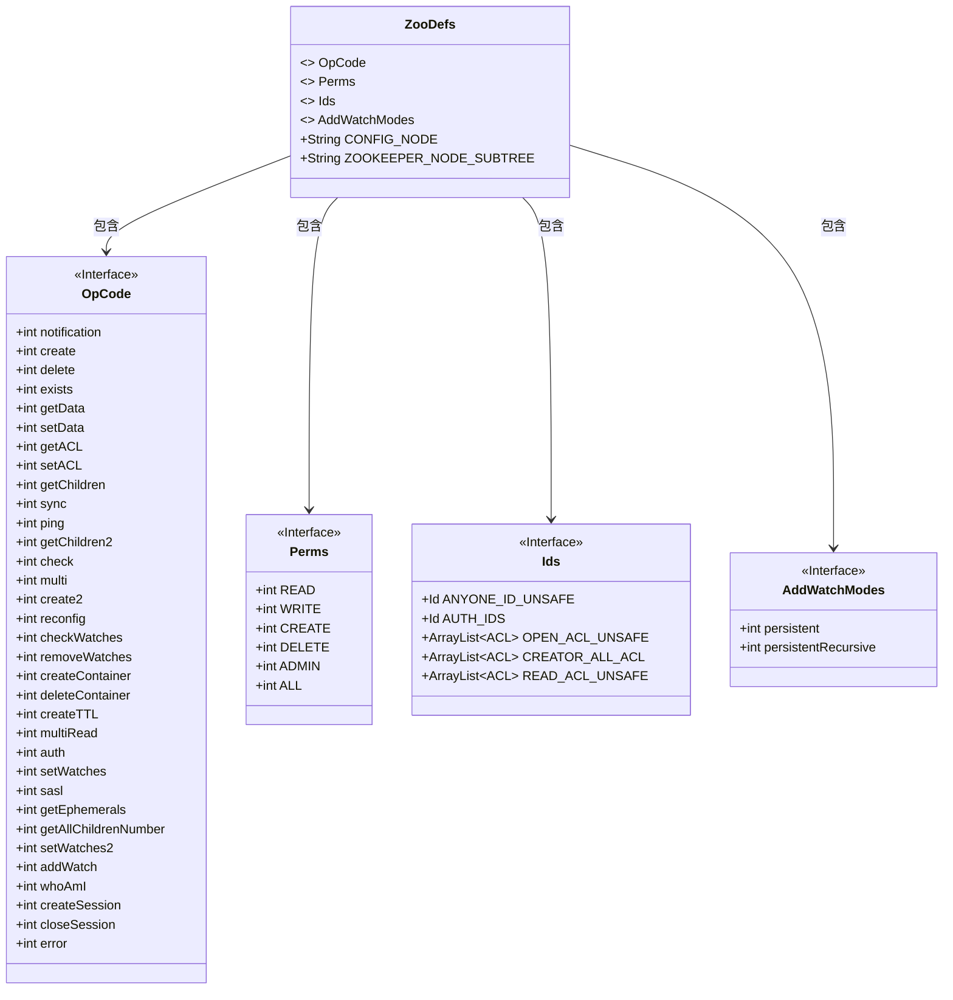
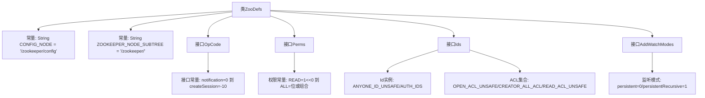

# 基础信息

|      |      |
|------|------|
| 名称 | ZooDefs |
| 编码语言 | .java |
| 代码路径 | zookeeper/zookeeper-server/src/main/java/org/apache/zookeeper/ZooDefs.java |
| 包名 | org.apache.zookeeper |
| 依赖项 | ['edu.umd.cs.findbugs.annotations.SuppressFBWarnings', 'java.util.ArrayList', 'java.util.Collections', 'org.apache.yetus.audience.InterfaceAudience', 'org.apache.zookeeper.data.ACL', 'org.apache.zookeeper.data.Id'] |
| 概述说明 | ZooDefs类定义Zookeeper常量：节点路径、操作码、权限和ID。包含CONFIG_NODE、ZOOKEEPER_NODE_SUBTREE路径；OpCode定义25种操作如create、delete；Perms定义5种权限如READ、WRITE；Ids定义ACL如OPEN_ACL_UNSAFE、CREATOR_ALL_ACL；AddWatchModes定义两种监视模式。 |

# 说明

ZooDefs类定义了ZooKeeper的核心常量与接口。包含配置节点路径CONFIG_NODE和ZOOKEEPER_NODE_SUBTREE。OpCode接口列举了34种操作类型代码，如create/delete/exists等基础操作及auth/sasl等安全操作。Perms接口定义了5种权限位掩码：READ/WRITE/CREATE/DELETE/ADMIN及ALL组合权限。Ids接口提供三种预定义ACL：OPEN_ACL_UNSAFE（完全开放）、CREATOR_ALL_ACL（创建者全权限）、READ_ACL_UNSAFE（全局只读）。AddWatchModes定义了两种监听模式：持久化（persistent）和递归持久化（persistentRecursive）。所有定义均标记为公共API。

# 类列表 Class Summary

| 名称   | 类型  | 说明 |
|-------|------|-------------|
| ZooDefs | class | ZooDefs类定义Zookeeper常量，包括配置节点路径、操作码、权限类型、ID标识和监视模式。操作码涵盖创建、删除、读写等操作，权限包括读写、创建、删除和管理。ID标识提供不同访问控制列表（ACL）配置。 |

## 类 ZooDefs

|      |      |
|------|------|
| 访问范围 | @InterfaceAudience.Public;public |
| 类型 | class |
| 名称 | ZooDefs |
| 说明 | ZooDefs类定义Zookeeper常量，包括配置节点路径、操作码、权限类型、ID标识和监视模式。操作码涵盖创建、删除、读写等操作，权限包括读写、创建、删除和管理。ID标识提供不同访问控制列表（ACL）配置。 |

### UML类图

类图描述：该图展示了ZooDefs类及其内部四个接口的结构。ZooDefs作为容器类，包含CONFIG_NODE和ZOOKEEPER_NODE_SUBTREE两个公共常量字符串，并通过依赖关系嵌套了OpCode（操作码常量）、Perms（权限掩码）、Ids（预定义ACL标识）和AddWatchModes（监视模式）四个接口。这些接口分别定义了ZooKeeper操作相关的各种常量值，包括操作类型枚举、权限位标识、默认访问控制列表和监视模式配置。整个结构为ZooKeeper客户端提供了集中式的配置和操作常量定义。

### 内部方法调用关系图

该流程图展示了ZooDefs类的完整结构，包含常量定义和三个核心接口（OpCode、Perms、Ids、AddWatchModes）的层次关系。OpCode接口定义了23种操作码常量，Perms接口用位运算表示权限类型，Ids接口提供预定义的安全标识和ACL集合，AddWatchModes则定义了两种监听模式。所有元素通过Public注解对外暴露，形成ZooKeeper的配置基础框架。

### 字段列表 Field List

| 名称  | 类型  | 说明 |
|-------|-------|------|
| ZOOKEEPER_NODE_SUBTREE = "/zookeeper/" | String | ZOOKEEPER_NODE_SUBTREE是静态常量字符串，值为"/zookeeper/"，用于表示ZooKeeper节点路径。 |
| CONFIG_NODE = "/zookeeper/config" | String | 这是一个Java静态常量，定义了一个ZooKeeper配置节点的路径字符串"/zookeeper/config"。 |

### 方法列表 Method List

| 名称  | 类型  | 说明 |
|-------|-------|------|

