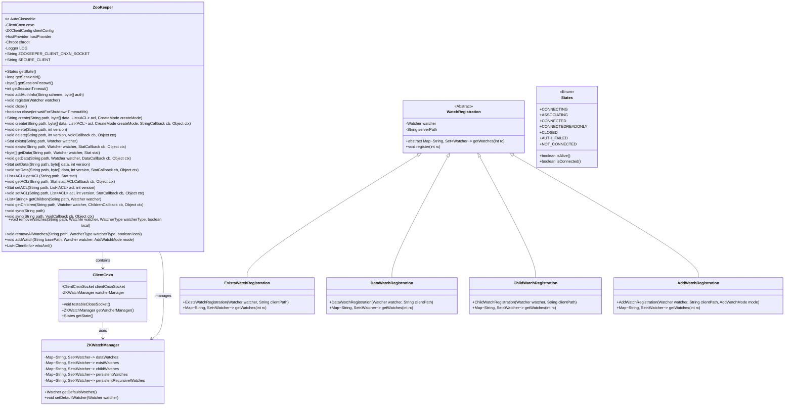
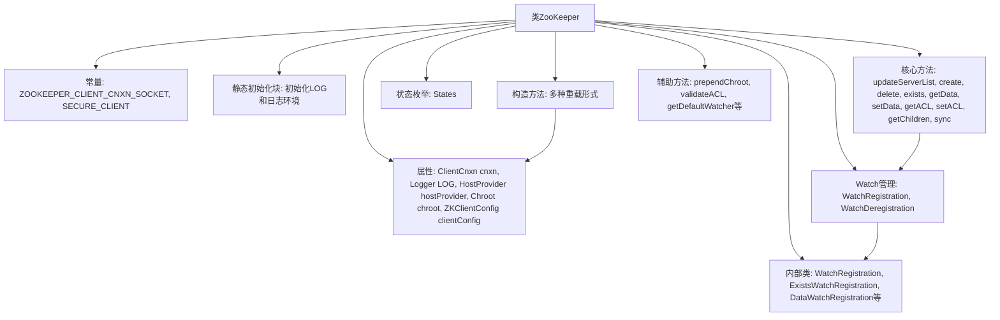
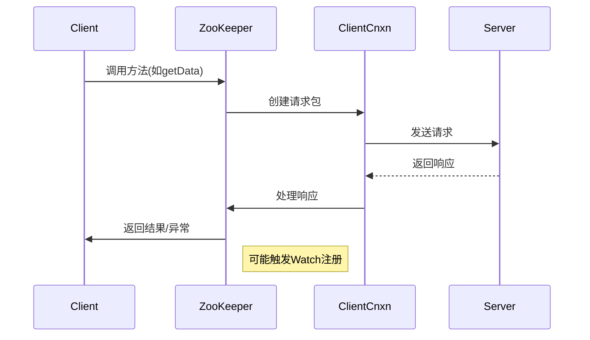

# 基础信息

|      |      |
|------|------|
| 名称 | ZooKeeper |
| 编码语言 | .java |
| 代码路径 | zookeeper/zookeeper-server/src/main/java/org/apache/zookeeper/ZooKeeper.java |
| 包名 | org.apache.zookeeper |
| 依赖项 | ['java.io.IOException', 'java.lang.reflect.Constructor', 'java.net.InetSocketAddress', 'java.net.SocketAddress', 'java.util.ArrayList', 'java.util.Collection', 'java.util.Collections', 'java.util.HashSet', 'java.util.List', 'java.util.Map', 'java.util.Set', 'org.apache.jute.Record', 'org.apache.yetus.audience.InterfaceAudience', 'org.apache.zookeeper.AsyncCallback.ACLCallback', 'org.apache.zookeeper.AsyncCallback.Children2Callback', 'org.apache.zookeeper.AsyncCallback.ChildrenCallback', 'org.apache.zookeeper.AsyncCallback.Create2Callback', 'org.apache.zookeeper.AsyncCallback.DataCallback', 'org.apache.zookeeper.AsyncCallback.MultiCallback', 'org.apache.zookeeper.AsyncCallback.StatCallback', 'org.apache.zookeeper.AsyncCallback.StringCallback', 'org.apache.zookeeper.AsyncCallback.VoidCallback', 'org.apache.zookeeper.OpResult.ErrorResult', 'org.apache.zookeeper.Watcher.WatcherType', 'org.apache.zookeeper.client.Chroot', 'org.apache.zookeeper.client.ConnectStringParser', 'org.apache.zookeeper.client.HostProvider', 'org.apache.zookeeper.client.StaticHostProvider', 'org.apache.zookeeper.client.ZKClientConfig', 'org.apache.zookeeper.client.ZooKeeperBuilder', 'org.apache.zookeeper.client.ZooKeeperOptions', 'org.apache.zookeeper.client.ZooKeeperSaslClient', 'org.apache.zookeeper.common.PathUtils', 'org.apache.zookeeper.data.ACL', 'org.apache.zookeeper.data.ClientInfo', 'org.apache.zookeeper.data.Stat', 'org.apache.zookeeper.proto.AddWatchRequest', 'org.apache.zookeeper.proto.CheckWatchesRequest', 'org.apache.zookeeper.proto.Create2Response', 'org.apache.zookeeper.proto.CreateRequest', 'org.apache.zookeeper.proto.CreateResponse', 'org.apache.zookeeper.proto.CreateTTLRequest', 'org.apache.zookeeper.proto.DeleteRequest', 'org.apache.zookeeper.proto.ErrorResponse', 'org.apache.zookeeper.proto.ExistsRequest', 'org.apache.zookeeper.proto.GetACLRequest', 'org.apache.zookeeper.proto.GetACLResponse', 'org.apache.zookeeper.proto.GetAllChildrenNumberRequest', 'org.apache.zookeeper.proto.GetAllChildrenNumberResponse', 'org.apache.zookeeper.proto.GetChildren2Request', 'org.apache.zookeeper.proto.GetChildren2Response', 'org.apache.zookeeper.proto.GetChildrenRequest', 'org.apache.zookeeper.proto.GetChildrenResponse', 'org.apache.zookeeper.proto.GetDataRequest', 'org.apache.zookeeper.proto.GetDataResponse', 'org.apache.zookeeper.proto.GetEphemeralsRequest', 'org.apache.zookeeper.proto.GetEphemeralsResponse', 'org.apache.zookeeper.proto.RemoveWatchesRequest', 'org.apache.zookeeper.proto.ReplyHeader', 'org.apache.zookeeper.proto.RequestHeader', 'org.apache.zookeeper.proto.SetACLRequest', 'org.apache.zookeeper.proto.SetACLResponse', 'org.apache.zookeeper.proto.SetDataRequest', 'org.apache.zookeeper.proto.SetDataResponse', 'org.apache.zookeeper.proto.SyncRequest', 'org.apache.zookeeper.proto.SyncResponse', 'org.apache.zookeeper.proto.WhoAmIResponse', 'org.apache.zookeeper.server.DataTree', 'org.apache.zookeeper.server.EphemeralType', 'org.slf4j.Logger', 'org.slf4j.LoggerFactory'] |
| 概述说明 | ZooKeeper是一个分布式协调服务客户端类，提供节点创建、删除、数据读写、ACL管理等操作。支持同步/异步调用，可设置监听器感知节点变化。通过会话机制维持连接，支持自动重连和只读模式。包含多种构造方法，支持自定义配置和主机选择策略。 |

# 说明

这是一个ZooKeeper客户端的Java类实现，主要功能包括：

1. 提供了与ZooKeeper服务器建立连接和会话管理的功能，支持多种构造方法配置连接参数。

2. 实现了完整的ZooKeeper节点操作API：
   - 创建节点(create)
   - 删除节点(delete)
   - 获取节点数据(getData)
   - 设置节点数据(setData)
   - 获取子节点列表(getChildren)
   - 设置和获取ACL权限
   - 批量操作(multi)

3. 提供了完善的watch机制：
   - 支持多种watch类型(数据变化、子节点变化等)
   - 支持watch注册和取消
   - 支持持久化watch

4. 支持会话状态管理：
   - 获取会话ID和密码
   - 检查连接状态
   - 关闭连接

5. 其他功能：
   - 支持chroot路径
   - 支持SSL安全连接
   - 支持只读模式
   - 支持服务器列表动态更新
   - 提供测试辅助方法

6. 实现了异步回调接口，所有操作都支持同步和异步两种调用方式。

这个类是ZooKeeper Java客户端API的核心实现，封装了与服务器通信的所有细节，提供了完整的功能集来操作ZooKeeper服务。

# 类列表 Class Summary

| 名称   | 类型  | 说明 |
|-------|------|-------------|
| ZooKeeper | class | ZooKeeper客户端类，实现AutoCloseable接口，支持创建、删除、查询节点等操作，提供同步/异步API，支持ACL权限控制、Watcher监听机制和会话管理。关键功能包括：连接管理、节点操作（create/delete/exists/getData/setData）、子节点查询、ACL管理、事务操作(multi)和监听器注册。支持chroot路径隔离，通过ClientCnxn处理网络通信，包含多种状态（CONNECTING/CONNECTED等）。 |

## 类 ZooKeeper

|      |      |
|------|------|
| 访问范围 | @SuppressWarnings("try");@InterfaceAudience.Public;public |
| 类型 | class |
| 名称 | ZooKeeper |
| 说明 | ZooKeeper客户端类，实现AutoCloseable接口，支持创建、删除、查询节点等操作，提供同步/异步API，支持ACL权限控制、Watcher监听机制和会话管理。关键功能包括：连接管理、节点操作（create/delete/exists/getData/setData）、子节点查询、ACL管理、事务操作(multi)和监听器注册。支持chroot路径隔离，通过ClientCnxn处理网络通信，包含多种状态（CONNECTING/CONNECTED等）。 |

### UML类图

这段代码展示了Apache ZooKeeper客户端的主要类结构。ZooKeeper类是核心客户端类，实现了AutoCloseable接口，负责与ZooKeeper服务器建立连接并执行各种操作。它包含ClientCnxn用于网络通信，ZKWatchManager用于管理watcher，以及处理路径前缀的Chroot类。WatchRegistration及其子类处理不同类型的watcher注册，States枚举表示连接状态。类图清晰地展示了这些组件之间的关系和职责划分，包括网络连接管理、watcher机制和状态跟踪等关键功能。

### 内部方法调用关系图

这段代码是Apache ZooKeeper客户端核心实现类，主要功能包括：
1. 维护与ZooKeeper集群的TCP连接（通过ClientCnxn）
2. 提供完整的ZooKeeper API实现（CRUD操作、ACL管理、Watch机制等）
3. 支持多种构造方式和配置参数
4. 实现自动重连和会话管理
5. 处理路径的chroot转换
6. 提供丰富的监控和状态管理功能

核心特点是：
- 使用ClientCnxn处理底层网络通信
- 通过WatchRegistration体系实现Watch机制
- 支持同步/异步两种调用方式
- 线程安全的连接管理
- 完善的错误处理和状态监控

### 字段列表 Field List

| 名称  | 类型  | 说明 |
|-------|-------|------|
| ZOOKEEPER_CLIENT_CNXN_SOCKET = "zookeeper.clientCnxnSocket" | String | 废弃常量ZOOKEEPER_CLIENT_CNXN_SOCKET，原用于ZooKeeper客户端连接配置。 |
| LOG | Logger | 声明一个私有静态不可变日志记录器常量LOG。 |
| clientConfig | ZKClientConfig | 私有ZKClientConfig配置对象。 |
| SECURE_CLIENT = "zookeeper.client.secure" | String | 已弃用的静态常量，用于标识ZooKeeper客户端安全配置。 |
| hostProvider | HostProvider | 保护型最终成员变量hostProvider，类型为HostProvider。 |
| cnxn | ClientCnxn | 受保护的最终客户端连接对象cnxn。 |
| chroot | Chroot | 私有不可变的Chroot实例变量。 |

### 方法列表 Method List

| 名称  | 类型  | 说明 |
|-------|-------|------|
| create | void | 这是一个Java方法，用于在ZooKeeper中创建节点。方法接收路径、数据、ACL列表、创建模式和回调等参数，验证路径后构建请求并发送到服务器。 |
| sync | void | 同步ZooKeeper路径的方法，验证路径后构建请求头和数据包，加入队列处理。 |
| getData | void | 这是一个从ZooKeeper获取节点数据的方法，接受路径、监听器和回调函数参数，验证路径后构建请求并发送到服务器。 |
| create | void | 这是一个Java方法，用于创建节点。参数包括路径、数据、访问控制列表、创建模式、回调函数和上下文。方法内部调用另一个重载方法，超时参数默认为-1。 |
| removeWatches | void | 这是一个Java方法，用于移除指定路径的监视器。方法参数包括路径、监视器对象、监视类型、本地标志、回调函数和上下文。内部调用另一个方法执行移除操作。 |
| removeWatches | void | 该方法用于移除ZooKeeper的监视器。验证路径后，创建监视器注销对象，设置请求头并生成移除请求，最后将请求加入队列处理。 |
| validatePath | List<OpResult> | 验证操作路径的方法，遍历操作列表并逐一验证，捕获异常时记录错误结果。若无错误则清空结果列表，最终返回验证结果。 |
| createConnection | ClientCnxn | 创建ClientCnxn连接实例，参数包括主机提供者、会话超时、客户端配置、默认监视器、套接字、会话ID、密码及只读标志。 |
| getRemoveWatchesRequest | Record | 私有方法根据操作码创建不同请求：检查监视请求或移除监视请求，设置路径和类型，未知操作码则记录警告。 |
| setData | Stat | 
方法setData用于设置ZooKeeper节点数据，验证路径后提交请求，处理错误并返回节点状态。 |
| getExistWatches | List<String> | 该方法返回已存在的监控列表，通过调用getWatchManager()的getExistWatchList()实现。 |
| getConfig | void | 方法getConfig从ZooKeeper获取配置数据，支持设置监听器。创建请求头和数据请求，若存在监听器则注册监听。最终将请求加入队列处理。 |
| exists | Stat | 检查ZooKeeper节点是否存在，支持监听器。验证路径，提交请求，处理响应。存在返回节点状态，否则返回null。异常时抛出错误。 |
| multi | void | 该方法执行批量操作：先验证操作列表，若存在无效操作则立即回调错误；否则生成事务并执行内部批量处理。 |
| getConfig | byte[] | 从ZooKeeper获取配置节点数据的方法，支持设置监听器并返回节点数据和状态信息，异常时抛出KeeperException。 |
| create | String | Java方法：创建路径，接收路径、数据、ACL列表、创建模式和状态参数，返回字符串，可能抛出KeeperException和InterruptedException。内部调用重载方法，超时参数默认为-1。 |
| close | void | 同步关闭方法，检查连接状态，若未活跃则直接返回；否则关闭连接并记录会话ID，忽略IO异常，最后确认关闭。 |
| getDataWatches | List<String> | 该方法返回受保护的数据监控列表，通过调用getWatchManager()获取监控管理器并返回其数据监控列表。 |
| getSessionPasswd | byte[] | 该方法返回会话密码的字节数组，直接调用cnxn对象的getSessionPasswd方法获取。 |
| multiInternal | void | 方法multiInternal处理多操作请求：若请求为空则直接回调；否则根据操作类型设置请求头，队列化请求包并返回响应。 |
| getAllChildrenNumber | void | 异步获取ZooKeeper节点子节点数量，验证路径后发送请求并处理回调。 |
| getEphemerals | List<String> | 该方法通过ZooKeeper获取指定路径下的临时节点列表，验证路径后提交请求并处理响应，异常时抛出KeeperException。返回临时节点列表。 |
| create | void | 创建ZooKeeper节点方法：验证路径和TTL，设置请求头，生成记录并发送请求。 |
| delete | void | 该方法用于删除指定路径的节点。首先验证路径有效性，根路径"/"不可删除。非根路径会添加前缀后构建删除请求，包括路径和版本号，最后将请求加入队列处理。 |
| getChildWatches | List<String> | 该方法返回一个受保护的字符串列表，内容为从watchManager获取的子监控列表。 |
| removeAllWatches | void | 移除指定路径的所有监视器，支持本地或全局操作，通过回调处理结果。 |
| removeWatches | void | 私有方法removeWatches用于移除指定路径的监视器，验证路径后提交请求，若出错则抛出异常。 |
| getPersistentRecursiveWatches | List<String> | 获取持久递归监视列表的方法，返回由监视管理器管理的持久递归监视字符串列表。 |
| getSessionTimeout | int | 该方法返回会话超时时间，直接调用cnxn的getSessionTimeout()获取结果。 |
| addWatch | void | 这是一个Java方法，用于添加监视路径。方法接受基础路径、监视模式、回调函数和上下文对象，调用内部方法实现监视功能。 |
| exists | void | 检查ZooKeeper节点是否存在，支持监听和回调处理。 |
| whoAmI | List<ClientInfo> | 这是一个同步方法，用于获取客户端信息。方法发送whoAmI请求，并返回包含客户端信息的列表。 |
| updateServerList | void | 更新服务器列表方法：解析连接字符串获取地址，检查当前主机，若需重配置则关闭套接字触发断开连接。 |
| getChildren | void | 获取指定路径的子节点，支持设置监视器，通过回调返回结果。 |
| getChildren | List<String> | 获取ZooKeeper指定路径的子节点列表，支持设置监听器。验证路径后，若存在监听器则注册，提交请求并处理响应，异常时抛出错误，成功返回子节点列表。 |
| addWatch | void | 这是一个Java方法，用于添加路径监视。方法接受基础路径和监视模式参数，可能抛出KeeperException和InterruptedException异常。内部调用重载方法，使用默认监视器。 |
| removeWatches | void | 该方法用于移除指定路径的监视器，参数包括路径、监视器对象、监视器类型及本地标志，会先验证监视器再调用内部移除操作。可能抛出中断或Keeper异常。 |
| transaction | Transaction | 定义一个返回新Transaction对象的方法transaction，使用当前对象作为参数。 |
| getAllChildrenNumber | int | 获取ZooKeeper节点下所有子节点数量。验证路径后提交请求，处理错误并返回总数。 |
| setACL | void | 这是一个设置ZooKeeper节点ACL的方法，包含路径、ACL列表、版本号、回调函数和上下文参数，最终将请求封装并发送到服务器。 |
| getChildren | List<String> | 获取指定路径下的子节点列表，可设置是否监听变更，异常时抛出KeeperException或InterruptedException。 |
| register | void | 同步方法register用于注册Watcher，通过getWatchManager设置默认Watcher。 |
| getChildren | List<String> | 获取子节点列表，可设置监视和状态参数，可能抛出异常。 |
| getData | byte[] | 获取指定路径数据，可选监听和状态信息，可能抛出异常。 |
| getPersistentWatches | List<String> | 获取持久监视列表的方法，返回字符串列表。 |
| getState | States | 该方法返回当前连接状态，直接调用cnxn的getState()获取结果。 |
| toString | String | 重写toString方法，返回状态、连接超时及会话信息。 |
| getDefaultWatcher | Watcher | 获取默认监视器：若required为true且存在则返回，否则抛异常；若为false则返回null。 |
| validateACL | void | 验证ACL列表非空且不含空元素，否则抛出InvalidACLException异常。 |
| setACL | Stat | 方法setACL用于设置ZooKeeper节点ACL权限，验证路径和ACL后提交请求，返回节点状态或抛出异常。 |
| multi | List<OpResult> | 该方法接收操作集合，验证每个操作后生成事务并执行，返回结果列表。可能抛出中断或ZooKeeper异常。 |
| multiInternal | List<OpResult> | 方法处理多操作请求，检查空请求后根据操作类型设置请求头，提交请求并处理响应。若为读操作直接返回结果，否则检查错误并抛出异常或返回结果列表。 |
| exists | Stat | 检查ZooKeeper节点是否存在，可设置监听，返回状态信息，异常时抛出KeeperException或InterruptedException。 |
| getACL | void | 这是一个获取ZooKeeper节点ACL的方法，验证路径后构造请求头和数据包，通过队列发送请求并处理响应回调。 |
| getData | byte[] | 方法getData从ZooKeeper获取指定路径的数据。验证路径后，设置监听器（如有），提交请求并处理响应。返回数据或异常，可选更新状态信息。 |
| generateMultiTransaction | MultiOperationRecord | 生成多交易记录方法：遍历操作集合并添加根前缀，返回新构建的多操作记录对象。 |
| getWatchManager | ZKWatchManager | 方法ZKWatchManager getWatchManager()返回cnxn的WatcherManager实例。 |
| getTestable | Testable | 方法getTestable返回一个基于cnxn的ZooKeeperTestable实例。 |
| getEphemerals | List<String> | 获取根目录下所有临时节点列表，可能抛出KeeperException和InterruptedException异常。 |
| getChildren | void | 获取指定路径的子节点，可选监听变更，通过回调返回结果。 |
| getACL | List<ACL> | 获取ZooKeeper节点ACL列表的方法：验证路径，设置请求头，提交请求并处理响应，返回ACL列表或异常。 |
| getConfig | void | 方法getConfig接收布尔值watch、回调函数cb和上下文ctx，调用内部方法getConfig并传入默认观察器和参数。 |
| getSaslClient | ZooKeeperSaslClient | 获取ZooKeeper的SASL客户端实例，返回cnxn中的ZooKeeperSaslClient对象。 |
| getChildren | List<String> | 获取指定路径下子节点列表的方法。验证路径，处理监听器，发送请求并返回子节点列表。异常时抛出KeeperException。 |
| getChildren | void | 方法getChildren用于获取ZooKeeper指定路径的子节点，支持设置监听器和回调。验证路径后，若存在监听器则注册，构建请求并发送至服务器。 |
| getConfig | byte[] | 获取配置数据，支持监听和状态更新，可能抛出异常。 |
| getClientConfig | ZKClientConfig | 方法getClientConfig返回ZKClientConfig对象clientConfig。 |
| create | String | 这是一个Java方法，用于在ZooKeeper中创建节点。方法接收路径、数据、ACL列表和创建模式参数，验证路径和ACL后向服务器提交创建请求。若成功返回节点路径，失败则抛出异常。 |
| setData | void | 方法setData用于设置ZooKeeper节点数据，包括路径、数据字节数组、版本号，通过回调处理结果。内部验证路径并构建请求，最终发送数据包。 |
| exists | void | 检查ZooKeeper路径是否存在，支持设置监视器，验证路径后发送请求到服务器并处理回调。 |
| addAuthInfo | void | 该方法用于添加认证信息，接收认证方案和认证数据作为参数，并调用内部连接对象的addAuthInfo方法进行处理。 |
| getChildren | void | 获取子节点方法：验证路径，注册监听器，构造请求并发送至服务器。 |
| withRootPrefix | Op | 该方法检查操作路径是否为空，若非空则添加根前缀生成服务器路径。若路径变化则返回新操作实例，否则返回原操作。 |
| validateWatcher | void | 验证Watcher对象非空，若为空则抛出非法参数异常。 |
| getEphemerals | void | 异步获取临时数据，调用回调函数cb，上下文为ctx，默认路径为根目录。 |
| makeCreateRecord | Record | 方法根据创建模式生成记录：若含TTL则创建TTL请求并设置数据、标志、路径、ACL和TTL；否则创建普通请求并设置数据、标志、路径和ACL。最终返回相应记录。 |
| create | String | 这是一个Java方法，用于在ZooKeeper中创建节点。方法接收路径、数据、ACL列表、创建模式等参数，验证路径和TTL后提交请求。若成功返回节点路径，失败抛出异常，并可更新节点状态信息。 |
| setCreateHeader | void | 方法根据创建模式设置请求头类型：TTL模式设为createTTL，容器模式设为createContainer，否则设为create2。 |
| addWatch | void | 这是一个Java方法，用于添加监视器。它验证路径和监视器，构建请求并发送到服务器。关键参数包括基础路径、监视器对象、模式和回调函数。 |
| addWatch | void | Java方法addWatch用于添加监视器，验证路径和监视器后提交请求，处理异常。参数包括路径、监视器和模式，可能抛出KeeperException和InterruptedException。 |
| getEphemerals | void | 获取临时节点方法：验证路径，创建请求头与请求对象，发送请求并回调处理响应。 |
| testableWaitForShutdown | boolean | 方法testableWaitForShutdown等待发送线程和事件线程关闭，若超时或线程存活则返回false，否则返回true。参数wait为等待时间，可能抛出InterruptedException。 |
| testableRemoteSocketAddress | SocketAddress | 该方法返回客户端连接的远程Socket地址，通过cnxn.sendThread获取ClientCnxnSocket对象后调用getRemoteSocketAddress()实现。 |
| testableLocalSocketAddress | SocketAddress | 该方法返回客户端连接的本地套接字地址，通过sendThread和ClientCnxnSocket获取。 |
| getClientCnxnSocket | ClientCnxnSocket | 获取客户端连接套接字实例，根据配置选择NIO或Netty实现，若配置无效则默认NIO，实例化失败抛出IO异常。 |
| delete | void | 该方法用于删除指定路径的节点，验证路径后处理根路径特殊情况，提交删除请求并检查错误。若出错则抛出异常。 |
| removeAllWatches | void | 该方法用于移除指定路径上的所有监视器，支持指定监视器类型和本地标志，可能抛出中断或ZooKeeper异常。 |
| prependChroot | String | 私有方法prependChroot接收clientPath参数，调用chroot对象的prepend方法处理并返回结果。 |
| getData | void | 这是一个Java方法，通过路径获取数据，支持监听变更，使用回调处理结果，上下文对象可选。 |
| close | boolean | 方法close调用无参close后，返回testableWaitForShutdown结果，参数为等待超时毫秒数，可能抛出InterruptedException异常。 |
| getSessionId | long | 获取当前会话ID的方法，返回长整型数值。 |
| sync | void | 同步ZooKeeper路径数据。验证路径，设置请求头与同步请求，提交请求并处理响应。若错误则抛出异常。 |

