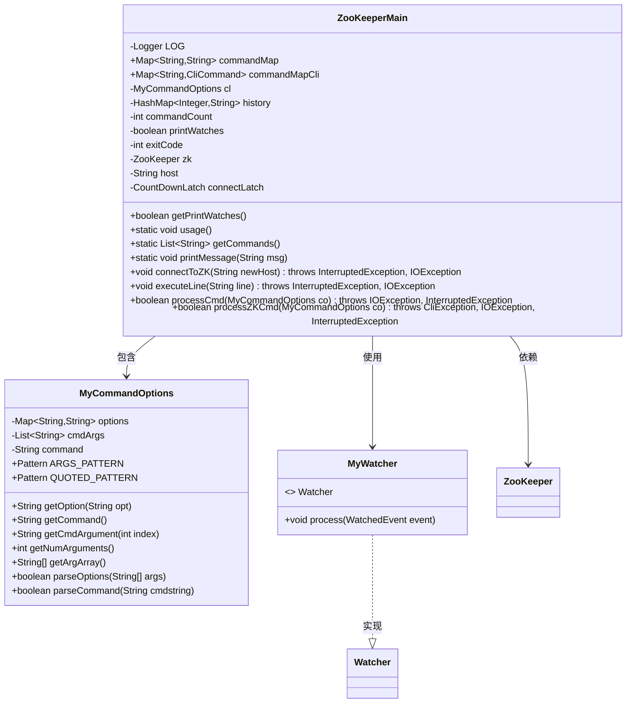
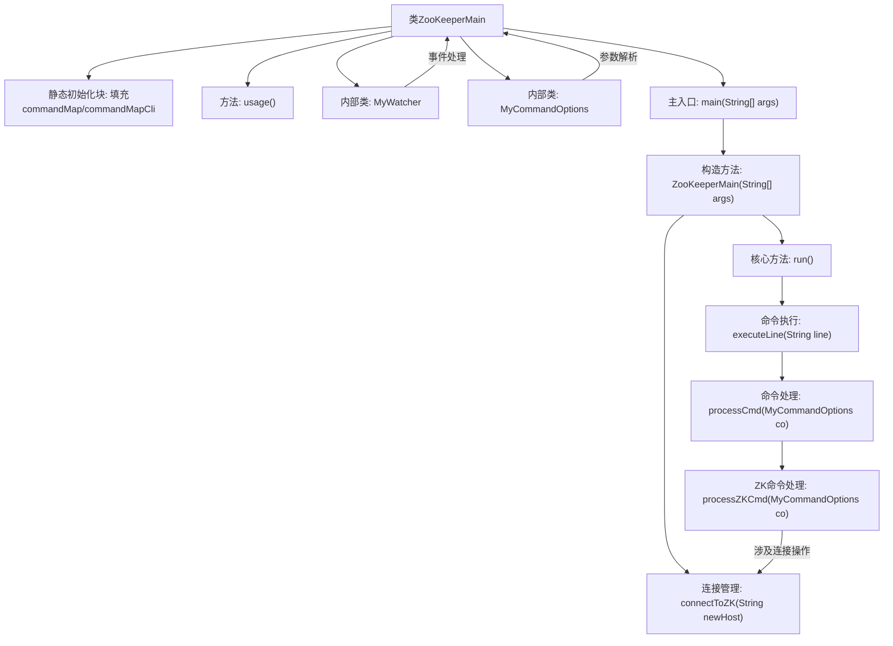

# 基础信息

|      |      |
|------|------|
| 名称 | ZooKeeperMain |
| 编码语言 | .java |
| 代码路径 | zookeeper/zookeeper-server/src/main/java/org/apache/zookeeper/ZooKeeperMain.java |
| 包名 | org.apache.zookeeper |
| 依赖项 | ['java.io.BufferedReader', 'java.io.IOException', 'java.io.InputStreamReader', 'java.lang.reflect.InvocationTargetException', 'java.lang.reflect.Method', 'java.util.ArrayList', 'java.util.Arrays', 'java.util.Collections', 'java.util.HashMap', 'java.util.Iterator', 'java.util.LinkedList', 'java.util.List', 'java.util.Map', 'java.util.NoSuchElementException', 'java.util.concurrent.CountDownLatch', 'java.util.concurrent.TimeUnit', 'java.util.regex.Matcher', 'java.util.regex.Pattern', 'java.util.stream.Stream', 'org.apache.yetus.audience.InterfaceAudience', 'org.apache.zookeeper.admin.ZooKeeperAdmin', 'org.apache.zookeeper.cli.CliCommand', 'org.apache.zookeeper.cli.CliException', 'org.apache.zookeeper.cli.CommandFactory', 'org.apache.zookeeper.cli.CommandNotFoundException', 'org.apache.zookeeper.cli.MalformedCommandException', 'org.apache.zookeeper.client.ZKClientConfig', 'org.apache.zookeeper.server.ExitCode', 'org.apache.zookeeper.server.quorum.QuorumPeerConfig', 'org.apache.zookeeper.util.ServiceUtils', 'org.slf4j.Logger', 'org.slf4j.LoggerFactory'] |
| 概述说明 | ZooKeeperMain是ZooKeeper命令行工具主类，提供连接管理、命令执行、历史记录等功能，支持交互式操作和脚本模式。 |

# 说明

ZooKeeperMain是ZooKeeper的公共命令行客户端主类，提供交互式shell和命令执行功能。核心功能包括：通过MyCommandOptions解析命令行参数和交互命令；维护命令历史记录；支持连接管理（connect/quit）、历史查看（history/redo）、监视开关（printwatches）等基础命令。类初始化时通过静态块加载所有支持的ZooKeeper命令到commandMap和commandMapCli映射表。关键组件包含：MyWatcher处理ZK事件通知；MyCommandOptions封装命令解析逻辑；processZKCmd方法处理具体命令执行流程。支持JLine实现交互式命令行自动补全，降级使用标准输入输出。通过ZooKeeperAdmin建立连接，支持只读模式、安全连接和超时配置。

# 类列表 Class Summary

| 名称   | 类型  | 说明 |
|-------|------|-------------|
| ZooKeeperMain | class | ZooKeeperMain是ZooKeeper命令行工具主类，提供连接管理、命令执行、历史记录等功能，支持交互式与脚本模式。包含命令映射、参数解析、连接控制等核心逻辑。 |

## 类 ZooKeeperMain

|      |      |
|------|------|
| 访问范围 | @InterfaceAudience.Public;public |
| 类型 | class |
| 名称 | ZooKeeperMain |
| 说明 | ZooKeeperMain是ZooKeeper命令行工具主类，提供连接管理、命令执行、历史记录等功能，支持交互式与脚本模式。包含命令映射、参数解析、连接控制等核心逻辑。 |

### UML类图

这段代码是ZooKeeper命令行客户端的主要实现类ZooKeeperMain，它提供了与ZooKeeper服务器交互的命令行界面。类图中展示了ZooKeeperMain与内部类MyCommandOptions（处理命令行参数）、MyWatcher（监听ZooKeeper事件）的关系，以及对外部类ZooKeeper的依赖。ZooKeeperMain负责命令解析、历史记录管理、连接建立和命令执行等核心功能，通过静态代码块初始化命令映射表，支持多种ZooKeeper操作命令。

### 内部方法调用关系图

流程图描述：该流程图展示了ZooKeeperMain类的核心结构，包含静态初始化、命令行参数解析、连接管理、事件监控和命令处理等关键流程。初始化阶段会填充命令映射表，运行时通过多层方法调用处理用户输入，内部类MyWatcher负责监控ZK状态变化，MyCommandOptions处理参数解析，最终通过processZKCmd方法执行具体的ZK操作命令。

### 字段列表 Field List

| 名称  | 类型  | 说明 |
|-------|-------|------|
| zk | ZooKeeper | 受保护的ZooKeeper实例zk。 |
| LOG = LoggerFactory.getLogger(ZooKeeperMain.class) | Logger | ZooKeeperMain类中定义了一个私有静态日志记录器LOG，用于记录日志信息。 |
| commandCount = 0 | int | 保护整型变量commandCount，初始值为0。 |
| printWatches = true | boolean | 保护布尔变量printWatches初始化为true，用于控制是否打印监视信息。 |
| connectLatch = null | CountDownLatch | 私有倒计时锁connectLatch初始化为空。 |
| cl = new MyCommandOptions() | MyCommandOptions | 创建受保护的MyCommandOptions实例cl。 |
| history = new HashMap<>() | HashMap<Integer, String> | 保护性哈希映射，键为整数，值为字符串，用于存储历史记录。 |
| commandMapCli = new HashMap<>() | Map<String, CliCommand> | 定义静态不可变哈希映射commandMapCli，键为字符串，值为CliCommand对象。 |
| host = "" | String | 声明一个受保护的字符串变量host，初始值为空。 |
| exitCode = ExitCode.EXECUTION_FINISHED.getValue() | int | 保护整型变量exitCode，初始值为ExitCode.EXECUTION_FINISHED的值。 |
| commandMap = new HashMap<>() | Map<String, String> | 定义静态不可变哈希映射commandMap，键值均为字符串类型。 |

### 方法列表 Method List

| 名称  | 类型  | 说明 |
|-------|-------|------|
| getPrompt | String | Java方法返回ZK主机状态和命令计数的字符串，格式如"[zk: host(状态) 命令数]"。 |
| getPrintWatches | boolean | 这是一个Java方法，返回布尔变量printWatches的值。 |
| connectToZK | void | 连接ZooKeeper主机，关闭旧连接，处理只读和安全配置，加载客户端配置，设置超时和等待连接，创建新连接并在超时失败时抛出异常。 |
| run | void | ZooKeeper命令行工具，支持JLine自动补全，若缺失则使用标准输入。无命令时显示欢迎信息，有命令则执行并退出。 |
| main | void | Java主方法，创建ZooKeeperMain实例并运行，可能抛出IO和中断异常。 |
| executeLine | void | 方法executeLine处理非空命令行：解析命令、记录历史、执行命令并计数。 |
| processCmd | boolean | 处理命令方法，执行ZKCmd，成功返回true并设退出码，异常时设对应退出码并打印错误信息。 |
| printMessage | void | 这是一个Java静态方法，用于打印传入的字符串消息并在前面添加换行符。 |
| getCommands | List<String> | 静态方法getCommands返回排序后的命令列表。从commandMap获取键集并转为ArrayList，排序后返回。 |
| addToHistory | void | 这是一个Java方法，功能是将字符串cmd存入history映射中，键为整数i。 |
| usage | void | ZooKeeper命令行工具用法：指定服务器地址和配置文件，列出所有支持的命令及其参数。 |
| processZKCmd | boolean | 处理ZooKeeper命令的方法，检查命令有效性，支持quit、redo、history等操作，需活跃连接，执行对应命令并返回监控状态。 |

