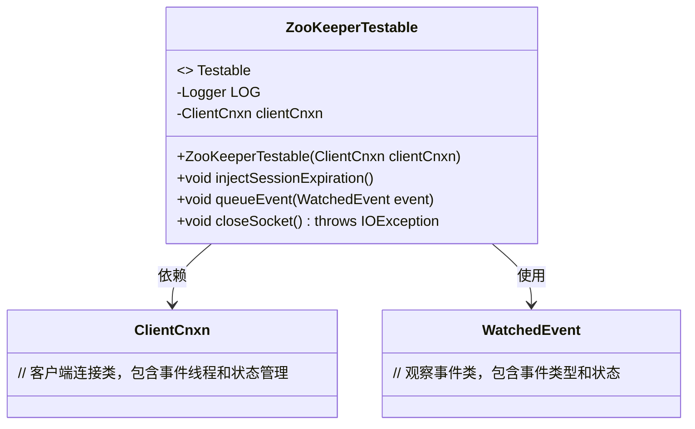
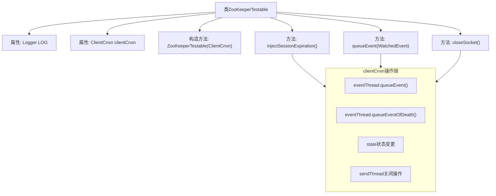

# 基础信息

|      |      |
|------|------|
| 名称 | ZooKeeperTestable |
| 编码语言 | .java |
| 代码路径 | zookeeper/zookeeper-server/src/main/java/org/apache/zookeeper/ZooKeeperTestable.java |
| 包名 | org.apache.zookeeper |
| 依赖项 | ['java.io.IOException', 'org.slf4j.Logger', 'org.slf4j.LoggerFactory'] |
| 概述说明 | ZooKeeperTestable类实现Testable接口，包含注入会话过期、事件入队和关闭Socket功能，通过clientCnxn操作事件线程和状态。 |

# 说明

ZooKeeperTestable类实现了Testable接口，用于测试ZooKeeper客户端连接。它包含一个ClientCnxn实例，通过构造函数注入。主要功能包括：注入会话过期事件，将事件加入队列，以及关闭套接字。injectSessionExpiration方法模拟会话过期，向事件线程队列添加Expired状态事件和终止事件，并更新连接状态为CLOSED。queueEvent方法将指定事件加入队列。closeSocket方法调用底层套接字关闭逻辑。所有操作均记录日志。

# 类列表 Class Summary

| 名称   | 类型  | 说明 |
|-------|------|-------------|
| ZooKeeperTestable | class | ZooKeeperTestable类实现Testable接口，包含注入会话过期、队列事件和关闭套接字方法，通过ClientCnxn操作事件线程和状态。 |

## 类 ZooKeeperTestable

|      |      |
|------|------|
| 访问范围 | None |
| 类型 | class |
| 名称 | ZooKeeperTestable |
| 说明 | ZooKeeperTestable类实现Testable接口，包含注入会话过期、队列事件和关闭套接字方法，通过ClientCnxn操作事件线程和状态。 |

### UML类图

类图描述：ZooKeeperTestable类实现了Testable接口，主要用于测试ZooKeeper客户端连接的各种异常场景。它通过ClientCnxn对象管理连接状态，提供注入会话过期、队列事件和关闭套接字等方法，依赖ClientCnxn和WatchedEvent类实现核心功能。日志记录贯穿所有操作，便于调试和监控。

### 内部方法调用关系图

该流程图展示了ZooKeeperTestable类的核心结构，重点描述了与ClientCnxn组件的交互逻辑。类包含三个关键方法：injectSessionExpiration()会触发会话过期事件链，queueEvent()用于事件入队，closeSocket()执行套接字关闭。所有方法最终都通过clientCnxn对象协调底层线程操作，形成明确的事件处理流程，包括状态变更、事件队列管理和网络连接终止等关键操作。

### 字段列表 Field List

| 名称  | 类型  | 说明 |
|-------|-------|------|
| clientCnxn | ClientCnxn | 私有不可变的ClientCnxn客户端连接对象。 |
| LOG = LoggerFactory.getLogger(ZooKeeperTestable.class) | Logger | ZooKeeperTestable类中定义了一个私有的静态日志记录器LOG。 |

### 方法列表 Method List

| 名称  | 类型  | 说明 |
|-------|-------|------|
| injectSessionExpiration | void | Java方法`injectSessionExpiration`用于ZooKeeper会话过期处理：记录日志、发送过期事件和关闭事件、更新状态为CLOSED、触发Socket关闭操作。 |
| queueEvent | void | Java方法重写，将WatchedEvent事件加入队列并记录日志，调用clientCnxn的事件线程处理。 |
| closeSocket | void | 重写closeSocket方法，调用clientCnxn的sendThread关闭socket并记录日志。 |

