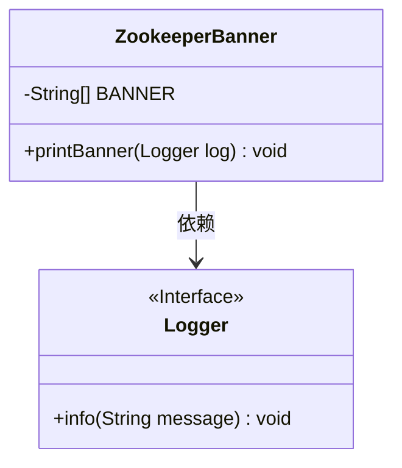
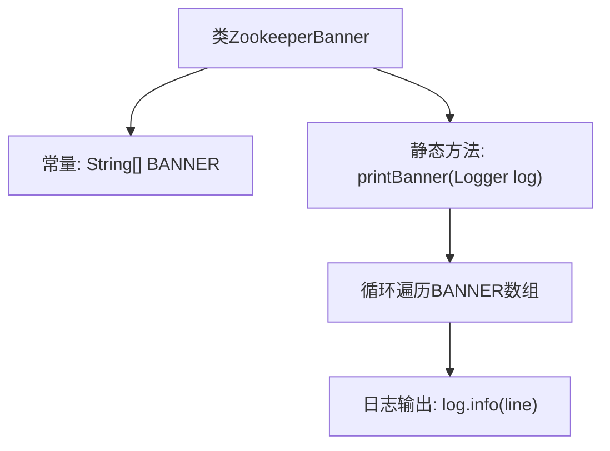

# 基础信息

|      |      |
|------|------|
| 名称 | ZookeeperBanner |
| 编码语言 | .java |
| 代码路径 | zookeeper/zookeeper-server/src/main/java/org/apache/zookeeper/ZookeeperBanner.java |
| 包名 | org.apache.zookeeper |
| 依赖项 | ['org.slf4j.Logger'] |
| 概述说明 | 这是一个Java类ZookeeperBanner，包含静态字符串数组BANNER存储ASCII艺术横幅，提供printBanner方法通过Logger逐行打印横幅内容。 |

# 说明

这段内容描述了一个名为ZookeeperBanner的Java类，主要用于打印Zookeeper的ASCII艺术字横幅。该类包含一个私有的静态字符串数组BANNER，存储了多行ASCII艺术字符组成的Zookeeper标志。类中还定义了一个公开的静态方法printBanner，接收一个Logger对象作为参数，通过循环遍历BANNER数组并使用Logger逐行输出横幅内容。整个实现简洁明了，专注于横幅的展示功能。

# 类列表 Class Summary

| 名称   | 类型  | 说明 |
|-------|------|-------------|
| ZookeeperBanner | class | 这是一个ZookeeperBanner类，包含静态字符串数组BANNER和打印横幅的printBanner方法，用于在日志中输出Zookeeper的ASCII艺术标志。 |

## 类 ZookeeperBanner

|      |      |
|------|------|
| 访问范围 | public |
| 类型 | class |
| 名称 | ZookeeperBanner |
| 说明 | 这是一个ZookeeperBanner类，包含静态字符串数组BANNER和打印横幅的printBanner方法，用于在日志中输出Zookeeper的ASCII艺术标志。 |

### UML类图

这段代码展示了一个ZookeeperBanner类，该类包含一个静态字符串数组BANNER用于存储ASCII艺术字形式的横幅，以及一个printBanner方法用于通过Logger接口逐行输出横幅内容。Logger作为接口被依赖，用于实际日志记录操作。整个设计简洁明了，实现了横幅展示与日志记录的解耦。

### 内部方法调用关系图

该流程图展示了ZookeeperBanner类的结构，包含一个静态字符串数组常量BANNER和一个打印横幅的静态方法。printBanner方法通过循环遍历BANNER数组的每一行，并使用Logger对象逐行输出日志内容。整个流程简洁明了，体现了类的基本功能和数据流向。

### 字段列表 Field List

| 名称  | 类型  | 说明 |
|-------|-------|------|
| BANNER = {        "",        "  ______                  _                                          ",        " |___  /                 | |                                         ",        "    / /    ___     ___   | | __   ___    ___   _ __     ___   _ __   ",        "   / /    / _ \\   / _ \\  | |/ /  / _ \\  / _ \\ | '_ \\   / _ \\ | '__|",        "  / /__  | (_) | | (_) | |   <  |  __/ |  __/ | |_) | |  __/ | |    ",        " /_____|  \\___/   \\___/  |_|\\_\\  \\___|  \\___| | .__/   \\___| |_|",        "                                              | |                     ",        "                                              |_|                     ", ""} | String[] | ASCII艺术横幅，显示"______"和"|___ /"等字符组成的装饰性图案，无实际功能意义。 |

### 方法列表 Method List

| 名称  | 类型  | 说明 |
|-------|-------|------|
| printBanner | void | 静态方法printBanner通过Logger逐行输出BANNER内容。 |

