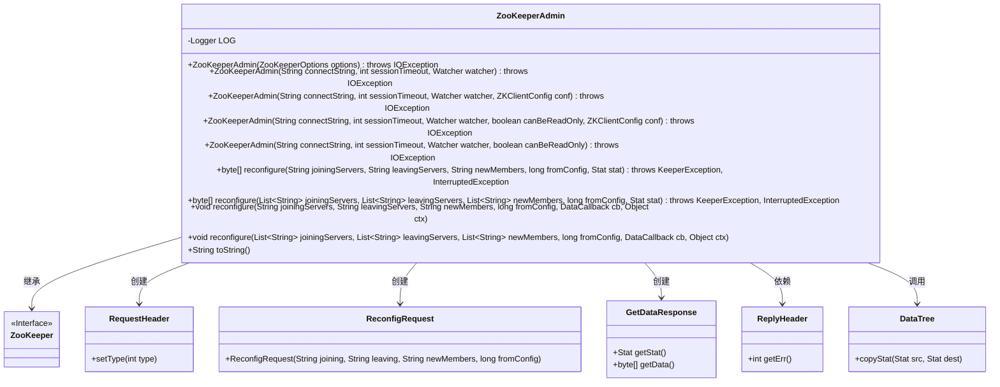
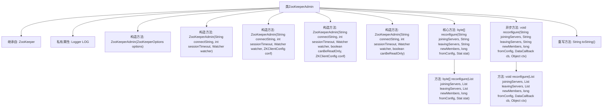

# 基础信息

|      |      |
|------|------|
| 名称 | ZooKeeperAdmin |
| 编码语言 | .java |
| 代码路径 | zookeeper/zookeeper-server/src/main/java/org/apache/zookeeper/admin/ZooKeeperAdmin.java |
| 包名 | org.apache.zookeeper.admin |
| 依赖项 | ['java.io.IOException', 'java.util.List', 'org.apache.yetus.audience.InterfaceAudience', 'org.apache.zookeeper.AsyncCallback.DataCallback', 'org.apache.zookeeper.KeeperException', 'org.apache.zookeeper.Watcher', 'org.apache.zookeeper.ZooDefs', 'org.apache.zookeeper.ZooKeeper', 'org.apache.zookeeper.client.ZKClientConfig', 'org.apache.zookeeper.client.ZooKeeperOptions', 'org.apache.zookeeper.common.StringUtils', 'org.apache.zookeeper.data.Stat', 'org.apache.zookeeper.proto.GetDataResponse', 'org.apache.zookeeper.proto.ReconfigRequest', 'org.apache.zookeeper.proto.ReplyHeader', 'org.apache.zookeeper.proto.RequestHeader', 'org.apache.zookeeper.server.DataTree', 'org.slf4j.Logger', 'org.slf4j.LoggerFactory'] |
| 概述说明 | ZooKeeperAdmin是ZooKeeper的扩展类，用于动态重配置操作，支持添加/移除服务器，提供同步和异步方法，可处理连接字符串、会话超时和监听器等参数。 |

# 说明

ZooKeeperAdmin是ZooKeeper的扩展类，专用于动态重新配置操作。它提供多个构造函数，支持不同参数组合，包括连接字符串、会话超时、监视器、配置对象及只读模式选项。主要功能reconfigure允许添加/移除服务器或更新成员列表，支持同步和异步操作。同步版本返回新配置数据，异步版本通过回调处理结果。类还包含便捷方法，支持列表参数而非逗号分隔字符串。所有方法均可能抛出IO异常或非法参数异常。该类继承自ZooKeeper，保留了其基本功能，同时扩展了管理接口。

# 类列表 Class Summary

| 名称   | 类型  | 说明 |
|-------|------|-------------|
| ZooKeeperAdmin | class | ZooKeeperAdmin是ZooKeeper的扩展类，用于动态重配置操作。提供多种构造函数，支持连接字符串、会话超时、监视器等参数。包含同步和异步的reconfigure方法，用于添加/移除服务器或更新成员列表，返回新配置。支持增量和非增量重配置，可处理网络异常和无效路径错误。 |

## 类 ZooKeeperAdmin

|      |      |
|------|------|
| 访问范围 | @SuppressWarnings("try");@InterfaceAudience.Public;public |
| 类型 | class |
| 名称 | ZooKeeperAdmin |
| 说明 | ZooKeeperAdmin是ZooKeeper的扩展类，用于动态重配置操作。提供多种构造函数，支持连接字符串、会话超时、监视器等参数。包含同步和异步的reconfigure方法，用于添加/移除服务器或更新成员列表，返回新配置。支持增量和非增量重配置，可处理网络异常和无效路径错误。 |

### UML类图

这段代码展示了ZooKeeperAdmin类继承自ZooKeeper接口，主要用于执行动态重新配置操作。类中包含多个构造函数用于不同配置场景，以及同步/异步的reconfigure方法用于服务器集群的增减和配置更新。通过RequestHeader、ReconfigRequest等辅助类实现与ZooKeeper服务端的交互，核心功能包括处理增量/全量配置变更、异常处理和状态同步。

### 内部方法调用关系图

该流程图展示了ZooKeeperAdmin类的完整结构，它是一个继承自ZooKeeper的管理类，主要用于执行ZooKeeper集群的动态重新配置操作。类包含5个不同参数的构造方法，核心的reconfigure同步/异步方法及其便利封装，以及重写的toString方法。所有构造方法都通过super调用父类实现，而reconfigure方法实现了服务端配置变更的核心逻辑，支持字符串和列表两种参数形式。

### 字段列表 Field List

| 名称  | 类型  | 说明 |
|-------|-------|------|
| LOG = LoggerFactory.getLogger(ZooKeeperAdmin.class) | Logger | ZooKeeperAdmin类中定义了一个私有静态日志记录器LOG。 |

### 方法列表 Method List

| 名称  | 类型  | 说明 |
|-------|-------|------|
| reconfigure | byte[] | Java方法reconfigure用于重新配置服务器列表，参数包括加入、离开和新的服务器列表，配置版本号和状态对象，可能抛出KeeperException和InterruptedException异常。 |
| reconfigure | void | reconfigure方法用于重新配置服务器列表，接收加入、离开和新成员列表，以及配置版本号、回调和上下文参数，内部调用同名方法处理字符串拼接。 |
| reconfigure | void | 这是一个ZooKeeper的reconfigure方法，用于动态重新配置集群。方法接收加入、离开的服务器列表、新成员信息、配置版本号，并构建请求包发送到配置节点进行处理。 |
| reconfigure | byte[] | 这是一个ZooKeeper的reconfigure方法，用于动态重新配置集群成员。它接收加入、离开和新成员列表，发送请求到服务器，处理响应并返回数据。异常时抛出KeeperException。 |
| toString | String | 重写toString方法，直接调用父类的toString方法。 |

