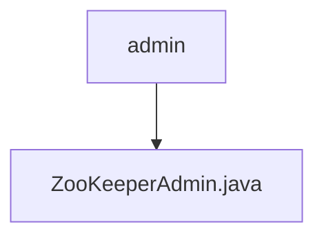

# 基础信息

|      |      |
|------|------|
| 名称 | admin |
| 编码语言 | .java |
| 代码路径 | zookeeper/zookeeper-server/src/main/java/org/apache/zookeeper/admin |
| 包名 | zookeeper.docs.zookeeper-server.src.main.java.org.apache.zookeeper.admin |
| 概述说明 | ZooKeeperAdmin是ZooKeeper的扩展类，用于动态重配置操作，支持添加/移除服务器，提供同步和异步方法，可处理连接字符串、会话超时和监听器等参数。 |

# 说明

ZooKeeperAdmin是ZooKeeper的扩展类，专用于动态重新配置操作。它提供多个构造函数，支持不同参数组合，包括连接字符串、会话超时、监视器、配置对象及只读模式选项。主要功能reconfigure允许添加/移除服务器或更新成员列表，支持同步和异步操作。同步版本返回新配置数据，异步版本通过回调处理结果。类还包含便捷方法，支持列表参数而非逗号分隔字符串。所有方法均可能抛出IO异常或非法参数异常。该类继承自ZooKeeper，保留了其基本功能，同时扩展了管理接口。

### 包内部结构视图

该流程图展示了ZooKeeper项目中admin目录与ZooKeeperAdmin.java文件的层级关系。admin作为父节点，ZooKeeperAdmin.java作为其子节点，表示该Java文件位于admin目录下。这种简洁的层级表示符合Mermaid语法规范，仅显示末端节点名称，准确反映了给定路径的结构关系。

# 文件列表 File List

| 名称   | 类型  | 说明 |
|-------|------|-------------|
| [ZooKeeperAdmin.java](ZooKeeperAdmin.md) | file | ZooKeeperAdmin是ZooKeeper的扩展类，用于动态重配置操作，支持添加/移除服务器，提供同步和异步方法，可处理连接字符串、会话超时和监听器等参数。 |

