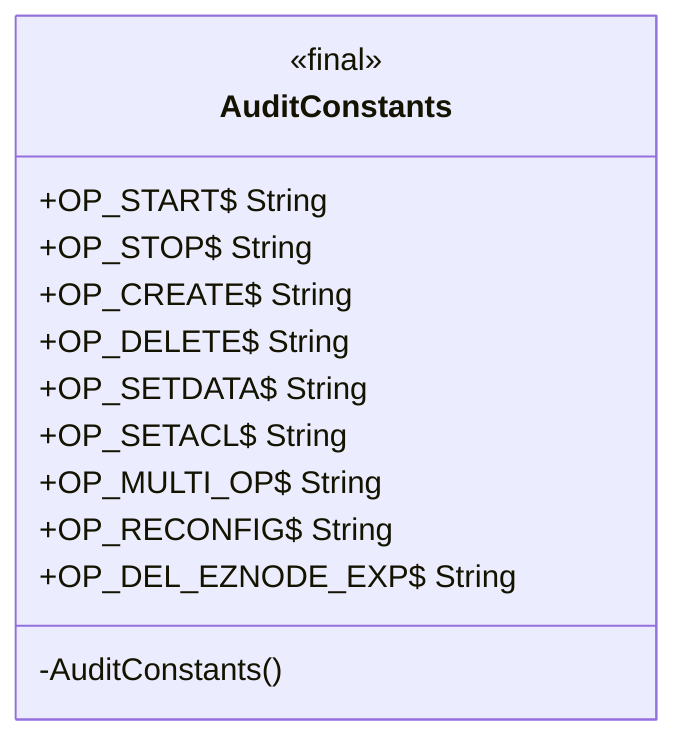
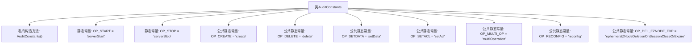

# 基础信息

|      |      |
|------|------|
| 名称 | AuditConstants |
| 编码语言 | .java |
| 代码路径 | zookeeper/zookeeper-server/src/main/java/org/apache/zookeeper/audit/AuditConstants.java |
| 包名 | org.apache.zookeeper.audit |
| 依赖项 | [] |
| 概述说明 | 审计操作常量类，包含服务器启停、创建删除、数据设置、权限设置、批量操作、重配置及临时节点删除等操作标识。 |

# 说明

这是一个名为AuditConstants的Java公共最终类，用于定义审计操作相关的常量字符串。该类被设计为工具类，因此构造函数被私有化以防止实例化。类中包含多个静态常量字段，分别表示不同的操作类型：服务器启动（OP_START）、服务器停止（OP_STOP）、创建（OP_CREATE）、删除（OP_DELETE）、设置数据（OP_SETDATA）、设置ACL（OP_SETACL）、多操作（OP_MULTI_OP）、重新配置（OP_RECONFIG）以及会话关闭或过期时删除临时节点（OP_DEL_EZNODE_EXP）。这些常量用于标识和记录系统中的各种审计事件。

# 类列表 Class Summary

| 名称   | 类型  | 说明 |
|-------|------|-------------|
| AuditConstants | class | 审计常量类，包含服务器启停、创建删除、数据设置、权限设置、批量操作、重新配置及临时节点删除等操作常量。 |

## 类 AuditConstants

|      |      |
|------|------|
| 访问范围 | public final |
| 类型 | class |
| 名称 | AuditConstants |
| 说明 | 审计常量类，包含服务器启停、创建删除、数据设置、权限设置、批量操作、重新配置及临时节点删除等操作常量。 |

### UML类图

该图展示了一个不可继承的工具类AuditConstants，包含9个静态字符串常量用于审计操作类型标识。类被标记为final且构造函数私有化，符合工具类的设计规范。所有常量均为public static final，表明它们是全局可访问的不可变值，主要用于记录服务器操作类型如创建/删除节点、设置ACL等ZK操作。$符号表示静态成员，<<final>>标注强调类不可扩展的特性。

### 内部方法调用关系图

这段代码定义了一个不可变的工具类`AuditConstants`，包含9个用于审计操作的字符串常量。类通过私有构造方法禁止实例化，所有常量均为静态字段，其中7个是公开可见的审计操作类型标识符（如创建、删除、配置等），2个是包内可见的服务器启停标识。这些常量用于统一管理系统中与审计日志相关的操作类型字符串，避免硬编码并保证类型安全。

### 字段列表 Field List

| 名称  | 类型  | 说明 |
|-------|-------|------|
| OP_STOP = "serverStop" | String | 定义静态常量字符串OP_STOP，值为"serverStop"。 |
| OP_DEL_EZNODE_EXP = "ephemeralZNodeDeletionOnSessionCloseOrExpire" | String | 静态常量OP_DEL_EZNODE_EXP表示会话关闭或过期时删除临时ZNode。 |
| OP_CREATE = "create" | String | 定义静态常量字符串OP_CREATE，值为"create"。 |
| OP_SETACL = "setAcl" | String | 定义静态常量字符串OP_SETACL，值为"setAcl"。 |
| OP_START = "serverStart" | String | 定义静态常量字符串OP_START，值为"serverStart"。 |
| OP_SETDATA = "setData" | String | 定义字符串常量OP_SETDATA，值为"setData"。 |
| OP_RECONFIG = "reconfig" | String | 定义静态常量OP_RECONFIG，值为"reconfig"。 |
| OP_MULTI_OP = "multiOperation" | String | 定义静态常量字符串OP_MULTI_OP，值为"multiOperation"。 |
| OP_DELETE = "delete" | String | 定义字符串常量OP_DELETE，值为"delete"。 |

### 方法列表 Method List

| 名称  | 类型  | 说明 |
|-------|-------|------|

