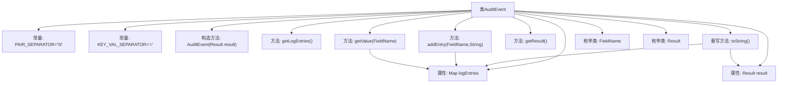

# 基础信息

|      |      |
|------|------|
| 名称 | AuditEvent |
| 编码语言 | .java |
| 代码路径 | zookeeper/zookeeper-server/src/main/java/org/apache/zookeeper/audit/AuditEvent.java |
| 包名 | org.apache.zookeeper.audit |
| 依赖项 | ['java.util.LinkedHashMap', 'java.util.Map', 'java.util.Set'] |
| 概述说明 | 审计事件类，用于记录日志条目，包含添加条目、获取值及结果，支持自定义字段和结果枚举，忽略空值生成日志字符串。 |

# 说明

AuditEvent类是一个用于记录审计事件的不可变类。它使用LinkedHashMap存储日志条目，键值对格式为字段名和对应值，字段名来自FieldName枚举。类提供添加条目、获取条目和获取结果的方法。toString方法生成格式化日志字符串，忽略空值字段，字段间用制表符分隔，键值用等号连接，最后追加result字段表示操作结果。Result枚举定义SUCCESS、FAILURE和INVOKED三种状态。FieldName枚举定义USER等7个标准字段名。

# 类列表 Class Summary

| 名称   | 类型  | 说明 |
|-------|------|-------------|
| AuditEvent | class | 审计事件类，用于记录日志条目，支持添加键值对，忽略空值，最终输出格式化字符串，包含结果状态枚举。 |


## 类 AuditEvent

|      |      |
|------|------|
| 访问范围 | public final |
| 类型 | class |
| 名称 | AuditEvent |
| 说明 | 审计事件类，用于记录日志条目，支持添加键值对，忽略空值，最终输出格式化字符串，包含结果状态枚举。 |


### UML类图

```mermaid
classDiagram
    class AuditEvent {
        -static final char PAIR_SEPARATOR
        -static final String KEY_VAL_SEPARATOR
        -Map~String, String~ logEntries
        -Result result
        +AuditEvent(Result result)
        +Set~Map.Entry~String, String~~ getLogEntries()
        +void addEntry(FieldName fieldName, String value)
        +String getValue(FieldName fieldName)
        +Result getResult()
        +String toString()
        +enum FieldName {
            <<enumeration>>
            USER
            OPERATION
            IP
            ACL
            ZNODE
            SESSION
            ZNODE_TYPE
        }
        +enum Result {
            <<enumeration>>
            SUCCESS
            FAILURE
            INVOKED
        }
    }
```

这段代码定义了一个名为`AuditEvent`的不可变类，用于记录审计事件信息。该类包含两个枚举类型`FieldName`和`Result`，分别表示审计字段名称和操作结果。主要功能包括：通过`addEntry`方法添加键值对形式的审计条目，使用`toString`方法生成格式化日志字符串（键值对用等号连接，条目间用制表符分隔），并通过`getLogEntries`获取所有条目。类设计注重空值处理和日志格式一致性，适用于需要结构化记录操作日志的场景。


### 内部方法调用关系图



流程图描述了AuditEvent类的结构及其方法调用关系。该类用于记录审计事件，包含两个常量字段、两个成员变量（logEntries和result）、构造方法、多个操作方法（如添加/获取日志条目）以及重写的toString方法。关键逻辑体现在toString方法中，它会遍历logEntries并格式化输出，最后追加result字段。类中还定义了FieldName和Result两个枚举类型，分别表示日志字段名和操作结果状态。

### 字段列表 Field List

| 名称  | 类型  | 说明 |
|-------|-------|------|
| result | Result | 私有结果变量result |
| logEntries = new LinkedHashMap<>() | Map<String, String> | 私有LinkedHashMap变量logEntries，用于存储字符串键值对。 |
| KEY_VAL_SEPARATOR = "=" | String | 定义常量KEY_VAL_SEPARATOR，值为等号，用于键值对分隔。 |
| PAIR_SEPARATOR = '\t' | char | 定义私有静态常量字符PAIR_SEPARATOR，值为制表符。 |

### 方法列表 Method List

| 名称  | 类型  | 说明 |
|-------|-------|------|
| getResult | Result | 方法getResult返回result对象。 |
| toString | String | Java方法：将logEntries的键值对拼接成字符串，用分隔符连接，最后追加result字段。忽略空值，首项不加分隔符。 |
| addEntry | void | 方法`addEntry`接收字段名和字符串值，若值非空则以小写字段名为键存入`logEntries`映射。 |
| getValue | String | 该方法通过字段名获取日志条目中的对应值，字段名转换为小写后作为键查询。 |
| getLogEntries | Set<Map.Entry<String, String>> | 该方法返回日志条目的键值对集合。 |


