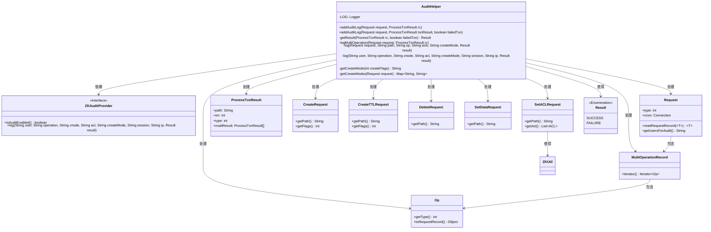
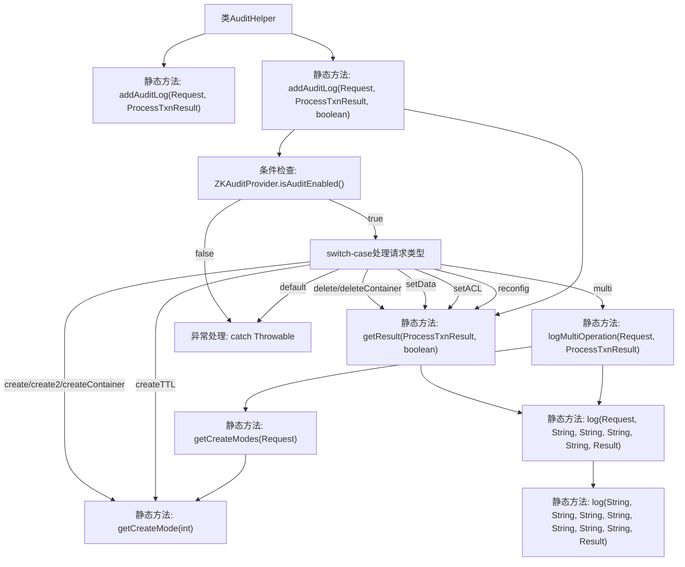

# 基础信息

|      |      |
|------|------|
| 名称 | AuditHelper |
| 编码语言 | .java |
| 代码路径 | zookeeper/zookeeper-server/src/main/java/org/apache/zookeeper/audit/AuditHelper.java |
| 包名 | org.apache.zookeeper.audit |
| 依赖项 | ['java.io.IOException', 'java.util.HashMap', 'java.util.Map', 'org.apache.zookeeper.CreateMode', 'org.apache.zookeeper.KeeperException', 'org.apache.zookeeper.MultiOperationRecord', 'org.apache.zookeeper.Op', 'org.apache.zookeeper.ZKUtil', 'org.apache.zookeeper.ZooDefs', 'org.apache.zookeeper.audit.AuditEvent.Result', 'org.apache.zookeeper.proto.CreateRequest', 'org.apache.zookeeper.proto.CreateTTLRequest', 'org.apache.zookeeper.proto.DeleteRequest', 'org.apache.zookeeper.proto.SetACLRequest', 'org.apache.zookeeper.proto.SetDataRequest', 'org.apache.zookeeper.server.DataTree.ProcessTxnResult', 'org.apache.zookeeper.server.Request', 'org.slf4j.Logger', 'org.slf4j.LoggerFactory'] |
| 概述说明 | AuditHelper类提供静态方法记录ZooKeeper操作审计日志，支持创建、删除、设置数据等操作类型，处理单次和批量事务，记录用户、路径、结果等信息。 |

# 说明

AuditHelper是一个用于管理审计日志的公共工具类，提供静态方法addAuditLog来记录不同类型的ZooKeeper操作。该类首先检查审计功能是否启用，然后根据请求类型（如创建、删除、设置数据、设置ACL等）提取相关信息（如路径、ACL、创建模式等），并处理失败事务。对于多操作请求（multi），会遍历子操作并分别记录。最终通过ZKAuditProvider记录审计日志，包含用户、操作类型、路径、会话ID、IP地址和结果（成功或失败）。异常情况下会记录错误日志。

# 类列表 Class Summary

| 名称   | 类型  | 说明 |
|-------|------|-------------|
| AuditHelper | class | AuditHelper类提供静态方法记录ZooKeeper操作审计日志，支持创建、删除、设置数据等操作类型，处理失败事务和多操作请求，最终调用ZKAuditProvider输出日志。 |

## 类 AuditHelper

|      |      |
|------|------|
| 访问范围 | public final |
| 类型 | class |
| 名称 | AuditHelper |
| 说明 | AuditHelper类提供静态方法记录ZooKeeper操作审计日志，支持创建、删除、设置数据等操作类型，处理失败事务和多操作请求，最终调用ZKAuditProvider输出日志。 |

### UML类图

这段代码实现了一个审计日志辅助类AuditHelper，主要用于处理ZooKeeper操作请求的审计日志记录。它通过检查请求类型(如create/delete/setData等)来生成相应的审计日志，支持普通操作和multi批量操作，并能处理失败事务。类图中展示了AuditHelper与ZooKeeper相关请求类、结果类以及审计提供者接口之间的关系，体现了其作为审计日志处理核心的桥梁作用。

### 内部方法调用关系图

流程图描述：该流程图展示了AuditHelper类的核心审计日志处理流程。从入口方法addAuditLog开始，首先检查审计功能是否启用，然后根据不同的ZooKeeper操作类型（create/delete/setData等）进行分支处理，提取相应参数后调用底层日志记录方法。特别处理了multi操作和异常情况，最终通过ZKAuditProvider输出审计日志。流程包含参数提取、操作类型判断、结果状态处理和异常捕获等关键环节。

### 字段列表 Field List

| 名称  | 类型  | 说明 |
|-------|-------|------|
| LOG = LoggerFactory.getLogger(AuditHelper.class) | Logger | 定义私有静态日志常量LOG，用于AuditHelper类的日志记录。 |

### 方法列表 Method List

| 名称  | 类型  | 说明 |
|-------|-------|------|
| addAuditLog | void | 静态方法addAuditLog接收请求和交易结果参数，默认调用三参数版本并传入false。 |
| getCreateMode | String | 该方法将创建标志转换为字符串形式的创建模式，转换为小写后返回。 |
| log | void | 私有静态方法log记录用户操作，参数包括用户、操作、节点、权限、模式、会话、IP和结果，调用ZKAuditProvider的log方法。 |
| logMultiOperation | void | 私有方法logMultiOperation处理多操作事务日志，根据子事务类型记录创建、删除、设置数据等操作，若任一子事务失败则记录整体操作失败。 |
| getCreateModes | Map<String, String> | 方法getCreateModes从请求中提取创建操作的路径和模式，仅在审计启用时处理。遍历多操作记录，筛选创建类型操作，解析路径和模式存入Map返回。 |
| log | void | 私有静态方法log记录请求审计信息，包括用户、操作、路径、ACLs、创建模式、会话ID、主机地址和结果。 |
| getResult | Result | 私有方法根据事务状态返回结果：失败事务返回FAILURE，否则检查错误码是否为OK，是则SUCCESS，否则FAILURE。 |
| addAuditLog | void | 方法addAuditLog根据请求类型记录审计日志，处理创建、删除、设置数据等操作，捕获路径、ACL和模式信息，失败事务时记录路径，最终记录日志或错误。 |

