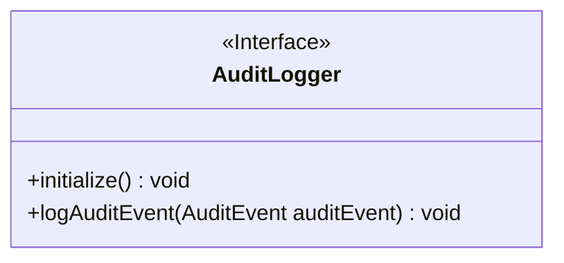
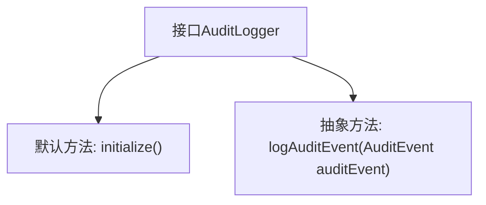

# 基础信息

|      |      |
|------|------|
| 名称 | AuditLogger |
| 编码语言 | .java |
| 代码路径 | zookeeper/zookeeper-server/src/main/java/org/apache/zookeeper/audit/AuditLogger.java |
| 包名 | org.apache.zookeeper.audit |
| 依赖项 | [] |
| 概述说明 | 审计日志接口，含初始化方法和记录审计事件方法。 |

# 说明

这是一个名为AuditLogger的公共接口，定义了两个方法。第一个方法是initialize()，它是一个默认方法，在日志记录器初始化时调用，默认实现为空。第二个方法是logAuditEvent(AuditEvent auditEvent)，用于记录审计事件，接收一个包含所有需要记录字段的AuditEvent对象作为参数。该接口提供了审计日志功能的基本框架，允许实现类自定义初始化过程和审计事件记录方式。

# 类列表 Class Summary

| 名称   | 类型  | 说明 |
|-------|------|-------------|
| AuditLogger | interface | 审计日志接口，含初始化方法和记录审计事件方法。 |

## 类 AuditLogger

|      |      |
|------|------|
| 访问范围 | public |
| 类型 | interface |
| 名称 | AuditLogger |
| 说明 | 审计日志接口，含初始化方法和记录审计事件方法。 |

### UML类图

这段类图描述了一个审计日志接口`AuditLogger`，该接口定义了两个方法：`initialize()`用于初始化日志记录器（提供默认空实现），以及`logAuditEvent()`用于记录审计事件（需子类强制实现）。作为接口，它通过`<<Interface>>`标记明确标识，所有方法均为公开抽象方法（省略abstract关键字），体现了日志组件的核心契约。后续具体日志实现类需实现该接口来完成实际审计功能。

### 内部方法调用关系图

该流程图展示了AuditLogger接口的结构，包含一个无操作的默认初始化方法和一个必须实现的抽象审计日志方法。initialize()方法提供可选初始化功能，而logAuditEvent()强制实现类处理审计事件记录。这种设计允许日志器灵活扩展，同时确保核心日志功能被正确实现。接口作为抽象契约，明确了日志记录组件的关键行为要求。

### 字段列表 Field List

| 名称  | 类型  | 说明 |
|-------|-------|------|

### 方法列表 Method List

| 名称  | 类型  | 说明 |
|-------|-------|------|
| initialize | void | 空初始化方法，无具体实现内容。 |
| logAuditEvent | void | 记录审计事件的方法，参数为AuditEvent对象。 |

