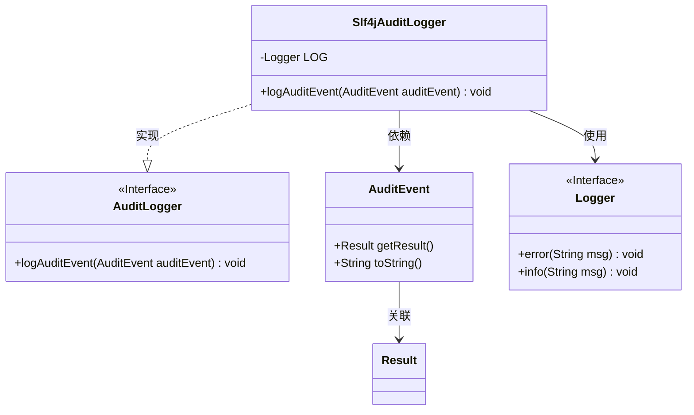
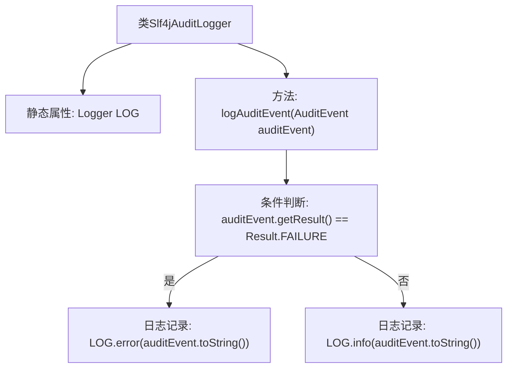

# 基础信息

|      |      |
|------|------|
| 名称 | Slf4jAuditLogger |
| 编码语言 | .java |
| 代码路径 | zookeeper/zookeeper-server/src/main/java/org/apache/zookeeper/audit/Slf4jAuditLogger.java |
| 包名 | org.apache.zookeeper.audit |
| 依赖项 | ['org.apache.zookeeper.audit.AuditEvent.Result', 'org.slf4j.Logger', 'org.slf4j.LoggerFactory'] |
| 概述说明 | Slf4jAuditLogger类实现审计日志功能，根据事件结果使用不同日志级别记录，失败时用error，成功用info。 |

# 说明

该内容描述了一个名为Slf4jAuditLogger的类，实现了AuditLogger接口。该类使用SLF4J日志框架记录审计事件。核心功能是通过logAuditEvent方法，根据审计事件的结果状态（成功或失败）选择不同日志级别输出：失败事件用error级别记录，成功事件用info级别记录。日志内容为审计事件的字符串表示形式。整个实现简洁直接，依赖SLF4J进行日志记录。

# 类列表 Class Summary

| 名称   | 类型  | 说明 |
|-------|------|-------------|
| Slf4jAuditLogger | class | Slf4jAuditLogger类实现AuditLogger接口，使用SLF4J记录审计事件，失败时输出错误日志，成功时输出信息日志。 |

## 类 Slf4jAuditLogger

|      |      |
|------|------|
| 访问范围 | public |
| 类型 | class |
| 名称 | Slf4jAuditLogger |
| 说明 | Slf4jAuditLogger类实现AuditLogger接口，使用SLF4J记录审计事件，失败时输出错误日志，成功时输出信息日志。 |

### UML类图

类图描述：该图展示了Slf4jAuditLogger类实现AuditLogger接口的关系，其中Slf4jAuditLogger通过组合方式使用Logger接口记录审计日志。AuditEvent类包含操作结果状态(Result枚举)和日志内容转换方法，Slf4jAuditLogger根据结果状态选择不同日志级别（error/info）输出事件信息。整体结构体现了日志记录功能的解耦设计，符合面向接口编程原则。

### 内部方法调用关系图

这段代码展示了一个基于SLF4J的审计日志记录器实现。类Slf4jAuditLogger包含一个静态Logger实例，通过logAuditEvent方法根据审计事件的结果状态（成功/失败）选择不同的日志级别记录。失败事件使用error级别，其他事件使用info级别，均输出审计事件的字符串表示形式。流程图清晰展现了从类结构到条件分支的完整处理逻辑。

### 字段列表 Field List

| 名称  | 类型  | 说明 |
|-------|-------|------|
| LOG = LoggerFactory.getLogger(Slf4jAuditLogger.class) | Logger | 定义静态常量LOG，使用Slf4j日志框架获取Slf4jAuditLogger类的日志记录器实例。 |

### 方法列表 Method List

| 名称  | 类型  | 说明 |
|-------|-------|------|
| logAuditEvent | void | 该方法根据审计事件结果选择日志级别：失败时记录错误日志，否则记录信息日志。 |

