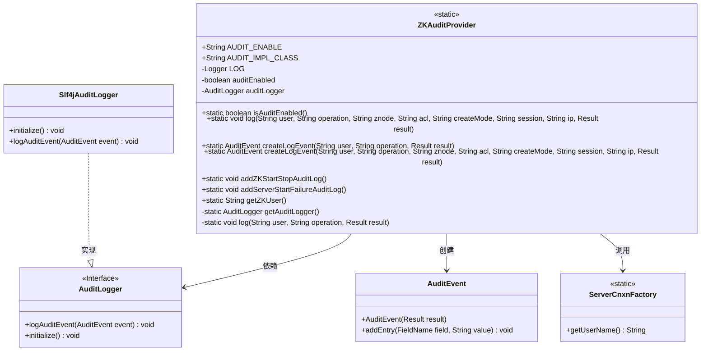
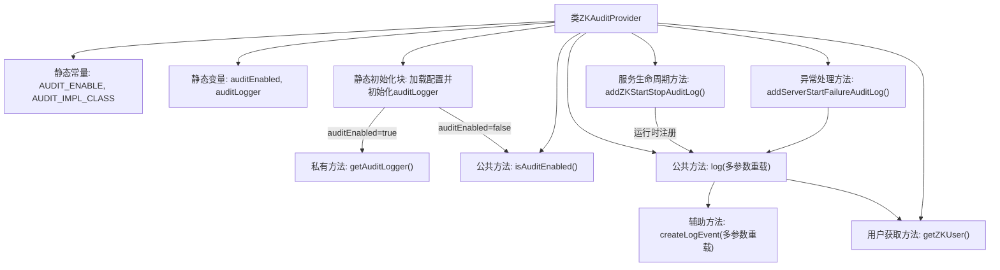

# 基础信息

|      |      |
|------|------|
| 名称 | ZKAuditProvider |
| 编码语言 | .java |
| 代码路径 | zookeeper/zookeeper-server/src/main/java/org/apache/zookeeper/audit/ZKAuditProvider.java |
| 包名 | org.apache.zookeeper.audit |
| 依赖项 | ['org.apache.zookeeper.audit.AuditEvent.FieldName', 'java.lang.reflect.Constructor', 'org.apache.zookeeper.audit.AuditEvent.Result', 'org.apache.zookeeper.server.ServerCnxnFactory', 'org.slf4j.Logger', 'org.slf4j.LoggerFactory'] |
| 概述说明 | ZKAuditProvider类管理ZooKeeper审计日志功能，支持开关配置、日志记录及事件创建，包含启动停止日志和失败处理。 |

# 说明

ZKAuditProvider是ZooKeeper的审计日志提供者类，用于管理审计日志功能。它通过静态变量控制审计日志的启用状态，默认禁用。启用时，会初始化AuditLogger实例，默认使用Slf4jAuditLogger。提供日志记录方法，支持记录用户、操作、节点、ACL等详细信息，并包含辅助方法创建审计事件对象。还支持服务器启动、停止及启动失败的审计日志记录，通过运行时钩子确保服务器停止时记录日志。审计日志功能可通过系统属性配置。

# 类列表 Class Summary

| 名称   | 类型  | 说明 |
|-------|------|-------------|
| ZKAuditProvider | class | ZKAuditProvider类提供ZooKeeper审计功能，通过静态变量控制审计开关，支持自定义审计日志实现类，记录用户操作、节点信息等事件，并包含服务启停的审计日志方法。 |

## 类 ZKAuditProvider

|      |      |
|------|------|
| 访问范围 | public |
| 类型 | class |
| 名称 | ZKAuditProvider |
| 说明 | ZKAuditProvider类提供ZooKeeper审计功能，通过静态变量控制审计开关，支持自定义审计日志实现类，记录用户操作、节点信息等事件，并包含服务启停的审计日志方法。 |

### UML类图

该类图展示了ZooKeeper审计日志系统的核心结构。ZKAuditProvider作为入口类，通过静态方法管理审计日志的初始化和记录，依赖AuditLogger接口实现具体日志操作。Slf4jAuditLogger是默认的日志实现类，AuditEvent封装审计事件数据，ServerCnxnFactory提供用户信息。系统通过静态代码块初始化时自动检测审计开关，支持记录服务器启停等关键操作事件，采用运行时反射机制动态加载日志实现类，体现了良好的扩展性和模块化设计。

### 内部方法调用关系图

该流程图展示了ZKAuditProvider类的完整控制流程，核心是通过静态初始化块根据配置决定是否启用审计日志。当启用时，会通过反射动态加载审计日志实现类，并提供了丰富的日志记录方法，包括服务启动/停止的自动注册、失败处理以及多参数的事件构造方法。所有日志操作最终都委托给AuditLogger实例执行，用户信息通过ServerCnxnFactory动态获取，体现了灵活的审计日志架构设计。

### 字段列表 Field List

| 名称  | 类型  | 说明 |
|-------|-------|------|
| auditEnabled | boolean | 私有静态布尔变量auditEnabled，用于控制审计功能开关状态。 |
| LOG = LoggerFactory.getLogger(ZKAuditProvider.class) | Logger | 私有静态日志常量，用于ZKAuditProvider类的日志记录。 |
| auditLogger | AuditLogger | 私有静态审计日志器变量。 |
| AUDIT_ENABLE = "zookeeper.audit.enable" | String | 静态常量AUDIT_ENABLE用于启用ZooKeeper审计功能。 |
| AUDIT_IMPL_CLASS = "zookeeper.audit.impl.class" | String | 静态常量AUDIT_IMPL_CLASS定义审计实现类配置键，值为zookeeper.audit.impl.class。 |

### 方法列表 Method List

| 名称  | 类型  | 说明 |
|-------|-------|------|
| isAuditEnabled | boolean | 检查审计功能是否启用，返回布尔值auditEnabled状态。 |
| createLogEvent | AuditEvent | 创建审计日志事件方法：传入用户、操作和结果，生成包含用户和操作信息的审计事件对象并返回。 |
| log | void | 静态方法log记录审计日志，参数包括用户、操作、节点、权限、模式、会话、IP和结果，调用auditLogger记录事件。 |
| log | void | 私有静态方法log记录用户操作审计日志，参数为用户、操作和结果，调用auditLogger记录日志事件。 |
| getAuditLogger | AuditLogger | 获取审计日志实例：读取系统属性指定类名，默认使用Slf4jAuditLogger，通过反射创建实例并初始化，失败抛出运行时异常。 |
| getZKUser | String | 获取ZooKeeper用户名的静态方法，返回ServerCnxnFactory中的用户名。 |
| addZKStartStopAuditLog | void | 静态方法`addZKStartStopAuditLog`在审计启用时记录启动日志，并注册关闭钩子记录停止日志。 |
| addServerStartFailureAuditLog | void | 静态方法记录服务器启动失败审计日志，当审计启用时记录用户、操作类型和失败结果。 |
| createLogEvent | AuditEvent | 方法createLogEvent创建审计事件对象，包含用户、操作、节点、权限、创建模式、会话、IP和结果等信息。 |

