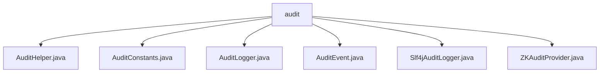

# 基础信息

|      |      |
|------|------|
| 名称 | audit |
| 编码语言 | .java |
| 代码路径 | zookeeper/zookeeper-server/src/main/java/org/apache/zookeeper/audit |
| 包名 | zookeeper.docs.zookeeper-server.src.main.java.org.apache.zookeeper.audit |
| 概述说明 | AuditHelper管理ZooKeeper审计日志，记录操作类型、路径等信息。AuditConstants定义操作类型常量。AuditLogger接口提供日志框架。AuditEvent存储日志条目。Slf4jAuditLogger用SLF4J记录日志。ZKAuditProvider管理审计功能，默认禁用，可配置。 |

# 说明

## 概述  
1. 模块核心职责是提供ZooKeeper操作的审计日志管理功能，例如记录创建、删除、设置数据等关键操作。  
2. 主要接口规范为Java静态方法调用和事件驱动模式，例如通过`addAuditLog`方法触发日志记录。  
3. 关键数据结构包括不可变的`AuditEvent`和`LinkedHashMap`键值对，例如用枚举定义标准字段名（如USER、OPERATION）。  
4. 外部依赖项为SLF4J日志框架，例如通过`Slf4jAuditLogger`实现日志分级输出。  
5. 通过系统属性配置审计功能，例如启用时默认使用`Slf4jAuditLogger`。  

## 主要业务场景  
1. 支持ZooKeeper全生命周期操作审计，例如服务器启停、节点增删改查及ACL设置。  
2. 典型交互模式为同步日志记录，例如操作执行后立即生成审计事件并输出。  
3. 功能完整性体现在支持多操作（MULTI_OP）分解，例如遍历子操作并单独记录。  
4. 主要使用场景包括安全合规审查，例如追踪用户操作路径和会话IP。  
5. 提供静态工具类API，例如`AuditHelper`直接调用无需实例化。  
6. 第三方可通过实现`AuditLogger`接口扩展，例如自定义日志存储或格式。

### 包内部结构视图

该流程图展示了Zookeeper项目中审计模块的文件结构关系。根节点"audit"下直接包含6个Java文件，包括审计助手类、常量定义、日志记录器接口、事件类、SLF4J实现类以及审计提供者类。所有文件均位于同一层级，没有嵌套子目录，形成一个扁平化的结构，用于实现Zookeeper的审计日志功能。

# 文件列表 File List

| 名称   | 类型  | 说明 |
|-------|------|-------------|
| [ZKAuditProvider.java](ZKAuditProvider.md) | file | ZKAuditProvider类管理ZooKeeper审计日志功能，支持开关配置、日志记录及事件创建，包含启动停止日志和失败处理。 |
| [Slf4jAuditLogger.java](Slf4jAuditLogger.md) | file | Slf4jAuditLogger类实现审计日志功能，根据事件结果使用不同日志级别记录，失败时用error，成功用info。 |
| [AuditEvent.java](AuditEvent.md) | file | 审计事件类，用于记录日志条目，包含添加条目、获取值及结果，支持自定义字段和结果枚举，忽略空值生成日志字符串。 |
| [AuditLogger.java](AuditLogger.md) | file | 审计日志接口，含初始化方法和记录审计事件方法。 |
| [AuditConstants.java](AuditConstants.md) | file | 审计操作常量类，包含服务器启停、创建删除、数据设置、权限设置、批量操作、重配置及临时节点删除等操作标识。 |
| [AuditHelper.java](AuditHelper.md) | file | AuditHelper类提供静态方法记录ZooKeeper操作审计日志，支持创建、删除、设置数据等操作类型，处理单次和批量事务，记录用户、路径、结果等信息。 |

