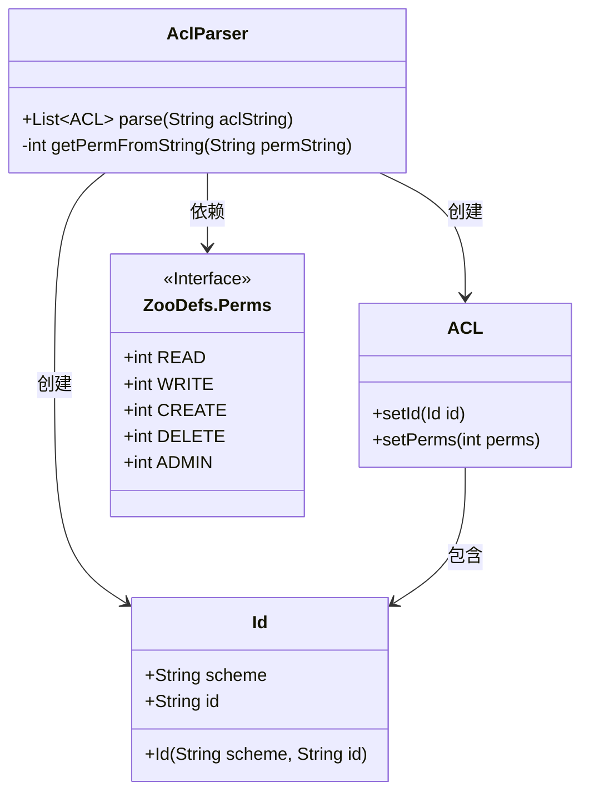
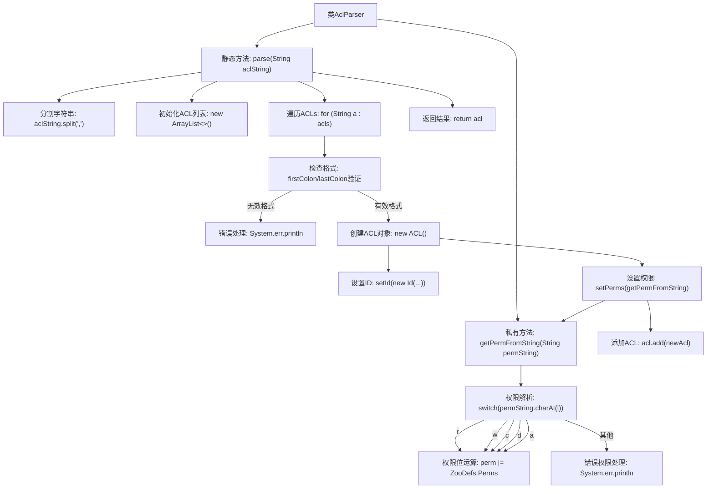

# 基础信息

|      |      |
|------|------|
| 名称 | AclParser |
| 编码语言 | .java |
| 代码路径 | zookeeper/zookeeper-server/src/main/java/org/apache/zookeeper/cli/AclParser.java |
| 包名 | org.apache.zookeeper.cli |
| 依赖项 | ['java.util.ArrayList', 'java.util.List', 'org.apache.zookeeper.ZooDefs', 'org.apache.zookeeper.data.ACL', 'org.apache.zookeeper.data.Id'] |
| 概述说明 | AclParser类解析ACL字符串为列表，格式为scheme:id:perm，支持r、w、c、d、a权限。 |

# 说明

AclParser类包含两个方法：parse方法将字符串解析为ACL列表，通过逗号分隔每个ACL条目，验证格式为scheme:id:perm，提取ID和权限后构建ACL对象；getPermFromString方法将权限字符串转换为位掩码，支持r、w、c、d、a五种权限类型，遇到无效字符会输出错误。

# 类列表 Class Summary

| 名称   | 类型  | 说明 |
|-------|------|-------------|
| AclParser | class | AclParser类解析ACL字符串为列表，格式为scheme:id:perm，支持权限r、w、c、d、a，无效输入跳过。 |

## 类 AclParser

|      |      |
|------|------|
| 访问范围 | public |
| 类型 | class |
| 名称 | AclParser |
| 说明 | AclParser类解析ACL字符串为列表，格式为scheme:id:perm，支持权限r、w、c、d、a，无效输入跳过。 |

### UML类图

这段代码展示了一个ACL解析器的类结构，主要包含AclParser、ACL、Id三个核心类和ZooDefs.Perms接口。AclParser负责将字符串解析为ACL列表，通过split和字符串处理提取scheme:id:perm格式的数据，并利用ZooDefs.Perms接口的权限常量进行位运算。ACL类包含Id对象和权限设置，Id类存储scheme和id信息。整个设计实现了ACL字符串到权限对象的转换功能。

### 内部方法调用关系图

该流程图描述了AclParser类的完整工作流程，主要展示如何将ACL字符串解析为ACL对象列表的过程。首先通过逗号分割字符串，然后逐个解析每个ACL条目，验证格式后提取scheme、id和权限信息。权限解析采用位运算方式，支持'r/w/c/d/a'五种权限类型，遇到无效格式或未知权限时会输出错误信息。整个过程严格遵循输入验证-对象创建-权限解析-结果返回的流程，具有完善的错误处理机制。

### 字段列表 Field List

| 名称  | 类型  | 说明 |
|-------|-------|------|

### 方法列表 Method List

| 名称  | 类型  | 说明 |
|-------|-------|------|
| getPermFromString | int | 将字符串权限转换为数字权限，支持r(读)、w(写)、c(创建)、d(删除)、a(管理)，未知字符报错。 |
| parse | List<ACL> | 解析ACL字符串为ACL对象列表。按逗号分割字符串，检查格式后提取scheme、id和权限，生成ACL对象并返回列表。格式错误则跳过。 |

