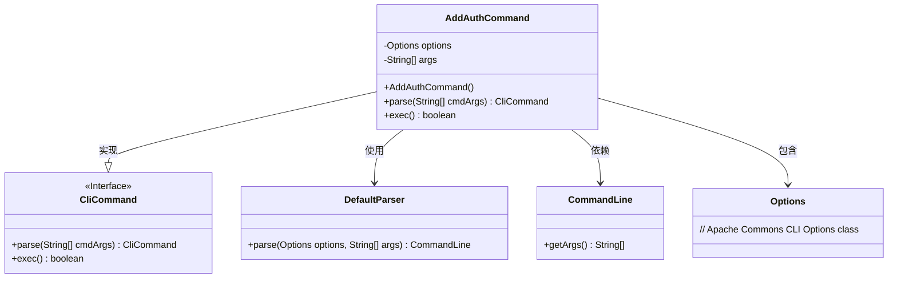
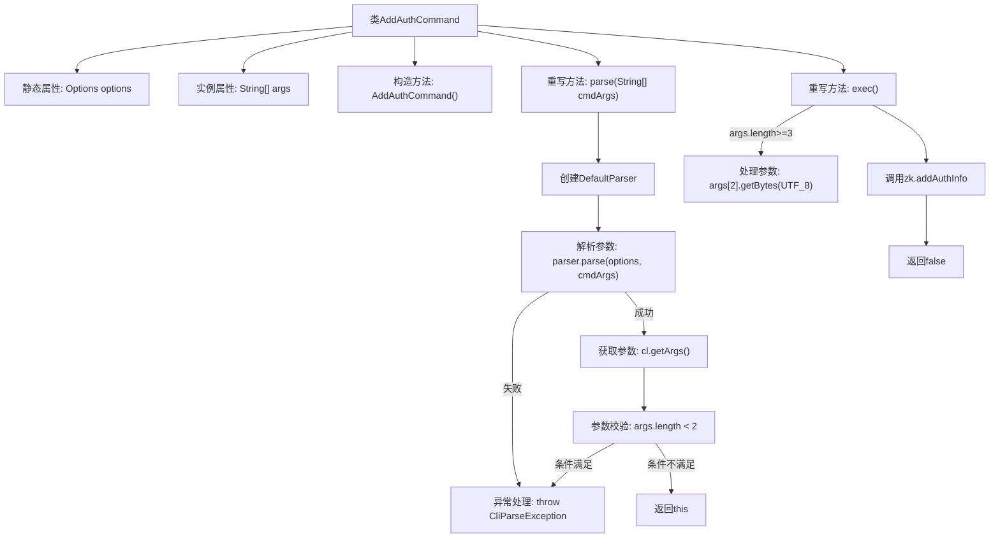

# 基础信息

|      |      |
|------|------|
| 名称 | AddAuthCommand |
| 编码语言 | .java |
| 代码路径 | zookeeper/zookeeper-server/src/main/java/org/apache/zookeeper/cli/AddAuthCommand.java |
| 包名 | org.apache.zookeeper.cli |
| 依赖项 | ['java.nio.charset.StandardCharsets.UTF_8', 'org.apache.commons.cli.CommandLine', 'org.apache.commons.cli.DefaultParser', 'org.apache.commons.cli.Options', 'org.apache.commons.cli.ParseException'] |
| 概述说明 | 这是一个Java类AddAuthCommand，继承自CliCommand，用于解析和执行添加认证信息的命令行指令。它通过parse方法解析参数，若参数不足则抛出异常；exec方法调用zk.addAuthInfo添加认证信息。 |

# 说明

这是一个名为AddAuthCommand的Java类，继承自CliCommand类，用于处理命令行授权添加操作。类中包含静态Options对象和字符串数组args。构造函数设置命令名称为"addauth"和描述"scheme auth"。parse方法使用DefaultParser解析命令行参数，验证参数数量不少于2个。exec方法执行授权添加逻辑，将第三个参数转为UTF-8字节数组后调用zk.addAuthInfo方法。整个类实现了命令行参数解析与授权信息添加功能。

# 类列表 Class Summary

| 名称   | 类型  | 说明 |
|-------|------|-------------|
| AddAuthCommand | class | 这是一个Java类AddAuthCommand，继承自CliCommand，用于解析和执行添加认证信息的命令行指令。包含解析参数和执行添加认证的核心逻辑。 |

## 类 AddAuthCommand

|      |      |
|------|------|
| 访问范围 | public |
| 类型 | class |
| 名称 | AddAuthCommand |
| 说明 | 这是一个Java类AddAuthCommand，继承自CliCommand，用于解析和执行添加认证信息的命令行指令。包含解析参数和执行添加认证的核心逻辑。 |

### UML类图

这段代码展示了一个ZooKeeper认证添加命令的实现类结构。AddAuthCommand继承自CliCommand接口，主要功能是解析命令行参数并执行添加认证信息的操作。它依赖于Apache Commons CLI库的DefaultParser、CommandLine和Options类来完成参数解析工作。类图中清晰地体现了继承关系和依赖关系，其中AddAuthCommand作为核心类，通过组合方式使用其他工具类，实现了命令模式的基本结构。该设计符合单一职责原则，将参数解析与业务逻辑分离，便于扩展和维护。

### 内部方法调用关系图

这段代码展示了一个继承自CliCommand的AddAuthCommand类，主要用于处理添加认证信息的命令行操作。流程图清晰地描述了从参数解析到执行认证添加的全过程：首先通过DefaultParser解析输入参数并进行校验，若参数不足则抛出异常；执行阶段根据参数情况处理字节数据，最终调用zk服务添加认证信息。整个过程包含严格的错误处理和参数验证机制。

### 字段列表 Field List

| 名称  | 类型  | 说明 |
|-------|-------|------|
| args | String[] | 声明一个私有字符串数组变量args。 |
| options = new Options() | Options | 定义私有静态变量options，初始化为Options类的新实例。 |

### 方法列表 Method List

| 名称  | 类型  | 说明 |
|-------|-------|------|
| parse | CliCommand | 解析命令行参数，若参数不足则抛出异常。 |
| exec | boolean | 重写exec方法，检查参数后调用zk.addAuthInfo进行认证，返回false。 |

