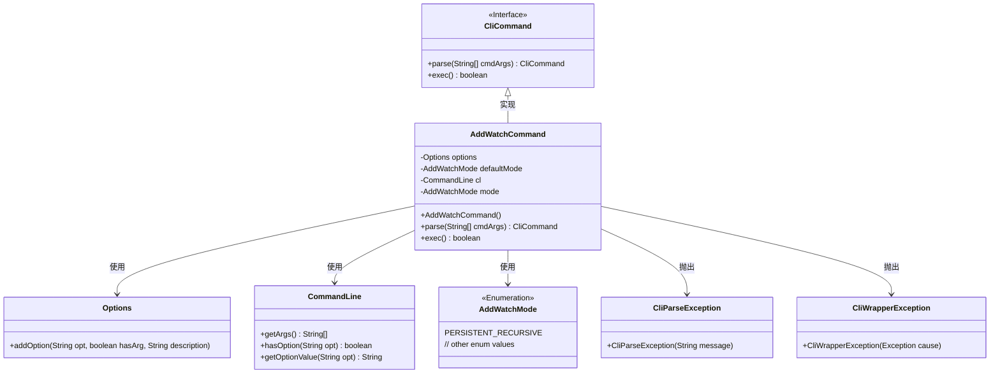
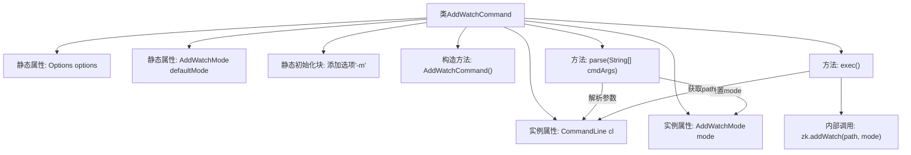
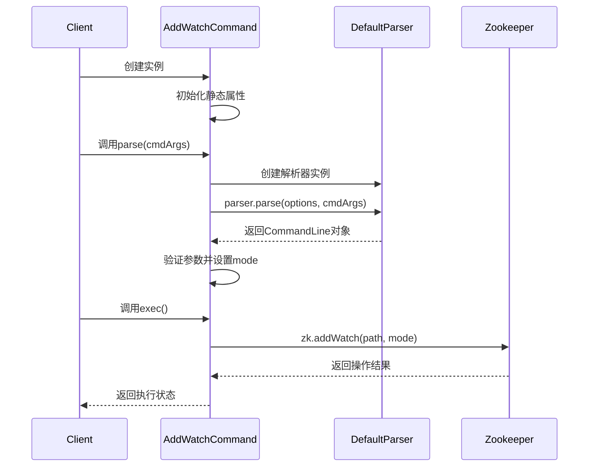

# 基础信息

|      |      |
|------|------|
| 名称 | AddWatchCommand |
| 编码语言 | .java |
| 代码路径 | zookeeper/zookeeper-server/src/main/java/org/apache/zookeeper/cli/AddWatchCommand.java |
| 包名 | org.apache.zookeeper.cli |
| 依赖项 | ['java.util.Arrays', 'org.apache.commons.cli.CommandLine', 'org.apache.commons.cli.DefaultParser', 'org.apache.commons.cli.Options', 'org.apache.commons.cli.ParseException', 'org.apache.zookeeper.AddWatchMode', 'org.apache.zookeeper.KeeperException'] |
| 概述说明 | AddWatchCommand是CLI命令类，支持添加监视路径，可选模式参数-m，默认持久递归模式，解析参数后执行zk.addWatch操作。 |

# 说明

这是一个名为AddWatchCommand的Java类，继承自CliCommand，用于实现添加监视命令的功能。该类包含一个静态选项配置，支持通过-m参数指定监视模式，默认为PERSISTENT_RECURSIVE。构造函数定义了命令名称和用法说明。parse方法负责解析命令行参数，验证参数数量并处理模式选项。exec方法执行核心功能，调用zk对象的addWatch方法添加监视，并处理可能的异常。整个类实现了命令解析和执行逻辑，封装了添加监视的完整操作流程。

# 类列表 Class Summary

| 名称   | 类型  | 说明 |
|-------|------|-------------|
| AddWatchCommand | class | 这是一个Java类AddWatchCommand，继承CliCommand，用于添加监视命令。支持可选模式参数-m，默认模式为PERSISTENT_RECURSIVE。主要功能是解析参数并执行zk.addWatch操作。 |

## 类 AddWatchCommand

|      |      |
|------|------|
| 访问范围 | public |
| 类型 | class |
| 名称 | AddWatchCommand |
| 说明 | 这是一个Java类AddWatchCommand，继承CliCommand，用于添加监视命令。支持可选模式参数-m，默认模式为PERSISTENT_RECURSIVE。主要功能是解析参数并执行zk.addWatch操作。 |

### UML类图

这段代码展示了一个`AddWatchCommand`类，它继承自`CliCommand`接口，实现了命令行解析和执行功能。主要功能是通过解析用户输入的命令行参数（包括可选的watch模式参数和路径参数），然后调用ZK客户端添加watch。类中包含静态初始化块来配置命令行选项，通过`parse()`方法解析参数并验证格式，`exec()`方法执行核心逻辑。整个过程涉及异常处理、枚举类型使用和第三方库集成，体现了良好的命令模式实现和错误处理机制。

### 内部方法调用关系图

这段代码实现了一个Zookeeper客户端添加监视节点的命令类。流程图展示了类的结构组成和内部调用关系，包含静态属性初始化、参数解析和执行监视添加三个主要部分。时序图详细描述了从客户端调用到最终执行Zookeeper操作的完整流程，重点呈现了参数解析和命令执行两个关键阶段的数据流转。该命令支持通过-m参数指定监视模式，默认使用持久化递归模式，并实现了完整的异常处理机制。

### 字段列表 Field List

| 名称  | 类型  | 说明 |
|-------|-------|------|
| options = new Options() | Options | 私有静态常量options初始化为Options类实例。 |
| mode = defaultMode | AddWatchMode | 私有变量mode初始化为默认模式defaultMode。 |
| cl | CommandLine | 私有命令行对象cl。 |
| defaultMode = AddWatchMode.PERSISTENT_RECURSIVE | AddWatchMode | 私有静态常量默认模式设为持久递归监控。 |

### 方法列表 Method List

| 名称  | 类型  | 说明 |
|-------|-------|------|
| exec | boolean | 重写exec方法，调用zk.addWatch监听指定路径，异常时抛出CliWrapperException，默认返回false。 |
| parse | CliCommand | 解析命令行参数，处理异常并验证参数数量及选项值，返回当前对象。 |

