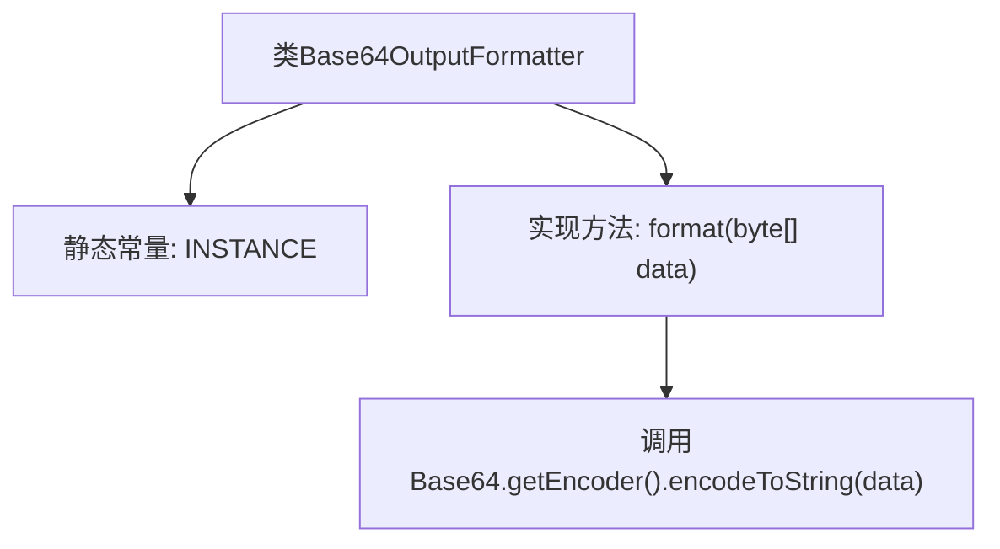

# 基础信息

|      |      |
|------|------|
| 名称 | Base64OutputFormatter |
| 编码语言 | .java |
| 代码路径 | zookeeper/zookeeper-server/src/main/java/org/apache/zookeeper/cli/Base64OutputFormatter.java |
| 包名 | org.apache.zookeeper.cli |
| 依赖项 | ['java.util.Base64'] |
| 概述说明 | Base64OutputFormatter类实现OutputFormatter接口，提供静态实例INSTANCE，通过format方法将字节数组转为Base64字符串。 |

# 说明

这段内容描述了一个名为Base64OutputFormatter的类，它实现了OutputFormatter接口。该类包含一个公共静态常量INSTANCE，用于获取该类的单例实例。类中定义了一个format方法，接收byte数组作为输入参数，使用Base64编码器将输入数据转换为Base64编码的字符串并返回。该类的功能是将字节数据格式化为Base64字符串。

# 类列表 Class Summary

| 名称   | 类型  | 说明 |
|-------|------|-------------|
| Base64OutputFormatter | class | Base64OutputFormatter类实现OutputFormatter接口，提供字节数组转Base64字符串的格式化功能，单例模式。 |


## 类 Base64OutputFormatter

|      |      |
|------|------|
| 访问范围 | public |
| 类型 | class |
| 名称 | Base64OutputFormatter |
| 说明 | Base64OutputFormatter类实现OutputFormatter接口，提供字节数组转Base64字符串的格式化功能，单例模式。 |


### UML类图

```mermaid
classDiagram
    class Base64OutputFormatter {
        +Base64OutputFormatter INSTANCE
        +format(byte[] data) String
    }
    <<interface>> OutputFormatter {
        +format(byte[] data) String
    }
    Base64OutputFormatter ..|> OutputFormatter : 实现
```

这段代码展示了一个Base64输出格式化工具的实现类图。Base64OutputFormatter类实现了OutputFormatter接口，提供了将字节数组转换为Base64编码字符串的功能。类中包含一个公共静态常量INSTANCE作为单例实例，以及实现接口要求的format方法。该设计遵循单例模式，通过接口实现保证了扩展性，适用于需要Base64编码输出的各种场景。


### 内部方法调用关系图



该流程图展示了Base64OutputFormatter类的结构，包含一个静态常量INSTANCE和一个实现方法format。format方法通过调用Base64编码器将字节数组转换为Base64字符串。类设计简洁，采用单例模式通过INSTANCE提供全局访问点，核心功能是将二进制数据编码为可读的Base64格式字符串。

### 字段列表 Field List

| 名称  | 类型  | 说明 |
|-------|-------|------|
| INSTANCE = new Base64OutputFormatter() | Base64OutputFormatter | 静态常量Base64OutputFormatter实例，命名为INSTANCE。 |

### 方法列表 Method List

| 名称  | 类型  | 说明 |
|-------|-------|------|
| format | String | Java方法：将字节数组转为Base64编码字符串。 |


