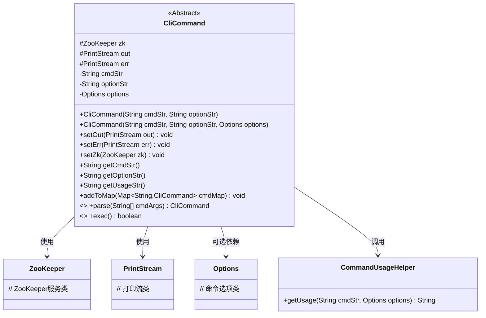

# 基础信息

|      |      |
|------|------|
| 名称 | CliCommand |
| 编码语言 | .java |
| 代码路径 | zookeeper/zookeeper-server/src/main/java/org/apache/zookeeper/cli/CliCommand.java |
| 包名 | org.apache.zookeeper.cli |
| 依赖项 | ['java.io.PrintStream', 'java.util.Map', 'javax.annotation.Nullable', 'org.apache.commons.cli.Options', 'org.apache.zookeeper.ZooKeeper'] |
| 概述说明 | 抽象类CliCommand定义CLI命令结构，含ZooKeeper实例、输入输出流、命令字符串和选项，提供解析、执行及工具方法。 |

# 说明

这是一个抽象类CliCommand，用于定义命令行接口命令的基本结构和功能。它包含ZooKeeper实例、输出和错误打印流、命令字符串、选项字符串以及可选选项对象。类提供了构造函数初始化这些字段，并支持设置输出流、错误流和ZooKeeper实例的方法。还包含获取命令字符串、选项字符串和用法字符串的方法，以及将命令添加到映射表的功能。抽象方法parse用于解析命令参数，exec用于执行命令并返回是否包含watch选项。该类主要用于构建可扩展的命令行工具。

# 类列表 Class Summary

| 名称   | 类型  | 说明 |
|-------|------|-------------|
| CliCommand | class | 抽象类CliCommand定义了CLI命令基类，包含命令字符串、选项、输出流及ZooKeeper实例，提供解析、执行及工具方法。 |

## 类 CliCommand

|      |      |
|------|------|
| 访问范围 | public abstract |
| 类型 | class |
| 名称 | CliCommand |
| 说明 | 抽象类CliCommand定义了CLI命令基类，包含命令字符串、选项、输出流及ZooKeeper实例，提供解析、执行及工具方法。 |

### UML类图

该类图展示了一个抽象CLI命令基类`CliCommand`的结构及其关联关系。该类封装了ZooKeeper操作、打印流控制和命令选项处理的核心功能，通过`parse`和`exec`抽象方法强制子类实现命令解析和执行逻辑。类图中明确区分了protected(#)和private(-)成员，并标注了抽象方法，同时显示了与ZooKeeper服务、打印流、选项配置及工具类的依赖关系。整体设计支持命令注册、参数解析和异常处理等CLI常见功能。

### 内部方法调用关系图

```mermaid
graph TD
    A["抽象类CliCommand"]
    B["属性: ZooKeeper zk"]
    C["属性: PrintStream out"]
    D["属性: PrintStream err"]
    E["属性: String cmdStr"]
    F["属性: String optionStr"]
    G["属性: Options options"]
    H["构造方法: CliCommand(String cmdStr, String optionStr)"]
    I["构造方法: CliCommand(String cmdStr, String optionStr, Options options)"]
    J["方法: setOut(PrintStream out)"]
    K["方法: setErr(PrintStream err)"]
    L["方法: setZk(ZooKeeper zk)"]
    M["方法: getCmdStr()"]
    N["方法: getOptionStr()"]
    O["方法: getUsageStr()"]
    P["方法: addToMap(Map<String, CliCommand> cmdMap)"]
    Q["抽象方法: parse(String[] cmdArgs)"]
    R["抽象方法: exec()"]

    A --> B
    A --> C
    A --> D
    A --> E
    A --> F
    A --> G
    A --> H
    A --> I
    A --> J
    A --> K
    A --> L
    A --> M
    A --> N
    A --> O
    A --> P
    A --> Q
    A --> R
```

该流程图展示了抽象类CliCommand的结构，包含5个属性和9个方法（其中2个是抽象方法）。核心功能包括：通过构造方法初始化命令字符串和选项，提供输出流设置方法，支持将命令添加到映射表，以及需要子类实现的命令解析(parse)和执行(exec)抽象方法。类设计主要用于处理CLI命令的通用逻辑，特别适合需要扩展不同具体命令的场景。

### 字段列表 Field List

| 名称  | 类型  | 说明 |
|-------|-------|------|
| options | Options | 可空私有选项对象。 |
| optionStr | String | 私有字符串变量optionStr。 |
| err | PrintStream | 声明一个受保护的PrintStream类型变量err。 |
| cmdStr | String | 声明一个私有字符串变量cmdStr。 |
| zk | ZooKeeper | 受保护的ZooKeeper实例变量zk。 |
| out | PrintStream | 声明一个受保护的PrintStream类型变量out。 |

### 方法列表 Method List

| 名称  | 类型  | 说明 |
|-------|-------|------|
| parse | CliCommand | 解析字符串数组生成CliCommand对象，可能抛出CliParseException异常。 |
| setErr | void | 设置错误输出流的方法，将参数err赋值给类的err变量。 |
| getCmdStr | String | 这是一个Java方法，返回字符串类型的cmdStr变量值。 |
| exec | boolean | 抽象方法exec，返回布尔值，可能抛出CliException异常。 |
| getUsageStr | String | 该方法返回命令使用说明字符串，通过拼接命令字符串和选项字符串，调用工具类生成格式化的帮助信息。 |
| setZk | void | 这是一个Java方法，用于设置ZooKeeper实例变量。方法名为setZk，接受ZooKeeper类型参数zk，并将其赋值给类的成员变量this.zk。 |
| setOut | void | 设置输出流方法，将参数out赋值给类的out成员变量。 |
| getOptionStr | String | 这是一个Java方法，返回字符串类型的成员变量optionStr的值。 |
| addToMap | void | 该方法将当前命令对象添加到传入的Map中，使用cmdStr作为键，this作为值。 |

